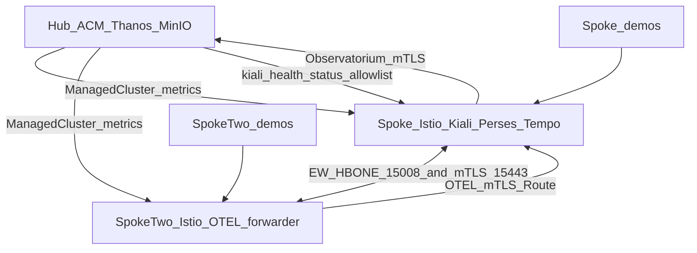

# OSSM ACM Multi-Cluster — Full Deployment Runbook

**Written:** 2026-07-23  
**Audience:** Operators / agents reproducing or auditing this RHQE deploy  
**Status:** All four tutorial phases completed and verified on live clusters  
**Short resume:** see [HANDOFF.md](../HANDOFF.md) (workspace) or `~/.local/share/ossm-acm/HANDOFF.md`

---

## Purpose

This document records **every step taken** on these clusters, from first hub+spoke configuration through spoke-two multi-primary, Perses dashboards, Tempo tracing, and Kiali health-status alerts. It includes full `oc`/YAML as applied, wait conditions, concrete hostnames/IPs from this deploy, and known deviations from the upstream tutorials.

Upstream sources of truth (wording may evolve; this runbook is what we ran):

| Phase | Tutorial |
|-------|----------|
| Part 1 Hub/spoke | https://kiali.io/docs/tutorials/ossm-multicluster/ossm-acm-hub-spoke/ |
| Part 2 Multi-primary | https://deploy-preview-995--kiali.netlify.app/docs/tutorials/ossm-multicluster/ossm-acm-multi-primary/ |
| Part 3 Perses + Tempo | https://deploy-preview-995--kiali.netlify.app/docs/tutorials/ossm-multicluster/ossm-dashboards-tracing/ |
| Part 4 Health alerts | https://deploy-preview-995--kiali.netlify.app/docs/tutorials/ossm-multicluster/ossm-health-status-alerts/ |

---

## Security policy

- **Never** store kubeadmin passwords, API tokens, or raw kubeconfig contents in this file or in git.
- Login placeholders: `-p='<KUBEADMIN_PASSWORD>'`.
- In-cluster MinIO demo credentials (`minio` / `minio123`) are tutorial defaults for object storage only — not cluster admin credentials.
- Do not commit this file with secrets pasted into command history examples.

---

## Prerequisites (local workstation)

| Tool | Notes |
|------|--------|
| `oc` | Logged into all three clusters |
| `openssl` | Istio CA + OTEL mTLS certs |
| `jq` | ConfigMap merges, verify queries |
| `istioctl` **1.30.1** | `~/.local/bin/istioctl` — remote secrets |
| `curl` / `wget` | Sample manifests, probes |
| VPN / bastion | Required for `*.apps.*` (private `10.0.x.x` DNS) |

```bash
export KUBECONFIG=~/.kube/ossm-acm-hub-spoke
export PATH="$HOME/.local/bin:$PATH"
```

---

## Environment inventory (this deploy)

| Context | Role | API |
|---------|------|-----|
| `ossm-kiali-hub` | ACM hub + Thanos/Observatorium (no OSSM) | `https://api.rzago-multi-cluster-hub.servicemesh.rhqeaws.com:6443` |
| `ossm-kiali-spoke` | Istio primary 1 + Kiali + Perses + Tempo | `https://api.rzago-ossm-multi-cluster-spoke1.servicemesh.rhqeaws.com:6443` |
| `ossm-kiali-spoke-two` | Istio primary 2 + OTEL forwarder | `https://api.zago-ossm-multi-cluster-spoke2.servicemesh.rhqeaws.com:6443` |

**Note:** spoke-two hostname is `zago-…` (no leading `r`).

| Item | Value |
|------|--------|
| OpenShift | **4.22.5** (all three) |
| ACM | channel used at install ≈ `release-2.17` |
| Istio / OSSM3 | `v1.30.1` |
| ManagedClusters | `local-cluster`, `spoke`, `spoke-two` |
| Kubeconfig path | `~/.kube/ossm-acm-hub-spoke` |
| Durable Istio root CA | `~/.local/share/ossm-acm/istio-certs/root-{cert,key}.pem` |
| Spoke-two intermediate | `~/.local/share/ossm-acm/istio-certs/spoke-two/` |
| Working CA copy | `/tmp/istio-certs/` (regenerate from durable if cleared) |
| OTEL mTLS (ephemeral) | `/tmp/otel-mtls/` |

### Full env block (keep consistent across all parts)

```bash
export KUBECONFIG=~/.kube/ossm-acm-hub-spoke
export PATH="$HOME/.local/bin:$PATH"

export SPOKE_CLUSTER_NAME="spoke"
export SPOKE_TWO_CLUSTER_NAME="spoke-two"
export ISTIO_VERSION="1.30.1"
export MESH_ID="mesh1"
export SPOKE_NETWORK="network1"
export SPOKE_TWO_NETWORK="network2"

export TEMPO_NAMESPACE="tempo"
export TEMPO_STACK_NAME="istio"
export TEMPO_TENANT="mesh1"          # matches MESH_ID

export MINIO_ACCESS_KEY="minio"
export MINIO_SECRET_KEY="minio123"   # in-cluster MinIO only (hub ACM + spoke Tempo)

export KIALI_CR_NS=istio-system
export KIALI_NS=istio-system
```

### Re-login template

```bash
export KUBECONFIG=~/.kube/ossm-acm-hub-spoke
oc login <API> -u=kubeadmin -p='<KUBEADMIN_PASSWORD>' --insecure-skip-tls-verify
# Rename contexts to: ossm-kiali-hub | ossm-kiali-spoke | ossm-kiali-spoke-two
# Example: oc config rename-context $(oc config current-context) ossm-kiali-spoke
```

### Locked decisions (ops style)

1. Run Kiali tutorials live (not rebuild Ansible).
2. No PRD/tickets; no git commits of secrets or wipe restoration.
3. Greenfield clusters at start of hub-spoke.
4. End-to-end; pause only on hard failures.
5. Cleanup sections of tutorials **not** run unless explicitly requested.

---

## Architecture (end state)



**East-West LB addresses (recorded at deploy):**

| Cluster | Network | HBONE `:15008` | Sidecar `:15443` |
|---------|---------|----------------|------------------|
| spoke | network1 | `10.0.191.55` | `10.0.191.40` |
| spoke-two | network2 | `10.0.190.88` | `10.0.190.42` |

Services: `istio-eastwestgateway`, `istio-eastwestgateway-sidecar-istio` in `istio-system`.

**Tempo remote receiver Route (spoke):**  
`otel-remote-spoke-two-istio-system.apps.rzago-ossm-multi-cluster-spoke1.servicemesh.rhqeaws.com`

---

## Table of contents

0. [Part 0 — Bootstrap](#part-0--bootstrap)
1. [Part 1 — Hub/Spoke](#part-1--hubspoke-acm--ossm--kiali--demos)
2. [Part 2 — Multi-Primary](#part-2--multi-primary-spoke-two--east-west--dual-kiali)
3. [Part 3 — Perses + Tempo](#part-3--perses--tempo)
4. [Part 4 — Health Status Alerts](#part-4--health-status-alerts)
5. [Appendix A — URLs](#appendix-a--urls--console-paths)
6. [Appendix B — Pitfalls](#appendix-b--pitfalls--deviations)
7. [Appendix C — Demo script](#appendix-c--demo-script-cross-cluster)
8. [Appendix D — Cleanup pointers](#appendix-d--cleanup-pointers)
9. [Appendix E — Resume checklist](#appendix-e--resume-checklist)

---

# Part 0 — Bootstrap

## 0.1 Login hub and spoke (then spoke-two for Part 2+)

```bash
export KUBECONFIG=~/.kube/ossm-acm-hub-spoke

oc login https://api.rzago-multi-cluster-hub.servicemesh.rhqeaws.com:6443 \
  -u=kubeadmin -p='<KUBEADMIN_PASSWORD>' --insecure-skip-tls-verify
oc config rename-context "$(oc config current-context)" ossm-kiali-hub

oc login https://api.rzago-ossm-multi-cluster-spoke1.servicemesh.rhqeaws.com:6443 \
  -u=kubeadmin -p='<KUBEADMIN_PASSWORD>' --insecure-skip-tls-verify
oc config rename-context "$(oc config current-context)" ossm-kiali-spoke

# Part 2+ only:
oc login https://api.zago-ossm-multi-cluster-spoke2.servicemesh.rhqeaws.com:6443 \
  -u=kubeadmin -p='<KUBEADMIN_PASSWORD>' --insecure-skip-tls-verify
oc config rename-context "$(oc config current-context)" ossm-kiali-spoke-two
```

## 0.2 Smoke-check (no installs yet)

```bash
oc --context=ossm-kiali-hub whoami --show-server
oc --context=ossm-kiali-spoke whoami --show-server
# after spoke-two login:
oc --context=ossm-kiali-spoke-two whoami --show-server

# Expect OpenShift ≥ 4.14; OperatorHub redhat-operators reachable
oc --context=ossm-kiali-hub get packagemanifest advanced-cluster-management -n openshift-marketplace
oc --context=ossm-kiali-spoke get packagemanifest servicemeshoperator3 -n openshift-marketplace
```

## 0.3 Preserve Istio root CA after Part 1 Phase 3.4

Immediately after generating `/tmp/istio-certs/root-*.pem`:

```bash
mkdir -p ~/.local/share/ossm-acm/istio-certs
cp -a /tmp/istio-certs/root-cert.pem /tmp/istio-certs/root-key.pem \
  ~/.local/share/ossm-acm/istio-certs/
```

If `/tmp` was cleared before Part 2:

```bash
mkdir -p /tmp/istio-certs
cp -a ~/.local/share/ossm-acm/istio-certs/root-*.pem /tmp/istio-certs/
```

---

<!-- Parts 1–4 are included below from the detailed phase extracts -->

---

# Part 1 — Hub/Spoke (ACM + OSSM + Kiali + Demos)

## Deployed Facts

| Item | Value |
| --- | --- |
| Hub API | https://api.rzago-multi-cluster-hub.servicemesh.rhqeaws.com:6443 |
| Spoke API | https://api.rzago-ossm-multi-cluster-spoke1.servicemesh.rhqeaws.com:6443 |
| OpenShift | 4.22.5 |
| ACM channel | release-2.17 |
| ISTIO_VERSION | 1.30.1 |
| MESH_ID | mesh1 |
| SPOKE_CLUSTER_NAME | spoke |
| Durable CA backup | ~/.local/share/ossm-acm/istio-certs/ |
| Cleanup | Skip Cleanup |

---

## Environment Setup

Set these variables in your shell before running any commands. They are referenced throughout this guide.

```
# Name for the spoke cluster in ACM (must be a valid Kubernetes resource name)
export SPOKE_CLUSTER_NAME="spoke"

# Istio version to install. Must be a version supported by the installed OSSM operator.
# After installing the operator (Phase 3.2), you can list supported versions with:
#   oc --context=ossm-kiali-spoke get crd istios.sailoperator.io \
#     -o jsonpath='{.spec.versions[0].schema.openAPIV3Schema.properties.spec.properties.version.enum}'
# Must be >= 1.30 for ambient cross-cluster traffic routing.
export ISTIO_VERSION="1.30.1"

# meshID - arbitrary identifier for this mesh
export MESH_ID="mesh1"

# MinIO credentials for in-cluster Thanos object storage (ACM Observability)
# These are only used inside the cluster — no external storage account is required
export MINIO_ACCESS_KEY="minio"
export MINIO_SECRET_KEY="minio123"

```

Verify both kubeconfig contexts are reachable:

```
oc --context=ossm-kiali-hub   whoami --show-server
oc --context=ossm-kiali-spoke whoami --show-server

```

---

## Phase 1: ACM on the Hub Cluster

### 1.1 Install ACM Operator

Detect the latest available ACM channel, then create the`open-cluster-management` namespace and install the operator via OLM. ACM channels follow the naming pattern`release-X.Y`(e.g.`release-2.17`):

```
ACM_CHANNEL=$(oc --context=ossm-kiali-hub get packagemanifest advanced-cluster-management \
  -n openshift-marketplace \
  -o jsonpath='{.status.channels[*].name}' | \
  tr ' ' '\n' | sort -V | tail -1)
echo "Using ACM channel: ${ACM_CHANNEL}"

oc --context=ossm-kiali-hub create namespace open-cluster-management 2>/dev/null || true

oc --context=ossm-kiali-hub apply -f - <<'EOF'
apiVersion: operators.coreos.com/v1
kind: OperatorGroup
metadata:
  name: open-cluster-management
  namespace: open-cluster-management
spec:
  targetNamespaces:
  - open-cluster-management
EOF

oc --context=ossm-kiali-hub apply -f - <<EOF
apiVersion: operators.coreos.com/v1alpha1
kind: Subscription
metadata:
  name: acm-operator-subscription
  namespace: open-cluster-management
spec:
  sourceNamespace: openshift-marketplace
  source: redhat-operators
  channel: ${ACM_CHANNEL}
  installPlanApproval: Automatic
  name: advanced-cluster-management
EOF

```

Wait for the ACM operator to install its CRDs. The`multiclusterhubs` CRD being`Established` confirms the operator is running and ready:

```
until oc --context=ossm-kiali-hub get crd \
  multiclusterhubs.operator.open-cluster-management.io &>/dev/null; do
  echo "Waiting for MCH CRD to appear..."
  sleep 5
done

oc --context=ossm-kiali-hub wait crd/multiclusterhubs.operator.open-cluster-management.io \
  --for=condition=Established \
  --timeout=300s

```

### 1.2 Create the MultiClusterHub

Wait for the operator pod to be fully ready before creating the MultiClusterHub. The MCH CR is validated by an admission webhook served by the operator — applying the CR before the webhook endpoint is ready causes an immediate rejection:

```
until oc --context=ossm-kiali-hub get pods \
  -l name=multiclusterhub-operator \
  -n open-cluster-management \
  --no-headers 2>/dev/null | grep -q .; do
  sleep 5
done

oc --context=ossm-kiali-hub wait pod \
  -l name=multiclusterhub-operator \
  -n open-cluster-management \
  --for=condition=Ready \
  --timeout=300s

```

```
oc --context=ossm-kiali-hub apply -f - <<'EOF'
apiVersion: operator.open-cluster-management.io/v1
kind: MultiClusterHub
metadata:
  name: multiclusterhub
  namespace: open-cluster-management
spec: {}
EOF

```

Wait for ACM to be fully ready. This typically takes 5–10 minutes on a fresh cluster:

```
echo "Waiting for MultiClusterHub to reach Running status..."
while true; do
  PHASE=$(oc --context=ossm-kiali-hub get mch multiclusterhub \
    -n open-cluster-management \
    -o jsonpath='{.status.phase}' 2>/dev/null)
  if [ "${PHASE}" = "Running" ]; then
    echo "MultiClusterHub is Running"
    break
  fi
  echo "  Current phase: ${PHASE} — waiting..."
  sleep 15
done

```

### 1.3 Verify ACM is Ready

```
oc --context=ossm-kiali-hub get multiclusterhub multiclusterhub -n open-cluster-management \
  -o jsonpath='{.status.phase}{"\n"}'
# Expected: Running

```

### 1.4 Enable ACM Observability (MultiClusterObservability)

ACM Observability collects metrics from all managed clusters and stores them in Thanos on the hub. Kiali will query these aggregated metrics via the Observatorium API.

ACM needs an S3-compatible object store as its Thanos backend. This guide deploys MinIO in-cluster so that no external storage account is required.

Create the observability namespace:

```
oc --context=ossm-kiali-hub create namespace open-cluster-management-observability 2>/dev/null || true

```

Deploy MinIO as a single-pod in-cluster object store:

```
oc --context=ossm-kiali-hub apply -f - <<EOF
apiVersion: apps/v1
kind: Deployment
metadata:
  name: minio
  namespace: open-cluster-management-observability
spec:
  replicas: 1
  selector:
    matchLabels:
      app: minio
  template:
    metadata:
      labels:
        app: minio
    spec:
      containers:
      - name: minio
        image: quay.io/minio/minio:latest
        args:
        - server
        - /data
        - --console-address
        - ":9001"
        env:
        - name: MINIO_ROOT_USER
          value: "${MINIO_ACCESS_KEY}"
        - name: MINIO_ROOT_PASSWORD
          value: "${MINIO_SECRET_KEY}"
        ports:
        - containerPort: 9000
          name: api
        - containerPort: 9001
          name: console
        volumeMounts:
        - name: data
          mountPath: /data
        readinessProbe:
          httpGet:
            path: /minio/health/ready
            port: 9000
          initialDelaySeconds: 10
          periodSeconds: 5
        livenessProbe:
          httpGet:
            path: /minio/health/live
            port: 9000
          initialDelaySeconds: 10
          periodSeconds: 5
      volumes:
      - name: data
        emptyDir: {}
---
apiVersion: v1
kind: Service
metadata:
  name: minio
  namespace: open-cluster-management-observability
spec:
  ports:
  - port: 9000
    name: api
    targetPort: 9000
  - port: 9001
    name: console
    targetPort: 9001
  selector:
    app: minio
EOF

```

Wait for MinIO to be ready, then create the Thanos bucket inside it:

```
oc --context=ossm-kiali-hub rollout status deployment/minio \
  -n open-cluster-management-observability \
  --timeout=120s

MINIO_POD=$(oc --context=ossm-kiali-hub get pods -n open-cluster-management-observability \
  -l app=minio -o jsonpath='{.items[0].metadata.name}')
oc --context=ossm-kiali-hub exec -n open-cluster-management-observability "${MINIO_POD}" -- mkdir -p /data/thanos

```

Create the Thanos object storage secret pointing at the in-cluster MinIO:

```
oc --context=ossm-kiali-hub apply -f - <<EOF
apiVersion: v1
kind: Secret
metadata:
  name: thanos-object-storage
  namespace: open-cluster-management-observability
type: Opaque
stringData:
  thanos.yaml: |
    type: s3
    config:
      bucket: thanos
      endpoint: minio.open-cluster-management-observability.svc:9000
      insecure: true
      access_key: ${MINIO_ACCESS_KEY}
      secret_key: ${MINIO_SECRET_KEY}
EOF

```

Create the`MultiClusterObservability` CR. This deploys Thanos, Observatorium, and the metrics collector add-on on all managed clusters. The retention is set to 14 days across all Thanos resolutions — this is both the Thanos minimum safe value (≥10d required for 5m→1h downsampling) and the value Kiali’s`retention_period` is configured to match:

```
oc --context=ossm-kiali-hub apply -f - <<'EOF'
apiVersion: observability.open-cluster-management.io/v1beta2
kind: MultiClusterObservability
metadata:
  name: observability
spec:
  observabilityAddonSpec: {}
  storageConfig:
    metricObjectStorage:
      name: thanos-object-storage
      key: thanos.yaml
    alertmanagerStorageSize: 1Gi
    compactStorageSize: 10Gi
    receiveStorageSize: 10Gi
    ruleStorageSize: 1Gi
    storeStorageSize: 10Gi
  advanced:
    retentionConfig:
      retentionResolution1h: 14d
      retentionResolution5m: 14d
      retentionResolutionRaw: 14d
    alertmanager:
      replicas: 1
      resources:
        requests:
          cpu: 20m
          memory: 64Mi
    compact:
      resources:
        requests:
          cpu: 50m
          memory: 128Mi
    grafana:
      replicas: 1
      resources:
        requests:
          cpu: 20m
          memory: 64Mi
    observatoriumAPI:
      replicas: 1
      resources:
        requests:
          cpu: 20m
          memory: 64Mi
    query:
      replicas: 1
      resources:
        requests:
          cpu: 50m
          memory: 128Mi
    queryFrontend:
      replicas: 1
      resources:
        requests:
          cpu: 50m
          memory: 64Mi
    queryFrontendMemcached:
      replicas: 1
      resources:
        requests:
          cpu: 20m
          memory: 64Mi
    rbacQueryProxy:
      replicas: 1
      resources:
        requests:
          cpu: 20m
          memory: 64Mi
    receive:
      resources:
        requests:
          cpu: 50m
          memory: 128Mi
    rule:
      replicas: 1
      resources:
        requests:
          cpu: 50m
          memory: 128Mi
    store:
      replicas: 1
      resources:
        requests:
          cpu: 50m
          memory: 128Mi
    storeMemcached:
      replicas: 1
      resources:
        requests:
          cpu: 20m
          memory: 64Mi
EOF

```

Wait for ACM Observability to be ready. This can take 5–10 minutes as Thanos components start up:

```
echo "Waiting for MultiClusterObservability to be ready..."
while true; do
  READY=$(oc --context=ossm-kiali-hub get mco observability \
    -o jsonpath='{.status.conditions[?(@.type=="Ready")].status}' 2>/dev/null || echo "Unknown")
  if [ "${READY}" = "True" ]; then
    echo "MultiClusterObservability is Ready"
    break
  fi
  echo "  Ready=${READY} — waiting..."
  sleep 15
done

```

Verify the Observatorium API route exists:

```
oc --context=ossm-kiali-hub get route observatorium-api \
  -n open-cluster-management-observability \
  -o jsonpath='{.spec.host}{"\n"}'

```

### 1.5 Create Istio Metrics Allowlist

ACM only forwards metrics that are explicitly allowlisted. Create this ConfigMap on the hub — ACM automatically distributes it to every managed cluster (including the spoke once imported) so that the spoke’s UWM Prometheus metrics collector sends Istio metrics to hub Thanos:

```
oc --context=ossm-kiali-hub apply -f - <<'EOF'
apiVersion: v1
kind: ConfigMap
metadata:
  name: observability-metrics-custom-allowlist
  namespace: open-cluster-management-observability
data:
  uwl_metrics_list.yaml: |
    names:
    # HTTP/gRPC metrics - from sidecars and waypoint proxies
    - istio_requests_total
    - istio_request_bytes_bucket
    - istio_request_bytes_count
    - istio_request_bytes_sum
    - istio_request_duration_milliseconds_bucket
    - istio_request_duration_milliseconds_count
    - istio_request_duration_milliseconds_sum
    - istio_request_messages_total
    - istio_response_bytes_bucket
    - istio_response_bytes_count
    - istio_response_bytes_sum
    - istio_response_messages_total
    # TCP metrics - from sidecars, waypoint proxies, and ztunnel
    - istio_tcp_connections_closed_total
    - istio_tcp_connections_opened_total
    - istio_tcp_received_bytes_total
    - istio_tcp_sent_bytes_total
    # Ztunnel-specific (Ambient L4 proxy)
    - workload_manager_active_proxy_count
    - istio_build
    # Pilot/control plane metrics
    - pilot_proxy_convergence_time_sum
    - pilot_proxy_convergence_time_count
    - pilot_services
    - pilot_xds
    - pilot_xds_pushes
    # Envoy proxy metrics
    - envoy_cluster_upstream_cx_active
    - envoy_cluster_upstream_rq_total
    - envoy_listener_downstream_cx_active
    - envoy_listener_http_downstream_rq
    - envoy_server_memory_allocated
    - envoy_server_memory_heap_size
    - envoy_server_uptime
    # Container/process metrics (control plane overview)
    - container_cpu_usage_seconds_total
    - container_memory_working_set_bytes
    - process_cpu_seconds_total
    - process_resident_memory_bytes
EOF

```

---

## Phase 2: Import the Spoke Cluster into ACM

### 2.1 Create the ManagedCluster Resource and Namespace

```
oc --context=ossm-kiali-hub create namespace "${SPOKE_CLUSTER_NAME}" 2>/dev/null || true

oc --context=ossm-kiali-hub apply -f - <<EOF
apiVersion: cluster.open-cluster-management.io/v1
kind: ManagedCluster
metadata:
  name: ${SPOKE_CLUSTER_NAME}
  labels:
    cloud: auto-detect
    vendor: auto-detect
spec:
  hubAcceptsClient: true
EOF

```

### 2.2 Create the Auto-Import Secret

The simplest way to import a spoke is to give ACM the spoke’s kubeconfig directly. ACM’s import controller detects the`auto-import-secret` and installs the klusterlet agent on the spoke automatically.

Extract the spoke’s kubeconfig context into a standalone file:

```
oc config view --context=ossm-kiali-spoke --minify --flatten \
  > /tmp/spoke-kubeconfig.yaml

# Verify it connects to the spoke
oc --kubeconfig=/tmp/spoke-kubeconfig.yaml whoami --show-server

```

Create the auto-import secret on the hub:

```
oc --context=ossm-kiali-hub create secret generic auto-import-secret \
  -n "${SPOKE_CLUSTER_NAME}" \
  --from-file=kubeconfig=/tmp/spoke-kubeconfig.yaml

```

ACM consumes and deletes this secret automatically once the klusterlet is installed.

### 2.3 Create a KlusterletAddonConfig

This enables the standard ACM add-ons on the spoke:

```
oc --context=ossm-kiali-hub apply -f - <<EOF
apiVersion: agent.open-cluster-management.io/v1
kind: KlusterletAddonConfig
metadata:
  name: ${SPOKE_CLUSTER_NAME}
  namespace: ${SPOKE_CLUSTER_NAME}
spec:
  applicationManager:
    enabled: true
  certPolicyController:
    enabled: true
  policyController:
    enabled: true
  searchCollector:
    enabled: true
EOF

```

### 2.4 Wait for the Spoke to Join

```
echo "Waiting for ${SPOKE_CLUSTER_NAME} to join and become available..."
while true; do
  STATUS=$(oc --context=ossm-kiali-hub get managedcluster "${SPOKE_CLUSTER_NAME}" \
    -o jsonpath='{range .status.conditions[*]}{.type}={.status}{" "}{end}' 2>/dev/null)
  echo "  Status: ${STATUS}"
  if echo "${STATUS}" | grep -q "ManagedClusterJoined=True" && \
     echo "${STATUS}" | grep -q "ManagedClusterConditionAvailable=True"; then
    echo "${SPOKE_CLUSTER_NAME} is joined and available"
    break
  fi
  sleep 15
done

```

Clean up the temporary kubeconfig:

```
rm -f /tmp/spoke-kubeconfig.yaml

```

Verify both clusters are managed:

```
oc --context=ossm-kiali-hub get managedclusters
# Should show local-cluster and ${SPOKE_CLUSTER_NAME} both with JOINED=True, AVAILABLE=True

```

---

## Phase 3: OpenShift Service Mesh 3 (Spoke Cluster)

### 3.1 Enable User Workload Monitoring

Check if already enabled:

```
oc --context=ossm-kiali-spoke get configmap cluster-monitoring-config \
  -n openshift-monitoring \
  -o jsonpath='{.data.config\.yaml}' 2>/dev/null | \
  grep -q "enableUserWorkload: true" && \
  echo "Already enabled" || echo "Not enabled"

```

If not enabled:

```
oc --context=ossm-kiali-spoke apply -f - <<'EOF'
apiVersion: v1
kind: ConfigMap
metadata:
  name: cluster-monitoring-config
  namespace: openshift-monitoring
data:
  config.yaml: |
    enableUserWorkload: true
EOF

```

Wait for UWM pods to appear and become ready. The pods take a moment to be created after the ConfigMap is applied:

```
until oc --context=ossm-kiali-spoke get pods \
  -l app.kubernetes.io/name=prometheus \
  -n openshift-user-workload-monitoring \
  --no-headers 2>/dev/null | grep -q .; do
  sleep 5
done

oc --context=ossm-kiali-spoke wait pod \
  --for=condition=Ready \
  -l app.kubernetes.io/name=prometheus \
  -n openshift-user-workload-monitoring \
  --timeout=300s

```

### 3.2 Install OpenShift Service Mesh 3 Operator

Install the OSSM 3 operator cluster-wide via OLM. The operator manages Istio control planes across all namespaces:

```
oc --context=ossm-kiali-spoke apply -f - <<'EOF'
apiVersion: operators.coreos.com/v1alpha1
kind: Subscription
metadata:
  name: openshift-service-mesh-operator
  namespace: openshift-operators
spec:
  channel: stable
  installPlanApproval: Automatic
  name: servicemeshoperator3
  source: redhat-operators
  sourceNamespace: openshift-marketplace
EOF

```

Wait for the operator pod to appear and become ready:

```
until oc --context=ossm-kiali-spoke get pods \
  -l app.kubernetes.io/created-by=servicemeshoperator3 \
  -n openshift-operators \
  --no-headers 2>/dev/null | grep -q .; do
  sleep 5
done

oc --context=ossm-kiali-spoke wait pod \
  --for=condition=Ready \
  -l app.kubernetes.io/created-by=servicemeshoperator3 \
  -n openshift-operators \
  --timeout=300s

```

### 3.3 Create Required Namespaces

The`ztunnel` namespace must have the`istio-discovery: enabled` label so that istiod discovers it and distributes the`istio-ca-root-cert` ConfigMap there — without which ztunnel pods fail to start:

```
oc --context=ossm-kiali-spoke create namespace istio-system 2>/dev/null || true
oc --context=ossm-kiali-spoke create namespace istio-cni 2>/dev/null || true
oc --context=ossm-kiali-spoke create namespace ztunnel 2>/dev/null || true

oc --context=ossm-kiali-spoke label namespace ztunnel istio-discovery=enabled

```

### 3.4 Generate and Apply Istio CA Certificates

A self-signed Istio root CA is required for mTLS within the mesh:

```
mkdir -p ~/.local/share/ossm-acm/istio-certs && cd ~/.local/share/ossm-acm/istio-certs

# Root CA key and certificate
openssl genrsa -out root-key.pem 4096

cat > root-ca.conf <<'CONF'
encrypt_key = no
prompt = no
utf8 = yes
default_md = sha256
default_bits = 4096
req_extensions = req_ext
x509_extensions = req_ext
distinguished_name = req_dn
[ req_ext ]
subjectKeyIdentifier = hash
basicConstraints = critical, CA:true
keyUsage = critical, digitalSignature, nonRepudiation, keyEncipherment, keyCertSign
[ req_dn ]
O = Istio
CN = Root CA
CONF

openssl req -sha256 -new \
  -key root-key.pem \
  -config root-ca.conf \
  -out root-cert.csr

openssl x509 -req -sha256 -days 3650 \
  -signkey root-key.pem \
  -extensions req_ext -extfile root-ca.conf \
  -in root-cert.csr \
  -out root-cert.pem

# Intermediate CA for the spoke
cat > intermediate.conf <<'CONF'
[ req ]
encrypt_key = no
prompt = no
utf8 = yes
default_md = sha256
default_bits = 4096
req_extensions = req_ext
x509_extensions = req_ext
distinguished_name = req_dn
[ req_ext ]
subjectKeyIdentifier = hash
basicConstraints = critical, CA:true, pathlen:0
keyUsage = critical, digitalSignature, nonRepudiation, keyEncipherment, keyCertSign
subjectAltName=@san
[ san ]
DNS.1 = istiod.istio-system.svc
[ req_dn ]
O = Istio
CN = Intermediate CA
L = spoke
CONF

openssl genrsa -out ca-key.pem 4096

openssl req -new \
  -config intermediate.conf \
  -key ca-key.pem \
  -out cluster-ca.csr

openssl x509 -req -sha256 -days 3650 \
  -CA root-cert.pem \
  -CAkey root-key.pem -CAcreateserial \
  -extensions req_ext -extfile intermediate.conf \
  -in cluster-ca.csr \
  -out ca-cert.pem

cat ca-cert.pem root-cert.pem > cert-chain.pem

cd -

```

Load the CA certificates into the`istio-system` namespace:

```
oc --context=ossm-kiali-spoke get secret cacerts -n istio-system &>/dev/null || \
oc --context=ossm-kiali-spoke create secret generic cacerts -n istio-system \
  --from-file=ca-cert.pem=~/.local/share/ossm-acm/istio-certs/ca-cert.pem \
  --from-file=ca-key.pem=~/.local/share/ossm-acm/istio-certs/ca-key.pem \
  --from-file=root-cert.pem=~/.local/share/ossm-acm/istio-certs/root-cert.pem \
  --from-file=cert-chain.pem=~/.local/share/ossm-acm/istio-certs/cert-chain.pem

```

### 3.5 Install IstioCNI

IstioCNI is required on OpenShift for both sidecar and ambient modes. It handles pod network setup:

```
oc --context=ossm-kiali-spoke apply -f - <<EOF
apiVersion: sailoperator.io/v1
kind: IstioCNI
metadata:
  name: default
spec:
  namespace: istio-cni
  profile: openshift-ambient
  version: v${ISTIO_VERSION}
EOF

```

Wait for IstioCNI to be ready:

```
oc --context=ossm-kiali-spoke wait istiocni default \
  --for=condition=Ready \
  --timeout=300s

```

### 3.6 Install the Istio Control Plane

The Istio CR uses the`openshift-ambient` profile and`discoverySelectors` to scope which namespaces Istio manages. The`trustedZtunnelNamespace` field tells istiod where the`ZTunnel` CR will deploy ztunnel:

```
oc --context=ossm-kiali-spoke apply -f - <<EOF
apiVersion: sailoperator.io/v1
kind: Istio
metadata:
  name: default
spec:
  namespace: istio-system
  profile: openshift-ambient
  updateStrategy:
    type: InPlace
  values:
    global:
      meshID: ${MESH_ID}
    meshConfig:
      discoverySelectors:
      - matchLabels:
          istio-discovery: enabled
    pilot:
      trustedZtunnelNamespace: ztunnel
  version: v${ISTIO_VERSION}
EOF

```

Wait for the Istio control plane to be ready:

```
oc --context=ossm-kiali-spoke wait istio default \
  --for=condition=Ready \
  --timeout=300s

```

### 3.7 Install ZTunnel

ZTunnel is the Ambient mode per-node L4 proxy. The dedicated`ZTunnel` CR is the recommended way to manage ztunnel in OSSM 3 — it gives you independent lifecycle control over the ztunnel DaemonSet.

```
oc --context=ossm-kiali-spoke apply -f - <<EOF
apiVersion: sailoperator.io/v1
kind: ZTunnel
metadata:
  name: default
spec:
  namespace: ztunnel
  version: v${ISTIO_VERSION}
EOF

```

Wait for the ZTunnel DaemonSet to be ready:

```
oc --context=ossm-kiali-spoke wait ztunnel default \
  --for=condition=Ready \
  --timeout=300s

# Confirm ztunnel pods are running on all nodes
oc --context=ossm-kiali-spoke get pods -n ztunnel -l app=ztunnel

```

### 3.8 Configure Istio Metrics Collection

The metrics pipeline for Kiali works in two hops: UWM Prometheus on the spoke scrapes Istio metrics every 30 seconds, then ACM’s metrics collector forwards them to hub Thanos every 5 minutes (the default`interval` set in the MCO CR). Kiali queries the hub Thanos via the Observatorium API.

Create the ServiceMonitors and PodMonitors that tell UWM Prometheus what to scrape.

ServiceMonitor for istiod (control plane metrics):

```
oc --context=ossm-kiali-spoke apply -f - <<'EOF'
apiVersion: monitoring.coreos.com/v1
kind: ServiceMonitor
metadata:
  name: istiod-monitor
  namespace: istio-system
spec:
  targetLabels:
  - app
  selector:
    matchLabels:
      istio: pilot
  endpoints:
  - port: http-monitoring
    interval: 30s
EOF

```

PodMonitor for ztunnel (L4 TCP metrics for ambient-mode traffic):

```
oc --context=ossm-kiali-spoke apply -f - <<EOF
apiVersion: monitoring.coreos.com/v1
kind: PodMonitor
metadata:
  name: ztunnel-monitor
  namespace: ztunnel
spec:
  selector:
    matchExpressions:
    - key: istio-prometheus-ignore
      operator: DoesNotExist
  podMetricsEndpoints:
  - path: /stats/prometheus
    interval: 30s
    relabelings:
    - action: keep
      sourceLabels: ["__meta_kubernetes_pod_container_name"]
      regex: "istio-proxy"
    - action: keep
      sourceLabels: ["__meta_kubernetes_pod_annotationpresent_prometheus_io_scrape"]
    - action: replace
      regex: (\d+);(([A-Fa-f0-9]{1,4}::?){1,7}[A-Fa-f0-9]{1,4})
      replacement: '[\$2]:\$1'
      sourceLabels: ["__meta_kubernetes_pod_annotation_prometheus_io_port","__meta_kubernetes_pod_ip"]
      targetLabel: "__address__"
    - action: replace
      regex: (\d+);((([0-9]+?)(\.|$)){4})
      replacement: '\$2:\$1'
      sourceLabels: ["__meta_kubernetes_pod_annotation_prometheus_io_port","__meta_kubernetes_pod_ip"]
      targetLabel: "__address__"
    - sourceLabels: ["__meta_kubernetes_namespace"]
      action: replace
      targetLabel: namespace
    - action: replace
      replacement: "${MESH_ID}"
      targetLabel: mesh_id
EOF

```

---

## Phase 4: Kiali — Metrics Certs (Hub) then Install (Spoke)

Kiali on the spoke queries metrics from the hub’s ACM Observatorium API using mTLS. This phase has two parts: first extract the necessary certificates from the hub, then install and configure Kiali on the spoke.

### 4.1 Extract ACM Observatorium Certificates (Hub Cluster)

Get the Observatorium API URL — you will need this for the Kiali CR:

```
export OBSERVATORIUM_URL=$(oc --context=ossm-kiali-hub get route observatorium-api \
  -n open-cluster-management-observability \
  -o jsonpath='https://{.spec.host}/api/metrics/v1/default')
echo "Observatorium URL: ${OBSERVATORIUM_URL}"

```

Extract the client certificate and key. ACM automatically creates long-lived (1 year) client certificates in the`observability-grafana-certs` secret:

```
oc --context=ossm-kiali-hub get secret observability-grafana-certs \
  -n open-cluster-management-observability \
  -o jsonpath='{.data.tls\.crt}' | base64 -d > /tmp/obs-tls.crt

oc --context=ossm-kiali-hub get secret observability-grafana-certs \
  -n open-cluster-management-observability \
  -o jsonpath='{.data.tls\.key}' | base64 -d > /tmp/obs-tls.key

```

Identify which CA signed the Observatorium API’s server certificate, then extract it:

```
HOST=$(oc --context=ossm-kiali-hub get route observatorium-api \
  -n open-cluster-management-observability \
  -o jsonpath='{.spec.host}')

echo | openssl s_client \
  -connect "${HOST}:443" \
  -servername "${HOST}" \
  -showcerts 2>/dev/null | openssl x509 -noout -issuer

```

If the issuer CN is`observability-server-ca-certificate`:

```
oc --context=ossm-kiali-hub get secret observability-server-ca-certs \
  -n open-cluster-management-observability \
  -o jsonpath='{.data.ca\.crt}' | base64 -d > /tmp/obs-server-ca.crt

```

If the issuer CN is`observability-client-ca-certificate`:

```
oc --context=ossm-kiali-hub get secret observability-client-ca-certs \
  -n open-cluster-management-observability \
  -o jsonpath='{.data.ca\.crt}' | base64 -d > /tmp/obs-server-ca.crt

```

### 4.2 Create Cert Resources on the Spoke

Load the extracted certificates into the`istio-system` namespace where Kiali runs on the spoke:

Create the mTLS client certificate secret:

```
oc --context=ossm-kiali-spoke create secret generic acm-observability-certs \
  -n istio-system \
  --from-file=tls.crt=/tmp/obs-tls.crt \
  --from-file=tls.key=/tmp/obs-tls.key

```

Create the CA bundle ConfigMap so Kiali trusts the Observatorium API’s server certificate:

```
oc --context=ossm-kiali-spoke create configmap kiali-cabundle \
  -n istio-system \
  --from-file=additional-ca-bundle.pem=/tmp/obs-server-ca.crt

```

### 4.3 Install the Kiali Operator (Spoke)

```
oc --context=ossm-kiali-spoke apply -f - <<'EOF'
apiVersion: operators.coreos.com/v1alpha1
kind: Subscription
metadata:
  name: kiali-ossm
  namespace: openshift-operators
spec:
  channel: stable
  installPlanApproval: Automatic
  name: kiali-ossm
  source: redhat-operators
  sourceNamespace: openshift-marketplace
EOF

```

Wait for the Kiali operator pod to appear and become ready:

```
until oc --context=ossm-kiali-spoke get pods \
  -l app.kubernetes.io/name=kiali-operator \
  -n openshift-operators \
  --no-headers 2>/dev/null | grep -q .; do
  sleep 5
done

oc --context=ossm-kiali-spoke wait pod \
  --for=condition=Ready \
  -l app.kubernetes.io/name=kiali-operator \
  -n openshift-operators \
  --timeout=300s

```

### 4.4 Install Kiali

Kiali is deployed in`istio-system` and queries metrics from the hub’s Observatorium API using the mTLS certificates created above. The`openshift` auth strategy integrates Kiali with OpenShift OAuth so users log in with their OpenShift credentials.

The`scrape_interval: "5m"` matches the default ACM metrics collection interval. The`retention_period: "14d"` matches the retention configured in the MCO CR above:

```
oc --context=ossm-kiali-spoke apply -f - <<EOF
apiVersion: kiali.io/v1alpha1
kind: Kiali
metadata:
  name: kiali
  namespace: istio-system
spec:
  auth:
    strategy: openshift
  deployment:
    cluster_wide_access: true
    instance_name: kiali
    namespace: istio-system
    replicas: 1
  external_services:
    grafana:
      enabled: false
    prometheus:
      auth:
        cert_file: secret:acm-observability-certs:tls.crt
        key_file: secret:acm-observability-certs:tls.key
        type: none
        use_kiali_token: false
      thanos_proxy:
        enabled: true
        retention_period: "14d"
        scrape_interval: "5m"
      url: "${OBSERVATORIUM_URL}"
  version: default
EOF

```

Wait for the Kiali CR to reconcile successfully:

```
oc --context=ossm-kiali-spoke wait kiali kiali \
  -n istio-system \
  --for=condition=Successful \
  --timeout=300s

```

Wait for the Kiali deployment to roll out:

```
oc --context=ossm-kiali-spoke rollout status deployment/kiali -n istio-system

```

### 4.5 Install the OpenShift Service Mesh Console Plugin

The`OSSMConsole` CR instructs the Kiali Operator to register a console plugin that adds the Service Mesh menu to the OpenShift console, providing an integrated Kiali view within the OCP UI:

```
oc --context=ossm-kiali-spoke apply -f - <<'EOF'
apiVersion: kiali.io/v1alpha1
kind: OSSMConsole
metadata:
  name: ossmconsole
  namespace: istio-system
spec: {}
EOF

until oc --context=ossm-kiali-spoke get ossmconsole ossmconsole \
  -n istio-system \
  -o jsonpath='{.status.conditions[?(@.type=="Successful")].status}' 2>/dev/null | grep -q "True"; do
  echo "Waiting for OSSMConsole reconciliation..."
  sleep 10
done
echo "OSSMConsole ready"

```

---

## Phase 5: Demo Applications (Spoke Cluster)

Two demo namespaces are created: one in ambient mode (ztunnel handles L4), one with sidecar injection (envoy proxy per pod). Both namespaces are labeled`istio-discovery: enabled` so that istiod’s`discoverySelectors` includes them.

### 5.1 Ambient Demo App — Helloworld

This namespace uses ambient mode. Ztunnel provides L4 TCP mTLS automatically — no sidecar containers are injected. The demo deploys the standard Istio`helloworld` application in two versions (`v1` and`v2`), which allows Kiali to show version-differentiated traffic distribution in the topology graph.

Create the`ambient-demo` namespace with the ambient mode and discovery labels:

```
oc --context=ossm-kiali-spoke apply -f - <<'EOF'
apiVersion: v1
kind: Namespace
metadata:
  name: ambient-demo
  labels:
    istio.io/dataplane-mode: ambient
    istio-discovery: enabled
EOF

```

Deploy the`helloworld` service and both versions using the OSSM sample manifests:

```
ISTIO_MINOR=$(echo "${ISTIO_VERSION}" | cut -d. -f1-2)

# Download the helloworld manifest once to avoid GitHub rate limits on repeated requests
curl -sL "https://raw.githubusercontent.com/openshift-service-mesh/istio/release-${ISTIO_MINOR}/samples/helloworld/helloworld.yaml" \
  -o /tmp/helloworld.yaml

oc --context=ossm-kiali-spoke apply -n ambient-demo -l service=helloworld -f /tmp/helloworld.yaml
oc --context=ossm-kiali-spoke apply -n ambient-demo -l version=v1 -f /tmp/helloworld.yaml
oc --context=ossm-kiali-spoke apply -n ambient-demo -l version=v2 -f /tmp/helloworld.yaml
rm -f /tmp/helloworld.yaml

```

Wait for both versions to be ready:

```
oc --context=ossm-kiali-spoke wait deployment/helloworld-v1 \
  -n ambient-demo --for=condition=Available --timeout=120s
oc --context=ossm-kiali-spoke wait deployment/helloworld-v2 \
  -n ambient-demo --for=condition=Available --timeout=120s

```

Deploy a traffic generator that continuously calls the`helloworld` service. Requests are round-robined between v1 and v2 by kube-proxy, which Kiali will show as weighted traffic edges to each version:

```
oc --context=ossm-kiali-spoke apply -f - <<'EOF'
apiVersion: apps/v1
kind: Deployment
metadata:
  name: traffic-gen
  namespace: ambient-demo
spec:
  replicas: 1
  selector:
    matchLabels:
      app: traffic-gen
  template:
    metadata:
      labels:
        app: traffic-gen
    spec:
      containers:
      - name: client
        image: registry.access.redhat.com/ubi9/ubi-minimal:latest
        command: ["/bin/sh", "-c"]
        args:
        - |
          while true; do
            curl -s --max-time 5 http://helloworld:5000/hello || echo "failed"
            sleep 2
          done
EOF

```

Verify all pods are running. No pod should have more than one container — ambient mode adds no sidecars:

```
oc --context=ossm-kiali-spoke get pods -n ambient-demo
# Each pod should show 1/1 READY (no istio-proxy sidecar)

```

### 5.1.1 Deploy a Waypoint for L7 Metrics

Without a waypoint, ztunnel only processes L4 traffic. Kiali will show traffic edges and TCP-level metrics (`istio_tcp_*`) but no HTTP details — no response codes, no latency, no request rates. A waypoint proxy is an Envoy-based L7 proxy that intercepts traffic inside the ambient mesh and produces the full set of HTTP metrics Kiali needs for its traffic graph and workload dashboards.

Deploy a waypoint for the`ambient-demo` namespace. The`istio.io/waypoint-for: service` label tells ztunnel that this waypoint handles traffic addressed to Kubernetes Services (not pod IPs). Valid values are`service`,`workload`,`all`, and`none`—`service` is the default and the right choice here since`traffic-gen` calls`helloworld` via its Service VIP:

```
oc --context=ossm-kiali-spoke apply -f - <<'EOF'
apiVersion: gateway.networking.k8s.io/v1
kind: Gateway
metadata:
  name: waypoint
  namespace: ambient-demo
  labels:
    istio.io/waypoint-for: service
spec:
  gatewayClassName: istio-waypoint
  listeners:
  - name: mesh
    port: 15008
    protocol: HBONE
EOF

```

Wait for the waypoint to be programmed, then enroll the namespace — this label tells ztunnel to redirect traffic to services in`ambient-demo` through the waypoint for L7 processing:

```
oc --context=ossm-kiali-spoke wait gateway/waypoint \
  -n ambient-demo \
  --for=condition=Programmed=True \
  --timeout=120s

oc --context=ossm-kiali-spoke label namespace ambient-demo \
  istio.io/use-waypoint=waypoint

```

Verify the Gateway and namespace are configured correctly:

```
# Confirm the Gateway has istio.io/waypoint-for: service
oc --context=ossm-kiali-spoke get gateway waypoint -n ambient-demo \
  -o jsonpath='waypoint-for={.metadata.labels.istio\.io/waypoint-for}{"\n"}'
# Expected: waypoint-for=service

# Confirm the namespace is enrolled
oc --context=ossm-kiali-spoke get namespace ambient-demo \
  -o jsonpath='use-waypoint={.metadata.labels.istio\.io/use-waypoint}{"\n"}'
# Expected: use-waypoint=waypoint

# Confirm the waypoint pod is running
oc --context=ossm-kiali-spoke get pods -n ambient-demo \
  -l gateway.networking.k8s.io/gateway-name=waypoint

```

After the next ACM collection cycle (~5 minutes), confirm the waypoint is producing L7 HTTP metrics by querying hub Thanos for`reporter=waypoint`:

```
oc --context=ossm-kiali-hub get --raw \
  "/api/v1/namespaces/open-cluster-management-observability/services/http:observability-thanos-query-frontend:9090/proxy/api/v1/query?query=istio_requests_total%7Breporter%3D%22waypoint%22%7D" \
  | jq '.data.result | length'
# Returns the count of waypoint reporter timeseries — must be > 0

```

Double edges in Kiali: Once the waypoint is active, Kiali will show two edges between workloads in`ambient-demo`— one from ztunnel (TCP/L4 metrics) and one from the waypoint (HTTP/L7 metrics). This is expected. Use the Traffic menu in the Kiali graph toolbar and select Waypoint to filter to L7-only edges, or select ZTunnel to see L4-only edges.

Create a PodMonitor so UWM Prometheus scrapes the waypoint’s Envoy metrics:

```
oc --context=ossm-kiali-spoke apply -f - <<EOF
apiVersion: monitoring.coreos.com/v1
kind: PodMonitor
metadata:
  name: istio-proxies-monitor
  namespace: ambient-demo
spec:
  selector:
    matchExpressions:
    - key: istio-prometheus-ignore
      operator: DoesNotExist
  podMetricsEndpoints:
  - path: /stats/prometheus
    interval: 30s
    relabelings:
    - action: keep
      sourceLabels: ["__meta_kubernetes_pod_container_name"]
      regex: "istio-proxy"
    - action: keep
      sourceLabels: ["__meta_kubernetes_pod_annotationpresent_prometheus_io_scrape"]
    - action: replace
      regex: (\d+);(([A-Fa-f0-9]{1,4}::?){1,7}[A-Fa-f0-9]{1,4})
      replacement: '[\$2]:\$1'
      sourceLabels: ["__meta_kubernetes_pod_annotation_prometheus_io_port","__meta_kubernetes_pod_ip"]
      targetLabel: "__address__"
    - action: replace
      regex: (\d+);((([0-9]+?)(\.|$)){4})
      replacement: '\$2:\$1'
      sourceLabels: ["__meta_kubernetes_pod_annotation_prometheus_io_port","__meta_kubernetes_pod_ip"]
      targetLabel: "__address__"
    - sourceLabels: ["__meta_kubernetes_namespace"]
      action: replace
      targetLabel: namespace
    - action: replace
      replacement: "${MESH_ID}"
      targetLabel: mesh_id
EOF

```

### 5.2 Sidecar Demo App — Bookinfo

The Bookinfo application is the standard Istio demo app. It consists of four microservices (`productpage`,`details`,`ratings`,`reviews`) connected via Envoy sidecar proxies, producing rich L7 HTTP metrics that Kiali uses for its traffic graph and workload views.

Create the`bookinfo` namespace and label it for sidecar injection and Istio discovery:

```
oc --context=ossm-kiali-spoke create namespace bookinfo 2>/dev/null || true

oc --context=ossm-kiali-spoke label namespace bookinfo \
  istio-injection=enabled \
  istio-discovery=enabled

```

Deploy the Bookinfo application using the OSSM-maintained sample manifests. The Istio version in the URL should match your installed Istio version:

```
ISTIO_MINOR=$(echo "${ISTIO_VERSION}" | cut -d. -f1-2)

oc --context=ossm-kiali-spoke apply -n bookinfo \
  -f "https://raw.githubusercontent.com/openshift-service-mesh/istio/release-${ISTIO_MINOR}/samples/bookinfo/platform/kube/bookinfo.yaml"

```

Wait for all Bookinfo pods to be ready. Each pod should show`2/2` containers (`app`+`istio-proxy` sidecar):

```
oc --context=ossm-kiali-spoke wait pods \
  --for=condition=Ready \
  --all \
  -n bookinfo \
  --timeout=180s

oc --context=ossm-kiali-spoke get pods -n bookinfo

```

Verify the app is reachable inside the cluster:

```
oc --context=ossm-kiali-spoke exec \
  "$(oc --context=ossm-kiali-spoke get pod -l app=ratings -n bookinfo \
     -o jsonpath='{.items[0].metadata.name}')" \
  -c ratings -n bookinfo -- \
  curl -sS productpage:9080/productpage | grep -o "<title>.*</title>"
# Expected: <title>Simple Bookstore App</title>

```

Expose the Bookinfo productpage externally using Gateway API:

```
oc --context=ossm-kiali-spoke apply -n bookinfo \
  -f "https://raw.githubusercontent.com/openshift-service-mesh/istio/release-${ISTIO_MINOR}/samples/bookinfo/gateway-api/bookinfo-gateway.yaml"

oc --context=ossm-kiali-spoke wait \
  --for=condition=Programmed \
  gateway/bookinfo-gateway \
  -n bookinfo \
  --timeout=120s

export BOOKINFO_URL="http://$(oc --context=ossm-kiali-spoke get gateway bookinfo-gateway \
  -n bookinfo \
  -o jsonpath='{.status.addresses[0].value}'):$(oc --context=ossm-kiali-spoke get gateway bookinfo-gateway \
  -n bookinfo \
  -o jsonpath='{.spec.listeners[?(@.name=="http")].port}')/productpage"
echo "Bookinfo URL: ${BOOKINFO_URL}"

```

Open`${BOOKINFO_URL}` in a browser to verify the app. To generate continuous traffic for Kiali’s graph without manual browser interaction, deploy a traffic generator:

```
oc --context=ossm-kiali-spoke apply -f - <<'EOF'
apiVersion: apps/v1
kind: Deployment
metadata:
  name: traffic-gen
  namespace: bookinfo
spec:
  replicas: 1
  selector:
    matchLabels:
      app: traffic-gen
  template:
    metadata:
      labels:
        app: traffic-gen
    spec:
      containers:
      - name: client
        image: registry.access.redhat.com/ubi9/ubi-minimal:latest
        command: ["/bin/sh", "-c"]
        args:
        - |
          while true; do
            curl -s -o /dev/null -w "%{http_code}\n" --max-time 5 http://productpage:9080/productpage || echo "failed"
            sleep 2
          done
EOF

```

### 5.3 PodMonitor for the Bookinfo Namespace

Sidecar (Envoy proxy) metrics must be scraped by UWM Prometheus. OpenShift UWM does not support`namespaceSelector` in PodMonitors, so a PodMonitor must be created in each namespace that has sidecar-injected pods:

```
oc --context=ossm-kiali-spoke apply -f - <<EOF
apiVersion: monitoring.coreos.com/v1
kind: PodMonitor
metadata:
  name: istio-proxies-monitor
  namespace: bookinfo
spec:
  selector:
    matchExpressions:
    - key: istio-prometheus-ignore
      operator: DoesNotExist
  podMetricsEndpoints:
  - path: /stats/prometheus
    interval: 30s
    relabelings:
    - action: keep
      sourceLabels: ["__meta_kubernetes_pod_container_name"]
      regex: "istio-proxy"
    - action: keep
      sourceLabels: ["__meta_kubernetes_pod_annotationpresent_prometheus_io_scrape"]
    - action: replace
      regex: (\d+);(([A-Fa-f0-9]{1,4}::?){1,7}[A-Fa-f0-9]{1,4})
      replacement: '[\$2]:\$1'
      sourceLabels: ["__meta_kubernetes_pod_annotation_prometheus_io_port","__meta_kubernetes_pod_ip"]
      targetLabel: "__address__"
    - action: replace
      regex: (\d+);((([0-9]+?)(\.|$)){4})
      replacement: '\$2:\$1'
      sourceLabels: ["__meta_kubernetes_pod_annotation_prometheus_io_port","__meta_kubernetes_pod_ip"]
      targetLabel: "__address__"
    - sourceLabels: ["__meta_kubernetes_pod_label_app_kubernetes_io_name","__meta_kubernetes_pod_label_app"]
      separator: ";"
      targetLabel: "app"
      action: replace
      regex: "(.+);.*|.*;(.+)"
      replacement: "\${1}\${2}"
    - sourceLabels: ["__meta_kubernetes_pod_label_app_kubernetes_io_version","__meta_kubernetes_pod_label_version"]
      separator: ";"
      targetLabel: "version"
      action: replace
      regex: "(.+);.*|.*;(.+)"
      replacement: "\${1}\${2}"
    - sourceLabels: ["__meta_kubernetes_namespace"]
      action: replace
      targetLabel: namespace
    - action: replace
      replacement: "${MESH_ID}"
      targetLabel: mesh_id
EOF

```

---

## Phase 6: Verification

Before running the metrics checks (6.3) and checking the Kiali traffic graph (6.4): ACM collects metrics from the spoke’s UWM Prometheus and forwards them to hub Thanos every 5 minutes (the default collection interval). After deploying the demo apps, wait at least 10 minutes before expecting metrics to appear — 5 minutes for the first ACM collection cycle, plus another 5 minutes for a second cycle so that Kiali’s`rate()` calculations have two data points. The mesh health checks (6.1) and traffic flow checks (6.2) can be run immediately.

### 6.1 Verify Mesh Components

Check that all Istio and ztunnel components are healthy on the spoke:

```
oc --context=ossm-kiali-spoke get istio default
# Should show Ready=True

oc --context=ossm-kiali-spoke get istiocni default
# Should show Ready=True

oc --context=ossm-kiali-spoke get ztunnel default
# Should show Ready=True

oc --context=ossm-kiali-spoke get pods -n istio-system
# istiod pod should be Running

oc --context=ossm-kiali-spoke get pods -n istio-cni
# istio-cni-node pods should be Running on all nodes

oc --context=ossm-kiali-spoke get pods -n ztunnel
# ztunnel pods should be Running on all nodes

```

### 6.2 Verify Traffic is Flowing

Check that traffic-gen pods are successfully sending requests:

```
# Ambient demo (expect "Hello version: v1" or "Hello version: v2" responses)
oc --context=ossm-kiali-spoke logs -n ambient-demo deployment/traffic-gen --tail=5

# Sidecar demo (expect HTTP 200 status codes)
oc --context=ossm-kiali-spoke logs -n bookinfo deployment/traffic-gen --tail=5

```

### 6.3 Verify Istio Metrics Are in Hub Thanos

The metrics pipeline has two hops (spoke UWM → hub Thanos), so allow at least 10 minutes after the demo apps start generating traffic before checking. Run these queries on the hub cluster:

```
# List all Istio metric names present in hub Thanos
oc --context=ossm-kiali-hub get --raw \
  "/api/v1/namespaces/open-cluster-management-observability/services/http:observability-thanos-query-frontend:9090/proxy/api/v1/label/__name__/values" \
  | jq -r '.data[]' | grep "^istio_"

```

You should see`istio_tcp_sent_bytes_total`,`istio_tcp_connections_opened_total`(from ztunnel for the ambient namespace) and`istio_requests_total`(from sidecar proxies for the sidecar namespace).

If no Istio metrics appear after 15 minutes, check that the PodMonitors exist and UWM pods are running:

```
# Confirm PodMonitors are in place
oc --context=ossm-kiali-spoke get podmonitor,servicemonitor -A | grep -E "ztunnel|istiod|bookinfo|ambient"

# Confirm UWM Prometheus pods are running
oc --context=ossm-kiali-spoke get pods -n openshift-user-workload-monitoring

# Confirm ACM metrics collector is running on the spoke
oc --context=ossm-kiali-spoke get pods -n open-cluster-management-addon-observability

```

### 6.4 Verify ACM Can See the Spoke

On the hub cluster, confirm the spoke cluster is healthy and visible to ACM:

```
oc --context=ossm-kiali-hub get managedcluster "${SPOKE_CLUSTER_NAME}"
oc --context=ossm-kiali-hub get managedclusteraddons -n "${SPOKE_CLUSTER_NAME}"

```

### 6.5 Access the Kiali UI

Kiali is accessible in two ways:

Standalone UI — the Kiali route URL:

```
oc --context=ossm-kiali-spoke get route kiali -n istio-system -o jsonpath='https://{.spec.host}{"\n"}'

```

OpenShift console — the Service Mesh item in the left-hand menu found at the`spoke` OpenShift console URL:

```
oc --context=ossm-kiali-spoke get route console -n openshift-console \
  -o jsonpath='https://{.spec.host}{"\n"}'

```

Open either URL and log in with your OpenShift credentials. You should see:

Traffic Graph: navigate to the Traffic Graph page and select`ambient-demo` and`bookinfo` from the namespace dropdown at the top. Traffic edges should appear for each namespace:

- `ambient-demo`:`traffic-gen`→`helloworld` split to`helloworld-v1` and`helloworld-v2`. With the waypoint active you may see double edges (ztunnel TCP + waypoint HTTP). To control what is shown, open the Traffic menu in the graph toolbar — under the Ambient section you will find`Waypoint`,`Ztunnel`, and`Total` toggles. Enable Waypoint to see L7 HTTP edges; enable Ztunnel to see L4 TCP edges. If only TCP edges appear, the waypoint’s L7 metrics may need another ACM collection cycle (~5 minutes) before appearing.
- `bookinfo`: full L7 graph across`productpage`→`details`,`reviews`→`ratings` with HTTP response codes and latency

For Kiali to show the Ambient badge and ztunnel details it needs access to the`ztunnel` namespace. The`cluster_wide_access: true` setting in the Kiali CR (configured in Phase 4) covers this automatically.

Because Kiali queries ACM’s hub Thanos (not the spoke’s local Prometheus), there is an inherent 5–10 minute latency before new traffic appears in the graph. This is the ACM metrics collection interval. After the initial warm-up (~10 minutes), the graph updates continuously on each collection cycle. The most recent data in the graph will always be approximately one collection interval old.

---

---

# Part 2 — Multi-Primary (Spoke-Two + East-West + Dual Kiali)

## Deployed Facts

| Item | Value |
| --- | --- |
| Spoke-two API | https://api.zago-ossm-multi-cluster-spoke2.servicemesh.rhqeaws.com:6443 |
| Spoke EW HBONE IP | 10.0.191.55 |
| Spoke EW sidecar IP | 10.0.191.40 |
| Spoke-two EW HBONE IP | 10.0.190.88 |
| Spoke-two EW sidecar IP | 10.0.190.42 |
| ISTIO_VERSION | 1.30.1 |
| MESH_ID | mesh1 |
| SPOKE_CLUSTER_NAME | spoke |
| SPOKE_TWO_CLUSTER_NAME | spoke-two |
| SPOKE_NETWORK | network1 |
| SPOKE_TWO_NETWORK | network2 |
| Durable CA backup | ~/.local/share/ossm-acm/istio-certs/ |
| Cleanup | Skip Cleanup |

### CRITICAL deployment notes

- `istioctl create-remote-secret` **MUST** use `-n istio-system` (see Phase 6).
- Kiali home cluster name: `spec.kubernetes_config.cluster_name=spoke` (Phase 4.4).
- OpenShift OAuth TLS skip for remote cluster login: `spec.auth.openshift.insecure_skip_verify_tls=true` — this field lives under **`auth.openshift`**, not under `kubernetes_config`.

---

## Environment Setup

Set these variables in the same shell session used for the hub/spoke guide, or re-export the variables from that guide first.

```
# Must match the hub/spoke guide values exactly
export SPOKE_CLUSTER_NAME="spoke"
export ISTIO_VERSION="1.30.1"
export MESH_ID="mesh1"

# Network names — each cluster must be on a different network
# (no direct pod-to-pod connectivity between clusters)
export SPOKE_NETWORK="network1"
export SPOKE_TWO_NETWORK="network2"

# Spoke-two ACM cluster name — also used as the Istio cluster identity and
# Kiali cluster name so that naming is consistent across all components
export SPOKE_TWO_CLUSTER_NAME="spoke-two"

```

---

## Phase 1: Generate Spoke-Two CA Certificate

The second spoke needs its own intermediate CA certificate, signed by the same root CA used for the first spoke in the hub/spoke guide. This shared root establishes mutual mTLS trust between the two control planes.

```
mkdir -p ~/.local/share/ossm-acm/istio-certs/spoke-two && cd ~/.local/share/ossm-acm/istio-certs

cat > spoke-two/intermediate.conf <<'CONF'
[ req ]
encrypt_key = no
prompt = no
utf8 = yes
default_md = sha256
default_bits = 4096
req_extensions = req_ext
x509_extensions = req_ext
distinguished_name = req_dn
[ req_ext ]
subjectKeyIdentifier = hash
basicConstraints = critical, CA:true, pathlen:0
keyUsage = critical, digitalSignature, nonRepudiation, keyEncipherment, keyCertSign
subjectAltName=@san
[ san ]
DNS.1 = istiod.istio-system.svc
[ req_dn ]
O = Istio
CN = Intermediate CA
L = spoke-two
CONF

openssl genrsa -out spoke-two/ca-key.pem 4096 2>/dev/null

openssl req -new \
  -config spoke-two/intermediate.conf \
  -key spoke-two/ca-key.pem \
  -out spoke-two/cluster-ca.csr 2>/dev/null

openssl x509 -req -sha256 -days 3650 \
  -CA root-cert.pem \
  -CAkey root-key.pem -CAcreateserial \
  -extensions req_ext -extfile spoke-two/intermediate.conf \
  -in spoke-two/cluster-ca.csr \
  -out spoke-two/ca-cert.pem 2>/dev/null

cat spoke-two/ca-cert.pem root-cert.pem > spoke-two/cert-chain.pem
cp root-cert.pem spoke-two/root-cert.pem

echo "Spoke-two intermediate CA: $(openssl x509 -noout -subject -in spoke-two/ca-cert.pem)"

cd -

```

---

## Phase 2: Import Spoke-Two into ACM

On the hub cluster, create a ManagedCluster resource and import`ossm-kiali-spoke-two` using the same auto-import approach as the hub/spoke guide.

```
oc --context=ossm-kiali-hub create namespace "${SPOKE_TWO_CLUSTER_NAME}" 2>/dev/null || true

oc --context=ossm-kiali-hub apply -f - <<EOF
apiVersion: cluster.open-cluster-management.io/v1
kind: ManagedCluster
metadata:
  name: ${SPOKE_TWO_CLUSTER_NAME}
  labels:
    cloud: auto-detect
    vendor: auto-detect
spec:
  hubAcceptsClient: true
EOF

oc --context=ossm-kiali-hub apply -f - <<EOF
apiVersion: agent.open-cluster-management.io/v1
kind: KlusterletAddonConfig
metadata:
  name: ${SPOKE_TWO_CLUSTER_NAME}
  namespace: ${SPOKE_TWO_CLUSTER_NAME}
spec:
  applicationManager:
    enabled: true
  certPolicyController:
    enabled: true
  policyController:
    enabled: true
  searchCollector:
    enabled: true
EOF

```

Extract the`spoke-two` kubeconfig and create the auto-import secret:

```
oc config view --context=ossm-kiali-spoke-two --minify --flatten \
  > /tmp/spoke-two-kubeconfig.yaml

oc --kubeconfig=/tmp/spoke-two-kubeconfig.yaml whoami --show-server

oc --context=ossm-kiali-hub create secret generic auto-import-secret \
  -n "${SPOKE_TWO_CLUSTER_NAME}" \
  --from-file=kubeconfig=/tmp/spoke-two-kubeconfig.yaml

rm -f /tmp/spoke-two-kubeconfig.yaml

```

Wait for`spoke-two` to join:

```
echo "Waiting for ${SPOKE_TWO_CLUSTER_NAME} to join..."
while true; do
  STATUS=$(oc --context=ossm-kiali-hub get managedcluster "${SPOKE_TWO_CLUSTER_NAME}" \
    -o jsonpath='{range .status.conditions[*]}{.type}={.status}{" "}{end}' 2>/dev/null)
  echo "  Status: ${STATUS}"
  if echo "${STATUS}" | grep -q "ManagedClusterJoined=True" && \
     echo "${STATUS}" | grep -q "ManagedClusterConditionAvailable=True"; then
    echo "${SPOKE_TWO_CLUSTER_NAME} is joined and available"
    break
  fi
  sleep 15
done

```

---

## Phase 3: Install OSSM 3 on Spoke-Two

### 3.1 Enable User Workload Monitoring

Check if already enabled:

```
oc --context=ossm-kiali-spoke-two get configmap cluster-monitoring-config \
  -n openshift-monitoring \
  -o jsonpath='{.data.config\.yaml}' 2>/dev/null | \
  grep -q "enableUserWorkload: true" && \
  echo "Already enabled" || echo "Not enabled"

```

If not enabled:

```
oc --context=ossm-kiali-spoke-two apply -f - <<'EOF'
apiVersion: v1
kind: ConfigMap
metadata:
  name: cluster-monitoring-config
  namespace: openshift-monitoring
data:
  config.yaml: |
    enableUserWorkload: true
EOF

```

until oc --context=ossm-kiali-spoke-two get pods \
  -l app.kubernetes.io/name=prometheus \
  -n openshift-user-workload-monitoring \
  --no-headers 2>/dev/null | grep -q .; do
  sleep 5
done

oc --context=ossm-kiali-spoke-two wait pod \
  --for=condition=Ready \
  -l app.kubernetes.io/name=prometheus \
  -n openshift-user-workload-monitoring \
  --timeout=300s

```

### 3.2 Install OSSM 3 Operator

```bash
oc --context=ossm-kiali-spoke-two apply -f - <<'EOF'
apiVersion: operators.coreos.com/v1alpha1
kind: Subscription
metadata:
  name: openshift-service-mesh-operator
  namespace: openshift-operators
spec:
  channel: stable
  installPlanApproval: Automatic
  name: servicemeshoperator3
  source: redhat-operators
  sourceNamespace: openshift-marketplace
EOF

until oc --context=ossm-kiali-spoke-two get pods \
  -l app.kubernetes.io/created-by=servicemeshoperator3 \
  -n openshift-operators \
  --no-headers 2>/dev/null | grep -q .; do
  sleep 5
done
oc --context=ossm-kiali-spoke-two wait pod \
  --for=condition=Ready \
  -l app.kubernetes.io/created-by=servicemeshoperator3 \
  -n openshift-operators \
  --timeout=300s

```

### 3.3 Create Namespaces and Label ztunnel for Discovery

```
oc --context=ossm-kiali-spoke-two create namespace istio-system 2>/dev/null || true
oc --context=ossm-kiali-spoke-two create namespace istio-cni 2>/dev/null || true
oc --context=ossm-kiali-spoke-two create namespace ztunnel 2>/dev/null || true

# ztunnel namespace must be labeled so istiod distributes the CA cert ConfigMap there
oc --context=ossm-kiali-spoke-two label namespace ztunnel istio-discovery=enabled

# istio-system must be labeled for two reasons:
# 1. topology.istio.io/network - tells istiod which network the cluster is on (required for multi-network routing)
# 2. istio-discovery: enabled - required for the Gateway API controller to process Gateways in this namespace
oc --context=ossm-kiali-spoke-two label namespace istio-system \
  topology.istio.io/network="${SPOKE_TWO_NETWORK}" \
  istio-discovery=enabled

```

### 3.4 Load CA Certificates

```
oc --context=ossm-kiali-spoke-two get secret cacerts -n istio-system &>/dev/null || \
oc --context=ossm-kiali-spoke-two create secret generic cacerts -n istio-system \
  --from-file=ca-cert.pem=~/.local/share/ossm-acm/istio-certs/spoke-two/ca-cert.pem \
  --from-file=ca-key.pem=~/.local/share/ossm-acm/istio-certs/spoke-two/ca-key.pem \
  --from-file=root-cert.pem=~/.local/share/ossm-acm/istio-certs/spoke-two/root-cert.pem \
  --from-file=cert-chain.pem=~/.local/share/ossm-acm/istio-certs/spoke-two/cert-chain.pem

```

### 3.5 Install IstioCNI

```
oc --context=ossm-kiali-spoke-two apply -f - <<EOF
apiVersion: sailoperator.io/v1
kind: IstioCNI
metadata:
  name: default
spec:
  namespace: istio-cni
  profile: openshift-ambient
  version: v${ISTIO_VERSION}
EOF

oc --context=ossm-kiali-spoke-two wait istiocni default \
  --for=condition=Ready \
  --timeout=300s

```

### 3.6 Install Istio Control Plane (with Multi-Cluster Config)

The Istio CR for`spoke-two` sets the cluster identity, network identity, and enables`AMBIENT_ENABLE_MULTI_NETWORK` for ambient cross-network routing. The`clusterName` must match the value in the ZTunnel CR exactly — istiod uses it to identify the local cluster, and ztunnel uses it when authenticating to istiod. A mismatch causes ztunnel pods to fail with`authentication failure`:

```
oc --context=ossm-kiali-spoke-two apply -f - <<EOF
apiVersion: sailoperator.io/v1
kind: Istio
metadata:
  name: default
spec:
  namespace: istio-system
  profile: openshift-ambient
  updateStrategy:
    type: InPlace
  values:
    global:
      meshID: ${MESH_ID}
      multiCluster:
        clusterName: ${SPOKE_TWO_CLUSTER_NAME}
      network: ${SPOKE_TWO_NETWORK}
    meshConfig:
      discoverySelectors:
      - matchLabels:
          istio-discovery: enabled
    pilot:
      trustedZtunnelNamespace: ztunnel
      env:
        AMBIENT_ENABLE_MULTI_NETWORK: "true"
  version: v${ISTIO_VERSION}
EOF

oc --context=ossm-kiali-spoke-two wait istio default \
  --for=condition=Ready \
  --timeout=300s

```

### 3.7 Install ZTunnel (with Cluster and Network Identity)

```
oc --context=ossm-kiali-spoke-two apply -f - <<EOF
apiVersion: sailoperator.io/v1
kind: ZTunnel
metadata:
  name: default
spec:
  namespace: ztunnel
  version: v${ISTIO_VERSION}
  values:
    ztunnel:
      multiCluster:
        clusterName: ${SPOKE_TWO_CLUSTER_NAME}
      network: ${SPOKE_TWO_NETWORK}
EOF

oc --context=ossm-kiali-spoke-two wait ztunnel default \
  --for=condition=Ready \
  --timeout=300s

oc --context=ossm-kiali-spoke-two get pods -n ztunnel -l app=ztunnel

```

### 3.8 Configure Istio Metrics Collection on Spoke-Two

```
oc --context=ossm-kiali-spoke-two apply -f - <<'EOF'
apiVersion: monitoring.coreos.com/v1
kind: ServiceMonitor
metadata:
  name: istiod-monitor
  namespace: istio-system
spec:
  targetLabels:
  - app
  selector:
    matchLabels:
      istio: pilot
  endpoints:
  - port: http-monitoring
    interval: 30s
EOF

oc --context=ossm-kiali-spoke-two apply -f - <<EOF
apiVersion: monitoring.coreos.com/v1
kind: PodMonitor
metadata:
  name: ztunnel-monitor
  namespace: ztunnel
spec:
  selector:
    matchExpressions:
    - key: istio-prometheus-ignore
      operator: DoesNotExist
  podMetricsEndpoints:
  - path: /stats/prometheus
    interval: 30s
    relabelings:
    - action: keep
      sourceLabels: ["__meta_kubernetes_pod_container_name"]
      regex: "istio-proxy"
    - action: keep
      sourceLabels: ["__meta_kubernetes_pod_annotationpresent_prometheus_io_scrape"]
    - action: replace
      regex: (\d+);(([A-Fa-f0-9]{1,4}::?){1,7}[A-Fa-f0-9]{1,4})
      replacement: '[\$2]:\$1'
      sourceLabels: ["__meta_kubernetes_pod_annotation_prometheus_io_port","__meta_kubernetes_pod_ip"]
      targetLabel: "__address__"
    - action: replace
      regex: (\d+);((([0-9]+?)(\.|$)){4})
      replacement: '\$2:\$1'
      sourceLabels: ["__meta_kubernetes_pod_annotation_prometheus_io_port","__meta_kubernetes_pod_ip"]
      targetLabel: "__address__"
    - sourceLabels: ["__meta_kubernetes_namespace"]
      action: replace
      targetLabel: namespace
    - action: replace
      replacement: "${MESH_ID}"
      targetLabel: mesh_id
EOF

```

---

## Phase 4: Update Spoke (Cluster 1) for Multi-Primary

The first spoke’s Istio and ZTunnel CRs from the hub/spoke guide did not include cluster identity or multi-network settings. Patch them now.

### 4.1 Label Spoke istio-system with Network Identity

```
oc --context=ossm-kiali-spoke label namespace istio-system \
  topology.istio.io/network="${SPOKE_NETWORK}" \
  istio-discovery=enabled

```

### 4.2 Update Spoke Istio CR

```
oc --context=ossm-kiali-spoke patch istio default --type=merge -p "{
  \"spec\": {
    \"values\": {
      \"global\": {
        \"multiCluster\": {\"clusterName\": \"${SPOKE_CLUSTER_NAME}\"},
        \"network\": \"${SPOKE_NETWORK}\"
      },
      \"pilot\": {
        \"env\": {
          \"AMBIENT_ENABLE_MULTI_NETWORK\": \"true\"
        }
      }
    }
  }
}"

oc --context=ossm-kiali-spoke wait istio default \
  --for=condition=Ready \
  --timeout=300s

```

### 4.3 Update Spoke ZTunnel CR

Setting`clusterName` in the`ZTunnel` CR must match the value in the Istio CR above — both istiod and ztunnel must agree on the local cluster identity (see Notes #5):

```
oc --context=ossm-kiali-spoke patch ztunnel default --type=merge -p "{
  \"spec\": {
    \"values\": {
      \"ztunnel\": {
        \"multiCluster\": {\"clusterName\": \"${SPOKE_CLUSTER_NAME}\"},
        \"network\": \"${SPOKE_NETWORK}\"
      }
    }
  }
}"

oc --context=ossm-kiali-spoke wait ztunnel default \
  --for=condition=Ready \
  --timeout=300s

```

### 4.4 Update Kiali with the Cluster Name

Kiali was installed in the hub/spoke guide without a cluster name because only one cluster existed. Now that`spoke` has`multiCluster.clusterName: spoke` configured, Kiali must be updated to match so it correctly identifies the home cluster — without this, the Kiali login page will redirect in an infinite loop:

```
oc --context=ossm-kiali-spoke patch kiali kiali -n istio-system --type=merge -p "{
  \"spec\": {
    \"kubernetes_config\": {
      \"cluster_name\": \"${SPOKE_CLUSTER_NAME}\"
    },
    \"auth\": {
      \"openshift\": {
        \"insecure_skip_verify_tls\": true
      }
    }
  }
}"

oc --context=ossm-kiali-spoke rollout status deployment/kiali \
  -n istio-system --timeout=120s

```

Restart the sidecar-injected pods in`bookinfo` so they pick up the new cluster identity from the updated Istio injection template (see Notes #5):

```
oc --context=ossm-kiali-spoke rollout restart deployment -n bookinfo
oc --context=ossm-kiali-spoke wait pods \
  --for=condition=Ready --all -n bookinfo --timeout=120s

```

---

## Phase 5: East-West Gateways

East-West gateways bridge the two cluster networks. Two types of cross-network traffic need separate gateways because they use different protocols:

- Ambient traffic (ztunnel → ztunnel): uses HBONE on port 15008, handled by the`istio-east-west` gatewayClassName
- Sidecar traffic (sidecar → sidecar): uses mTLS auto-passthrough on port 15443, handled by a standard`istio` gatewayClassName gateway with TLS Passthrough

### 5.1 HBONE Gateway (Ambient Traffic)

Deploy the HBONE east-west gateway on each cluster. This handles cross-cluster traffic for ambient-mode workloads:

```
for CTX_AND_NET in "ossm-kiali-spoke:${SPOKE_NETWORK}" "ossm-kiali-spoke-two:${SPOKE_TWO_NETWORK}"; do
  CTX="${CTX_AND_NET%%:*}"
  NET="${CTX_AND_NET##*:}"
  oc --context="${CTX}" apply -f - <<EOF
apiVersion: gateway.networking.k8s.io/v1
kind: Gateway
metadata:
  name: istio-eastwestgateway
  namespace: istio-system
  labels:
    topology.istio.io/network: ${NET}
spec:
  gatewayClassName: istio-east-west
  listeners:
  - name: mesh
    port: 15008
    protocol: HBONE
    tls:
      mode: Terminate
      options:
        gateway.istio.io/tls-terminate-mode: ISTIO_MUTUAL
EOF
  oc --context="${CTX}" wait gateway/istio-eastwestgateway \
    -n istio-system \
    --for=condition=Programmed=True \
    --timeout=180s
done

```

### 5.2 Sidecar Gateway (mTLS Auto-Passthrough)

Sidecar proxies route cross-network traffic via mTLS on port 15443 — a different protocol than HBONE. The`istio-east-west` gatewayClassName only handles HBONE, so a second gateway using the standard`istio` gatewayClassName is needed.

A Gateway API resource with`protocol: TLS` and`tls.mode: Passthrough` on port 15443 is sufficient — Istio’s Gateway API implementation automatically generates SNI-based passthrough filter chains for all discovered mesh services.

Deploy the sidecar east-west gateway on each cluster:

```
for CTX_AND_NET in "ossm-kiali-spoke:${SPOKE_NETWORK}" "ossm-kiali-spoke-two:${SPOKE_TWO_NETWORK}"; do
  CTX="${CTX_AND_NET%%:*}"
  NET="${CTX_AND_NET##*:}"
  oc --context="${CTX}" apply -f - <<EOF
apiVersion: gateway.networking.k8s.io/v1
kind: Gateway
metadata:
  name: istio-eastwestgateway-sidecar
  namespace: istio-system
  labels:
    topology.istio.io/network: ${NET}
spec:
  gatewayClassName: istio
  listeners:
  - name: tls
    port: 15443
    protocol: TLS
    tls:
      mode: Passthrough
    allowedRoutes:
      namespaces:
        from: Same
EOF
  oc --context="${CTX}" wait gateway/istio-eastwestgateway-sidecar \
    -n istio-system \
    --for=condition=Programmed=True \
    --timeout=180s
done

```

### 5.3 Configure meshNetworks

The`meshNetworks` configuration tells each istiod where the East-West gateways are for each network. Each network entry has two gateways: the HBONE gateway (port 15008) for ambient workloads, and the sidecar gateway (port 15443) for sidecar-injected workloads. Istiod selects the correct gateway based on the proxy type of the requesting workload.

```
HBONE_IP1=$(oc --context=ossm-kiali-spoke get svc istio-eastwestgateway \
  -n istio-system -o jsonpath='{.status.loadBalancer.ingress[0].ip}')
SIDECAR_IP1=$(oc --context=ossm-kiali-spoke get svc istio-eastwestgateway-sidecar-istio \
  -n istio-system -o jsonpath='{.status.loadBalancer.ingress[0].ip}')
HBONE_IP2=$(oc --context=ossm-kiali-spoke-two get svc istio-eastwestgateway \
  -n istio-system -o jsonpath='{.status.loadBalancer.ingress[0].ip}')
SIDECAR_IP2=$(oc --context=ossm-kiali-spoke-two get svc istio-eastwestgateway-sidecar-istio \
  -n istio-system -o jsonpath='{.status.loadBalancer.ingress[0].ip}')
echo "Spoke:     HBONE=${HBONE_IP1}  Sidecar=${SIDECAR_IP1}"
echo "Spoke-two: HBONE=${HBONE_IP2}  Sidecar=${SIDECAR_IP2}"
# Deployed East-West gateway IPs (this environment):
# Spoke:     HBONE=10.0.191.55  Sidecar=10.0.191.40
# Spoke-two: HBONE=10.0.190.88  Sidecar=10.0.190.42


for CTX in ossm-kiali-spoke ossm-kiali-spoke-two; do
  oc --context="${CTX}" patch istio default --type=merge -p "{
    \"spec\": {
      \"values\": {
        \"global\": {
          \"meshNetworks\": {
            \"${SPOKE_NETWORK}\": {
              \"endpoints\": [{\"fromRegistry\": \"${SPOKE_CLUSTER_NAME}\"}],
              \"gateways\": [
                {\"address\": \"${HBONE_IP1}\", \"port\": 15008},
                {\"address\": \"${SIDECAR_IP1}\", \"port\": 15443}
              ]
            },
            \"${SPOKE_TWO_NETWORK}\": {
              \"endpoints\": [{\"fromRegistry\": \"${SPOKE_TWO_CLUSTER_NAME}\"}],
              \"gateways\": [
                {\"address\": \"${HBONE_IP2}\", \"port\": 15008},
                {\"address\": \"${SIDECAR_IP2}\", \"port\": 15443}
              ]
            }
          }
        }
      }
    }
  }"
done

```

---

## Phase 6: Cross-Cluster Endpoint Discovery

Each istiod must be able to watch the other cluster’s Kubernetes API server for services and endpoints. This requires a service account with`cluster-reader` permissions on each cluster and a cross-cluster secret generated via`istioctl`.

### 6.1 Create istio-reader Service Accounts

```
oc --context=ossm-kiali-spoke create serviceaccount istio-reader-service-account \
  -n istio-system 2>/dev/null || true
oc --context=ossm-kiali-spoke adm policy add-cluster-role-to-user cluster-reader \
  -z istio-reader-service-account -n istio-system

oc --context=ossm-kiali-spoke-two create serviceaccount istio-reader-service-account \
  -n istio-system 2>/dev/null || true
oc --context=ossm-kiali-spoke-two adm policy add-cluster-role-to-user cluster-reader \
  -z istio-reader-service-account -n istio-system

```

### 6.2 Install Remote Secret on Cluster 1 (from Cluster 2)

This lets cluster 1’s istiod discover cluster 2’s endpoints:

```
istioctl create-remote-secret \
  --context=ossm-kiali-spoke-two \
  --name="${SPOKE_TWO_CLUSTER_NAME}" \
  -n istio-system \
  --create-service-account=false | \
  oc --context=ossm-kiali-spoke apply -f -

```

### 6.3 Install Remote Secret on Cluster 2 (from Cluster 1)

This lets cluster 2’s istiod discover cluster 1’s endpoints:

```
istioctl create-remote-secret \
  --context=ossm-kiali-spoke \
  --name="${SPOKE_CLUSTER_NAME}" \
  -n istio-system \
  --create-service-account=false | \
  oc --context=ossm-kiali-spoke-two apply -f -

```

Verify remote secrets are present on both clusters:

```
oc --context=ossm-kiali-spoke get secrets \
  -n istio-system -l istio/multiCluster=true

oc --context=ossm-kiali-spoke-two get secrets \
  -n istio-system -l istio/multiCluster=true

```

---

## Phase 7: Update Kiali for Multi-Cluster Access

Kiali runs on`ossm-kiali-spoke` and already queries ACM Thanos for metrics (set up in the hub/spoke guide). It now also needs API access to`ossm-kiali-spoke-two` to show workloads, services, and Istio config from that cluster.

### 7.1 Install Kiali Operator on Spoke-Two

The Kiali Operator on`spoke-two` creates the service account and RBAC that Kiali on`spoke` uses to access the cluster. No Kiali server is deployed on`spoke-two`.

```
oc --context=ossm-kiali-spoke-two apply -f - <<'EOF'
apiVersion: operators.coreos.com/v1alpha1
kind: Subscription
metadata:
  name: kiali-ossm
  namespace: openshift-operators
spec:
  channel: stable
  installPlanApproval: Automatic
  name: kiali-ossm
  source: redhat-operators
  sourceNamespace: openshift-marketplace
EOF

until oc --context=ossm-kiali-spoke-two get pods \
  -l app.kubernetes.io/name=kiali-operator \
  -n openshift-operators \
  --no-headers 2>/dev/null | grep -q .; do
  sleep 5
done
oc --context=ossm-kiali-spoke-two wait pod \
  --for=condition=Ready \
  -l app.kubernetes.io/name=kiali-operator \
  -n openshift-operators \
  --timeout=300s

```

### 7.2 Install Kiali CR on Spoke-Two (Remote Resources Only)

The Kiali CR needs the OAuth redirect URI pointing back to the Kiali server on`spoke`. Get that URL first:

```
KIALI_HOST=$(oc --context=ossm-kiali-spoke get route kiali -n istio-system \
  -o jsonpath='{.spec.host}')
echo "Kiali host: ${KIALI_HOST}"

```

Create the Kiali CR with`remote_cluster_resources_only: true`. This creates the`kiali-service-account` SA and RBAC but no Kiali server. The redirect URI is required for the OpenShift OAuth flow when a user logs into`spoke-two` through the Kiali UI:

```
oc --context=ossm-kiali-spoke-two apply -f - <<EOF
apiVersion: kiali.io/v1alpha1
kind: Kiali
metadata:
  name: kiali
  namespace: istio-system
spec:
  auth:
    openshift:
      redirect_uris:
      - "https://${KIALI_HOST}/api/auth/callback/${SPOKE_TWO_CLUSTER_NAME}"
  deployment:
    namespace: istio-system
    remote_cluster_resources_only: true
EOF

```

Wait for the CR to reconcile successfully, then verify the SA and ClusterRoleBinding were created:

```
until oc --context=ossm-kiali-spoke-two get kiali kiali -n istio-system \
  -o jsonpath='{.status.conditions[?(@.type=="Successful")].status}' 2>/dev/null | grep -q "True"; do
  echo "Waiting for Kiali CR reconciliation..."
  sleep 10
done

oc --context=ossm-kiali-spoke-two get sa kiali-service-account -n istio-system
oc --context=ossm-kiali-spoke-two get clusterrolebinding kiali -o name

```

### 7.3 Create the Kiali Multi-Cluster Secret

Kiali reads remote cluster credentials from a secret named`kiali-multi-cluster-secret` in the Kiali deployment namespace. Each key in the secret is a cluster name; its value is a kubeconfig that grants Kiali API access to that cluster. This single-secret pattern scales naturally — to add more clusters later, add more keys to the same secret.

Labeling the secret with`kiali.io/kiali-multi-cluster-secret: "true"` tells the Kiali Operator to watch it and automatically roll out a new Kiali pod whenever the secret changes (no manual trigger needed).

In Kubernetes 1.24+, service account token secrets are not created automatically. Create one for`kiali-service-account` on`spoke-two` so that a long-lived token is available:

```
oc --context=ossm-kiali-spoke-two apply -f - <<'EOF'
apiVersion: v1
kind: Secret
metadata:
  name: "kiali-service-account"
  namespace: "istio-system"
  annotations:
    kubernetes.io/service-account.name: "kiali-service-account"
type: kubernetes.io/service-account-token
EOF

until oc --context=ossm-kiali-spoke-two get secret kiali-service-account \
  -n istio-system \
  -o jsonpath='{.data.token}' 2>/dev/null | grep -q .; do
  sleep 3
done
echo "SA token secret is ready"

```

Collect`spoke-two`’s connection details and write a kubeconfig to a temporary file:

```
SPOKE_TWO_SERVER=$(oc --context=ossm-kiali-spoke-two whoami --show-server | tr -d '[:space:]') && \
SPOKE_TWO_CA=$(oc --context=ossm-kiali-spoke-two get secret kiali-service-account \
  -n istio-system -o jsonpath='{.data.ca\.crt}') && \
SPOKE_TWO_TOKEN=$(oc --context=ossm-kiali-spoke-two get secret kiali-service-account \
  -n istio-system -o jsonpath='{.data.token}' | base64 -d) && \
cat > /tmp/cluster2-kubeconfig.yaml <<EOF
apiVersion: v1
kind: Config
current-context: ${SPOKE_TWO_CLUSTER_NAME}
contexts:
- name: ${SPOKE_TWO_CLUSTER_NAME}
  context:
    cluster: ${SPOKE_TWO_CLUSTER_NAME}
    user: ${SPOKE_TWO_CLUSTER_NAME}
clusters:
- name: ${SPOKE_TWO_CLUSTER_NAME}
  cluster:
    server: ${SPOKE_TWO_SERVER}
    certificate-authority-data: ${SPOKE_TWO_CA}
users:
- name: ${SPOKE_TWO_CLUSTER_NAME}
  user:
    token: ${SPOKE_TWO_TOKEN}
EOF
echo "Kubeconfig written — server: ${SPOKE_TWO_SERVER}"

```

Create`kiali-multi-cluster-secret` on`spoke`. The file key name must match the cluster name (`${SPOKE_TWO_CLUSTER_NAME}`):

```
oc --context=ossm-kiali-spoke create secret generic kiali-multi-cluster-secret \
  -n istio-system \
  --from-file="${SPOKE_TWO_CLUSTER_NAME}=/tmp/cluster2-kubeconfig.yaml"

oc --context=ossm-kiali-spoke label secret kiali-multi-cluster-secret \
  -n istio-system \
  "kiali.io/kiali-multi-cluster-secret=true"

rm -f /tmp/cluster2-kubeconfig.yaml

```

Verify the secret and confirm the kubeconfig can reach`spoke-two`:

```
oc --context=ossm-kiali-spoke get secret kiali-multi-cluster-secret \
  -n istio-system --show-labels

# Extract and test the embedded kubeconfig
oc --context=ossm-kiali-spoke get secret kiali-multi-cluster-secret \
  -n istio-system \
  -o jsonpath="{.data.${SPOKE_TWO_CLUSTER_NAME}}" | base64 -d > /tmp/verify-kubeconfig.yaml

oc --kubeconfig=/tmp/verify-kubeconfig.yaml whoami --show-server
# Expected: spoke-two's API server URL

rm -f /tmp/verify-kubeconfig.yaml

```

The`kiali.io/kiali-multi-cluster-secret: "true"` label causes the Kiali Operator to automatically detect the secret and roll out a new Kiali pod with the`spoke-two` credentials mounted.

Wait for the rollout to complete (triggered by the multi-cluster secret being detected):

```
oc --context=ossm-kiali-spoke rollout status deployment/kiali \
  -n istio-system --timeout=120s

```

---

## Phase 8: Demo Applications (Spoke-Two)

### 8.1 Ambient Demo App — Helloworld

Deploy`helloworld` v1 and v2 on`spoke-two`’s`ambient-demo` namespace. Both clusters now have the same service name — Istio’s multi-cluster federation merges them into a single virtual service with endpoints from both clusters. Label the service`istio.io/global=true` so spoke’s istiod discovers`spoke-two`’s endpoints.

Once deployed, the existing`traffic-gen` on`spoke`(from the hub/spoke guide) will automatically start load-balancing requests across pods on both clusters through the East-West gateway.

```
oc --context=ossm-kiali-spoke-two create namespace ambient-demo 2>/dev/null || true
oc --context=ossm-kiali-spoke-two label namespace ambient-demo \
  istio.io/dataplane-mode=ambient \
  istio-discovery=enabled

ISTIO_MINOR=$(echo "${ISTIO_VERSION}" | cut -d. -f1-2)

# Download the helloworld manifest once to avoid GitHub rate limits on repeated requests
curl -sL "https://raw.githubusercontent.com/openshift-service-mesh/istio/release-${ISTIO_MINOR}/samples/helloworld/helloworld.yaml" \
  -o /tmp/helloworld.yaml

oc --context=ossm-kiali-spoke-two apply -n ambient-demo -l service=helloworld -f /tmp/helloworld.yaml
oc --context=ossm-kiali-spoke-two apply -n ambient-demo -l version=v1 -f /tmp/helloworld.yaml
oc --context=ossm-kiali-spoke-two apply -n ambient-demo -l version=v2 -f /tmp/helloworld.yaml
rm -f /tmp/helloworld.yaml

oc --context=ossm-kiali-spoke-two wait deployment/helloworld-v1 \
  -n ambient-demo --for=condition=Available --timeout=120s
oc --context=ossm-kiali-spoke-two wait deployment/helloworld-v2 \
  -n ambient-demo --for=condition=Available --timeout=120s

# Label service global on BOTH clusters so each istiod discovers the other's endpoints
oc --context=ossm-kiali-spoke label svc helloworld \
  -n ambient-demo \
  istio.io/global=true
oc --context=ossm-kiali-spoke-two label svc helloworld \
  -n ambient-demo \
  istio.io/global=true

oc --context=ossm-kiali-spoke-two get pods -n ambient-demo
# Each pod should show 1/1 READY — ambient mode, no sidecars

```

### 8.1.1 Deploy a Waypoint for L7 Metrics

Without a waypoint, ztunnel only produces TCP metrics. Deploy one to get full L7 HTTP visibility on`spoke-two`’s side of the cross-cluster traffic. See the hub/spoke guide’s section 5.1.1 for the explanation of why`istio.io/waypoint-for: service` is required.

```
oc --context=ossm-kiali-spoke-two apply -f - <<'EOF'
apiVersion: gateway.networking.k8s.io/v1
kind: Gateway
metadata:
  name: waypoint
  namespace: ambient-demo
  labels:
    istio.io/waypoint-for: service
spec:
  gatewayClassName: istio-waypoint
  listeners:
  - name: mesh
    port: 15008
    protocol: HBONE
EOF

oc --context=ossm-kiali-spoke-two wait gateway/waypoint \
  -n ambient-demo \
  --for=condition=Programmed=True \
  --timeout=120s

oc --context=ossm-kiali-spoke-two label namespace ambient-demo \
  istio.io/use-waypoint=waypoint

```

Add a PodMonitor to scrape waypoint Envoy metrics:

```
oc --context=ossm-kiali-spoke-two apply -f - <<EOF
apiVersion: monitoring.coreos.com/v1
kind: PodMonitor
metadata:
  name: istio-proxies-monitor
  namespace: ambient-demo
spec:
  selector:
    matchExpressions:
    - key: istio-prometheus-ignore
      operator: DoesNotExist
  podMetricsEndpoints:
  - path: /stats/prometheus
    interval: 30s
    relabelings:
    - action: keep
      sourceLabels: ["__meta_kubernetes_pod_container_name"]
      regex: "istio-proxy"
    - action: keep
      sourceLabels: ["__meta_kubernetes_pod_annotationpresent_prometheus_io_scrape"]
    - action: replace
      regex: (\d+);(([A-Fa-f0-9]{1,4}::?){1,7}[A-Fa-f0-9]{1,4})
      replacement: '[\$2]:\$1'
      sourceLabels: ["__meta_kubernetes_pod_annotation_prometheus_io_port","__meta_kubernetes_pod_ip"]
      targetLabel: "__address__"
    - action: replace
      regex: (\d+);((([0-9]+?)(\.|$)){4})
      replacement: '\$2:\$1'
      sourceLabels: ["__meta_kubernetes_pod_annotation_prometheus_io_port","__meta_kubernetes_pod_ip"]
      targetLabel: "__address__"
    - sourceLabels: ["__meta_kubernetes_namespace"]
      action: replace
      targetLabel: namespace
    - action: replace
      replacement: "${MESH_ID}"
      targetLabel: mesh_id
EOF

```

Add a ztunnel PodMonitor on`spoke-two` so ACM collects L4 TCP metrics:

```
oc --context=ossm-kiali-spoke-two apply -f - <<EOF
apiVersion: monitoring.coreos.com/v1
kind: PodMonitor
metadata:
  name: ztunnel-monitor
  namespace: ztunnel
spec:
  selector:
    matchExpressions:
    - key: istio-prometheus-ignore
      operator: DoesNotExist
  podMetricsEndpoints:
  - path: /stats/prometheus
    interval: 30s
    relabelings:
    - action: keep
      sourceLabels: ["__meta_kubernetes_pod_container_name"]
      regex: "istio-proxy"
    - action: keep
      sourceLabels: ["__meta_kubernetes_pod_annotationpresent_prometheus_io_scrape"]
    - action: replace
      regex: (\d+);(([A-Fa-f0-9]{1,4}::?){1,7}[A-Fa-f0-9]{1,4})
      replacement: '[\$2]:\$1'
      sourceLabels: ["__meta_kubernetes_pod_annotation_prometheus_io_port","__meta_kubernetes_pod_ip"]
      targetLabel: "__address__"
    - action: replace
      regex: (\d+);((([0-9]+?)(\.|$)){4})
      replacement: '\$2:\$1'
      sourceLabels: ["__meta_kubernetes_pod_annotation_prometheus_io_port","__meta_kubernetes_pod_ip"]
      targetLabel: "__address__"
    - sourceLabels: ["__meta_kubernetes_namespace"]
      action: replace
      targetLabel: namespace
    - action: replace
      replacement: "${MESH_ID}"
      targetLabel: mesh_id
EOF

```

### 8.2 Sidecar Demo — Split Bookinfo

Spoke-one already has the full Bookinfo application running (from the hub/spoke guide). Here we extend it by deploying a`ratings-v2` workload on`spoke-two`. Because the`ratings` Service is federated across the mesh,`reviews-v2` and`reviews-v3` on`spoke` will occasionally route their ratings calls to`spoke-two` via the East-West gateway — creating cross-cluster L7 traffic visible in Kiali.

No changes to`spoke`’s existing bookinfo are needed. Sidecars produce full L7 HTTP metrics natively so no waypoint is required.

Create the`bookinfo` namespace on`spoke-two` with sidecar injection enabled:

```
oc --context=ossm-kiali-spoke-two create namespace bookinfo 2>/dev/null || true
oc --context=ossm-kiali-spoke-two label namespace bookinfo \
  istio-injection=enabled \
  istio-discovery=enabled

```

Deploy`ratings-v2` on`spoke-two`. This uses the same container image as`ratings-v1` but with a`version: v2` label so it appears as a distinct versioned workload in Kiali:

```
oc --context=ossm-kiali-spoke-two apply -f - <<'EOF'
apiVersion: v1
kind: ServiceAccount
metadata:
  name: bookinfo-ratings
  namespace: bookinfo
---
apiVersion: v1
kind: Service
metadata:
  name: ratings
  namespace: bookinfo
  labels:
    app: ratings
    service: ratings
spec:
  ports:
  - port: 9080
    name: http
  selector:
    app: ratings
---
apiVersion: apps/v1
kind: Deployment
metadata:
  name: ratings-v2
  namespace: bookinfo
  labels:
    app: ratings
    version: v2
spec:
  replicas: 1
  selector:
    matchLabels:
      app: ratings
      version: v2
  template:
    metadata:
      labels:
        app: ratings
        version: v2
    spec:
      serviceAccountName: bookinfo-ratings
      containers:
      - name: ratings
        image: docker.io/istio/examples-bookinfo-ratings-v1:1.20.3
        imagePullPolicy: IfNotPresent
        ports:
        - containerPort: 9080
EOF

```

Wait for`ratings-v2` to be ready. Each pod should show`2/2`(app container + istio-proxy sidecar):

```
oc --context=ossm-kiali-spoke-two wait deployment/ratings-v2 \
  -n bookinfo --for=condition=Available --timeout=120s

oc --context=ossm-kiali-spoke-two get pods -n bookinfo
# Should show 2/2 READY

```

Label the`ratings` Service as global on both clusters so each istiod discovers the other’s endpoints:

```
oc --context=ossm-kiali-spoke label svc ratings \
  -n bookinfo \
  istio.io/global=true
oc --context=ossm-kiali-spoke-two label svc ratings \
  -n bookinfo \
  istio.io/global=true

```

Add a PodMonitor for the`bookinfo` namespace on`spoke-two` so its sidecar metrics reach hub Thanos:

```
oc --context=ossm-kiali-spoke-two apply -f - <<EOF
apiVersion: monitoring.coreos.com/v1
kind: PodMonitor
metadata:
  name: istio-proxies-monitor
  namespace: bookinfo
spec:
  selector:
    matchExpressions:
    - key: istio-prometheus-ignore
      operator: DoesNotExist
  podMetricsEndpoints:
  - path: /stats/prometheus
    interval: 30s
    relabelings:
    - action: keep
      sourceLabels: ["__meta_kubernetes_pod_container_name"]
      regex: "istio-proxy"
    - action: keep
      sourceLabels: ["__meta_kubernetes_pod_annotationpresent_prometheus_io_scrape"]
    - action: replace
      regex: (\d+);(([A-Fa-f0-9]{1,4}::?){1,7}[A-Fa-f0-9]{1,4})
      replacement: '[\$2]:\$1'
      sourceLabels: ["__meta_kubernetes_pod_annotation_prometheus_io_port","__meta_kubernetes_pod_ip"]
      targetLabel: "__address__"
    - action: replace
      regex: (\d+);((([0-9]+?)(\.|$)){4})
      replacement: '\$2:\$1'
      sourceLabels: ["__meta_kubernetes_pod_annotation_prometheus_io_port","__meta_kubernetes_pod_ip"]
      targetLabel: "__address__"
    - sourceLabels: ["__meta_kubernetes_pod_label_app_kubernetes_io_name","__meta_kubernetes_pod_label_app"]
      separator: ";"
      targetLabel: "app"
      action: replace
      regex: "(.+);.*|.*;(.+)"
      replacement: "\${1}\${2}"
    - sourceLabels: ["__meta_kubernetes_pod_label_app_kubernetes_io_version","__meta_kubernetes_pod_label_version"]
      separator: ";"
      targetLabel: "version"
      action: replace
      regex: "(.+);.*|.*;(.+)"
      replacement: "\${1}\${2}"
    - sourceLabels: ["__meta_kubernetes_namespace"]
      action: replace
      targetLabel: namespace
    - action: replace
      replacement: "${MESH_ID}"
      targetLabel: mesh_id
EOF

```

The cross-cluster traffic flow is:`traffic-gen`→`productpage`→`reviews-v2/v3`→`ratings`(load-balanced: sometimes`ratings-v1` on cluster1, sometimes`ratings-v2` on cluster2 via the East-West gateway). Kiali will show this as a cross-cluster edge from the`reviews` workloads to`ratings` with the cluster label distinguishing which instance served each request.

---

## Phase 9: Verification

### 9.1 Verify Both Control Planes

```
oc --context=ossm-kiali-spoke     get istio default
oc --context=ossm-kiali-spoke     get ztunnel default
oc --context=ossm-kiali-spoke-two get istio default
oc --context=ossm-kiali-spoke-two get ztunnel default

```

### 9.2 Verify East-West Gateways

Both the HBONE (ambient) and sidecar gateways should be`Programmed=True` with external IPs:

```
oc --context=ossm-kiali-spoke     get gateway -n istio-system
oc --context=ossm-kiali-spoke-two get gateway -n istio-system
# Each cluster should show istio-eastwestgateway (HBONE) and istio-eastwestgateway-sidecar (mTLS)

```

### 9.3 Verify Remote Secrets

```
oc --context=ossm-kiali-spoke     get secrets -n istio-system -l istio/multiCluster=true
oc --context=ossm-kiali-spoke-two get secrets -n istio-system -l istio/multiCluster=true
# Each cluster should show a secret for the other cluster

```

### 9.4 Verify ACM Sees Both Spokes

```
oc --context=ossm-kiali-hub get managedclusters
# Both spoke and spoke-two should show JOINED=True, AVAILABLE=True

```

### 9.5 Verify meshNetworks Configuration

Confirm that the`meshNetworks` settings from the Istio CR were applied to the`istio` ConfigMap on both clusters. Each cluster should show both network gateways with their correct external IPs:

```
oc --context=ossm-kiali-spoke get configmap istio \
  -n istio-system \
  -o jsonpath='{.data.meshNetworks}'

oc --context=ossm-kiali-spoke-two get configmap istio \
  -n istio-system \
  -o jsonpath='{.data.meshNetworks}'

```

Expected output on each cluster — each network should have two gateway entries (HBONE on 15008, sidecar on 15443):

```
networks:
  network1:
    endpoints:
    - fromRegistry: spoke
    gateways:
    - address: <spoke-hbone-gw-ip>
      port: 15008
    - address: <spoke-sidecar-gw-ip>
      port: 15443
  network2:
    endpoints:
    - fromRegistry: spoke-two
    gateways:
    - address: <spoke-two-hbone-gw-ip>
      port: 15008
    - address: <spoke-two-sidecar-gw-ip>
      port: 15443

```

### 9.6 Verify Cross-Cluster Traffic

The helloworld response includes the pod instance name. First, record the pod names on each cluster so you know what to look for in the logs:

```
echo "=== Spoke-one helloworld pods ==="
oc --context=ossm-kiali-spoke get pods -n ambient-demo -l app=helloworld \
  -o jsonpath='{range .items[*]}{.metadata.name}{"\n"}{end}'

echo "=== Spoke-two helloworld pods ==="
oc --context=ossm-kiali-spoke-two get pods -n ambient-demo -l app=helloworld \
  -o jsonpath='{range .items[*]}{.metadata.name}{"\n"}{end}'

```

Now check the traffic-gen logs — you should see instance names from both clusters appearing:

```
oc --context=ossm-kiali-spoke logs -n ambient-demo \
  deployment/traffic-gen --tail=20
# Expect lines like:
# Hello version: v1, instance: helloworld-v1-<spoke-suffix>
# Hello version: v1, instance: helloworld-v1-<spoke-two-suffix>   ← different pod name = cross-cluster

```

### 9.7 Verify Kiali Sees Both Clusters

```
oc --context=ossm-kiali-spoke get route kiali -n istio-system \
  -o jsonpath='https://{.spec.host}{"\n"}'

```

Open the URL and log in. In the top-right cluster dropdown you should see both`spoke` and`spoke-two`. After logging into`spoke-two` via the Kiali OAuth flow:

1. Overview: namespaces from both clusters visible
2. Traffic Graph: navigate to the Traffic Graph page and select`ambient-demo` and`bookinfo` from the namespace dropdown — namespaces from both clusters appear in the same list. Traffic edges should appear showing`traffic-gen`→`helloworld` in`ambient-demo` and the bookinfo topology in`bookinfo`(allow 10–15 minutes for ACM metrics pipeline)
3. Mesh page: both control planes represented

---

---

# Part 3 — Perses + Tempo

**Source:** [Dashboards and Tracing](https://deploy-preview-995--kiali.netlify.app/docs/tutorials/ossm-multicluster/ossm-dashboards-tracing/)  
**Scope:** Part 1 Perses (1.1–1.6) and Part 2 Tempo (2.1–2.10). Cleanup omitted.  
**Prerequisites:** Multi-Primary Mesh guide complete (ACM hub, both spokes, OSSM 3, Kiali on spoke, ACM Observability, demo apps).

## Deployed environment facts

| Variable | Value |
|----------|-------|
| `SPOKE_CLUSTER_NAME` | `spoke` |
| `SPOKE_TWO_CLUSTER_NAME` | `spoke-two` |
| `TEMPO_NAMESPACE` | `tempo` |
| `TEMPO_STACK_NAME` | `istio` |
| `TEMPO_TENANT` | `mesh1` |
| Remote OTEL Route (deployed) | `otel-remote-spoke-two-istio-system.apps.rzago-ossm-multi-cluster-spoke1.servicemesh.rhqeaws.com` |

**Kubeconfig:** `~/.kube/ossm-acm-hub-spoke`  
**Contexts:** `ossm-kiali-hub`, `ossm-kiali-spoke`, `ossm-kiali-spoke-two`

```bash
export KUBECONFIG=~/.kube/ossm-acm-hub-spoke
export PATH="$HOME/.local/bin:$PATH"
export SPOKE_CLUSTER_NAME="spoke"
export SPOKE_TWO_CLUSTER_NAME="spoke-two"
export TEMPO_NAMESPACE="tempo"
export TEMPO_STACK_NAME="istio"
export TEMPO_TENANT="mesh1"
```

**Kiali patch rule:** Sections 1.5 and 2.9 use **merge-safe** `jq` patches — only the target key under `external_services` is updated. Do **not** wipe existing `prometheus`, `auth.openshift.insecure_skip_verify_tls`, or other `external_services` settings. Do **not** set `internal_url` for Perses (COO uses OpenShift OAuth).

---

## Environment Setup

These variables extend the multi-primary environment. Re-export all variables from that guide first, then add:

```
# Namespace where the TempoStack and MinIO are deployed
export TEMPO_NAMESPACE="tempo"

# Name of the TempoStack CR — becomes part of service names
# (e.g. tempo-${TEMPO_STACK_NAME}-gateway). Use one stack per independent
# Tempo deployment; if you run multiple meshes, each mesh can share this
# stack by using a separate tenant.
export TEMPO_STACK_NAME="istio"

# Tempo tenant name — a logical partition within the TempoStack that
# isolates one mesh's traces from another's. Matches MESH_ID from the
# hub/spoke guide so the tenant name reflects the mesh it belongs to.
# If you add a second mesh later, create a second tenant rather than
# a second TempoStack.
export TEMPO_TENANT="mesh1"

```

---

## Part 1: Perses — Multi-Cluster Metrics Dashboards

Perses is a metrics dashboard platform. On OpenShift it is managed by the Cluster Observability Operator (COO), which provides native CRDs (`Perses`,`PersesDatasource`,`PersesDashboard`) and integrates with the OpenShift console as a UI plugin. Kiali links to Perses dashboards from its workload and service metrics pages.

The key multi-cluster aspect: Perses is configured with a datasource pointing at hub Thanos (the ACM Observatorium endpoint) rather than a local Prometheus. This gives Perses visibility into metrics from both spoke clusters without any additional aggregation work.

### 1.1 Install the Cluster Observability Operator

The Cluster Observability Operator is available from`redhat-operators` and manages Perses instances via CRDs. Install it on`spoke`:

```
oc --context=ossm-kiali-spoke apply -f - <<'EOF'
apiVersion: operators.coreos.com/v1alpha1
kind: Subscription
metadata:
  name: cluster-observability-operator
  namespace: openshift-operators
spec:
  channel: stable
  installPlanApproval: Automatic
  name: cluster-observability-operator
  source: redhat-operators
  sourceNamespace: openshift-marketplace
EOF

```

Wait for the operator to be ready:

```
until oc --context=ossm-kiali-spoke get crd perses.perses.dev &>/dev/null; do
  echo "Waiting for Perses CRDs..."
  sleep 10
done
echo "COO CRDs ready"

until oc --context=ossm-kiali-spoke get pods \
  -l app.kubernetes.io/name=perses-operator \
  -n openshift-operators \
  --no-headers 2>/dev/null | grep -q .; do sleep 5; done
oc --context=ossm-kiali-spoke wait pod \
  --for=condition=Ready \
  -l app.kubernetes.io/name=perses-operator \
  -n openshift-operators \
  --timeout=300s
echo "COO Perses operator ready"

```

### 1.2 Create the Monitoring UIPlugin to Deploy the Perses Server

The Perses server is deployed by a`UIPlugin` CR with`spec.monitoring.perses.enabled: true`. This also adds the Observe > Dashboards (Perses) menu to the OpenShift console. The`Perses` CR that COO creates under the covers is a configuration holder — the UIPlugin is what triggers the actual Perses server pod:

```
oc --context=ossm-kiali-spoke apply -f - <<'EOF'
apiVersion: observability.openshift.io/v1alpha1
kind: UIPlugin
metadata:
  name: monitoring
spec:
  type: Monitoring
  monitoring:
    perses:
      enabled: true
EOF

```

Wait for the Perses server pod. The COO creates it as a StatefulSet in the`openshift-operators` namespace:

```
until oc --context=ossm-kiali-spoke get pods \
  -l app.kubernetes.io/name=perses \
  -n openshift-operators \
  --no-headers 2>/dev/null | grep -q .; do
  echo "Waiting for Perses pod..."
  sleep 5
done
oc --context=ossm-kiali-spoke wait pod \
  --for=condition=Ready \
  -l app.kubernetes.io/name=perses \
  -n openshift-operators \
  --timeout=300s
echo "Perses ready"

```

### 1.3 Create the Hub Thanos Datasource

The Observatorium API on the hub requires mutual TLS (mTLS): Perses must verify the server’s certificate (using a custom ACM CA, not the OCP service CA) and also present a client certificate to authenticate. The Perses server handles this through two mechanisms:

1. Server CA — mounted into`/etc/ssl/certs/` so Go’s system cert pool trusts the hub Thanos route’s certificate
2. Client cert — the`PersesDatasource` CR’s`spec.client.tls.userCert` field tells the Perses operator which K8s Secret holds the client cert. The operator reads it and creates a Perses-internal secret. The`spec.config.plugin.spec.proxy.spec.secret` field then wires that internal secret to the HTTP proxy transport, completing the mTLS handshake

Get the Observatorium URL:

```
export OBSERVATORIUM_URL=$(oc --context=ossm-kiali-hub get route observatorium-api \
  -n open-cluster-management-observability \
  -o jsonpath='https://{.spec.host}/api/metrics/v1/default')
echo "Observatorium URL: ${OBSERVATORIUM_URL}"

```

Two credentials need to be prepared before creating the datasource:

- Server CA — the hub Observatorium API route’s TLS certificate is signed by a custom ACM CA (`observability-server-ca-certificate`), not the standard OCP service CA. Extract it from the hub and store it in a ConfigMap in`openshift-operators` on`spoke` so it can be mounted into the Perses pod.
- Client cert — Perses will use the same mTLS client certificate that Kiali uses to authenticate to hub Thanos. That certificate is the`acm-observability-certs` secret in`istio-system` on`spoke`. Copy it to`openshift-operators` under a new name so it can be mounted into the Perses pod as a volume (the Perses pod runs in`openshift-operators` and can only mount secrets from its own namespace).

```
# Server CA — extracted from the hub, stored as a ConfigMap on spoke
oc --context=ossm-kiali-hub get secret observability-server-ca-certs \
  -n open-cluster-management-observability \
  -o jsonpath='{.data.ca\.crt}' | base64 -d > /tmp/obs-server-ca.crt

oc --context=ossm-kiali-spoke create configmap perses-acm-server-ca \
  -n openshift-operators \
  --from-file=ca.crt=/tmp/obs-server-ca.crt \
  --dry-run=client -o yaml | oc --context=ossm-kiali-spoke apply -f -
rm -f /tmp/obs-server-ca.crt

# Client cert — copied from istio-system to openshift-operators
oc --context=ossm-kiali-spoke get secret acm-observability-certs \
  -n istio-system -o json | \
  jq 'del(.metadata.namespace, .metadata.resourceVersion, .metadata.uid, .metadata.creationTimestamp, .metadata.ownerReferences) | .metadata.namespace = "openshift-operators" | .metadata.name = "perses-acm-client-certs"' | \
  oc --context=ossm-kiali-spoke apply -f -

```

Mount the CA ConfigMap into`/etc/ssl/certs/` in the Perses pod using the`Perses` CR’s`spec.volumes` and`spec.volumeMounts`. Placing it there adds it to Go’s system certificate pool, so the Perses server trusts the hub Thanos route’s TLS certificate for all outgoing connections:

```
oc --context=ossm-kiali-spoke patch perses perses \
  -n openshift-operators --type=merge -p '{
  "spec": {
    "volumes": [
      {
        "name": "acm-server-ca",
        "configMap": {"name": "perses-acm-server-ca"}
      }
    ],
    "volumeMounts": [
      {
        "name": "acm-server-ca",
        "mountPath": "/etc/ssl/certs/acm-thanos-ca.crt",
        "subPath": "ca.crt",
        "readOnly": true
      }
    ]
  }
}'

oc --context=ossm-kiali-spoke wait pod \
  --for=condition=Ready \
  -l app.kubernetes.io/name=perses \
  -n openshift-operators \
  --timeout=120s

```

Create the`perses` namespace if it does not yet exist. This is where`PersesDatasource` and`PersesDashboard` CRs live — the Perses Operator maps this namespace to a Perses project, making dashboards available in the console under the`perses` project:

```
oc --context=ossm-kiali-spoke create namespace perses

```

Create the`PersesDatasource` CR. The`client.tls.userCert` field references the`perses-acm-client-certs` secret created above. The Perses operator reads that K8s Secret and creates a Perses-internal secret automatically named` -secret`— in this case`acm-thanos-secret`. The`proxy.spec.secret: acm-thanos-secret` field tells the Perses server to use that internal secret (with the client cert and key) when building the mTLS transport for this datasource:

```
oc --context=ossm-kiali-spoke apply -f - <<EOF
apiVersion: perses.dev/v1alpha2
kind: PersesDatasource
metadata:
  name: acm-thanos
  namespace: perses
spec:
  config:
    display:
      name: "ACM Hub Thanos"
    default: false
    plugin:
      kind: PrometheusDatasource
      spec:
        proxy:
          kind: HTTPProxy
          spec:
            url: "${OBSERVATORIUM_URL}"
            secret: acm-thanos-secret
  client:
    tls:
      enable: true
      caCert:
        type: file
        certPath: /etc/ssl/certs/acm-thanos-ca.crt
      userCert:
        type: secret
        name: perses-acm-client-certs
        namespace: openshift-operators
        certPath: tls.crt
        privateKeyPath: tls.key
EOF

```

Verify the datasource was accepted:

```
oc --context=ossm-kiali-spoke get persesdatasource acm-thanos \
  -n perses \
  -o jsonpath='{.status.conditions[?(@.type=="Available")].message}{"\n"}'
# Expected: Datasource (acm-thanos) created successfully

```

### 1.4 Create Istio Dashboards

Create three Istio dashboards, each focusing on a different layer of observability:

- Istio Mesh Overview — cluster-wide HTTP request rates, 5xx error rates, and ambient L4 TCP throughput. Use this to get a top-down view of overall mesh health across both spoke clusters.
- Istio Workload Dashboard — per-workload inbound and outbound HTTP request rates, p99 latency, and success rate. Accepts`$workload` and`$namespace` variables to filter to a specific workload.
- Istio Ztunnel Dashboard — ambient-mode L4 TCP connection counts and byte throughput, showing traffic handled by ztunnel across the mesh.

The`PersesDashboard` resources below contain the full Prometheus queries for each panel. You can modify the queries, add panels, or create entirely new dashboards to suit your environment — these are a starting point. All panels use the`acm-thanos` datasource so data from both spoke clusters is included.

The rate windows below use`[10m]` rather than the typical`[5m]`. Because ACM collects metrics every 5 minutes, a`rate([5m])` window contains only one data point and returns no result. Using`[10m]` ensures at least two collection points are in the window so`rate()` can compute a value. If you change the ACM collection interval, adjust the rate windows to be at least 2x that interval.

Istio Mesh Overview — cluster-wide HTTP and TCP traffic rates:

```
oc --context=ossm-kiali-spoke apply -f - <<'EOF'
apiVersion: perses.dev/v1alpha2
kind: PersesDashboard
metadata:
  name: istio-mesh-overview
  namespace: perses
spec:
  config:
    display:
      name: "Istio Mesh Overview"
    duration: 30m
    layouts:
    - kind: Grid
      spec:
        display:
          title: "HTTP Traffic"
        items:
        - content:
            $ref: '#/spec/panels/request_rate'
          height: 8
          width: 12
          x: 0
          "y": 0
        - content:
            $ref: '#/spec/panels/error_rate'
          height: 8
          width: 12
          x: 12
          "y": 0
    - kind: Grid
      spec:
        display:
          title: "TCP Traffic (Ambient / Ztunnel)"
        items:
        - content:
            $ref: '#/spec/panels/tcp_sent'
          height: 8
          width: 12
          x: 0
          "y": 0
        - content:
            $ref: '#/spec/panels/tcp_received'
          height: 8
          width: 12
          x: 12
          "y": 0
    panels:
      request_rate:
        kind: Panel
        spec:
          display:
            name: "Request Rate (rps)"
          plugin:
            kind: TimeSeriesChart
            spec:
              legend:
                mode: list
                position: bottom
          queries:
          - kind: TimeSeriesQuery
            spec:
              plugin:
                kind: PrometheusTimeSeriesQuery
                spec:
                  datasource:
                    kind: PrometheusDatasource
                    name: acm-thanos
                  query: sum(rate(istio_requests_total{reporter="destination"}[10m])) by (destination_service_name)
      error_rate:
        kind: Panel
        spec:
          display:
            name: "5xx Error Rate"
          plugin:
            kind: TimeSeriesChart
            spec:
              legend:
                mode: list
                position: bottom
          queries:
          - kind: TimeSeriesQuery
            spec:
              plugin:
                kind: PrometheusTimeSeriesQuery
                spec:
                  datasource:
                    kind: PrometheusDatasource
                    name: acm-thanos
                  query: sum(rate(istio_requests_total{reporter="destination",response_code=~"5.*"}[10m])) by (destination_service_name)
      tcp_sent:
        kind: Panel
        spec:
          display:
            name: "TCP Bytes Sent"
          plugin:
            kind: TimeSeriesChart
            spec:
              legend:
                mode: list
                position: bottom
          queries:
          - kind: TimeSeriesQuery
            spec:
              plugin:
                kind: PrometheusTimeSeriesQuery
                spec:
                  datasource:
                    kind: PrometheusDatasource
                    name: acm-thanos
                  query: sum(rate(istio_tcp_sent_bytes_total[10m])) by (destination_workload)
      tcp_received:
        kind: Panel
        spec:
          display:
            name: "TCP Bytes Received"
          plugin:
            kind: TimeSeriesChart
            spec:
              legend:
                mode: list
                position: bottom
          queries:
          - kind: TimeSeriesQuery
            spec:
              plugin:
                kind: PrometheusTimeSeriesQuery
                spec:
                  datasource:
                    kind: PrometheusDatasource
                    name: acm-thanos
                  query: sum(rate(istio_tcp_received_bytes_total[10m])) by (destination_workload)
EOF

```

Istio Workload Dashboard — per-workload inbound/outbound HTTP rates and latency, with`$workload` and`$namespace` variables:

```
oc --context=ossm-kiali-spoke apply -f - <<'EOF'
apiVersion: perses.dev/v1alpha2
kind: PersesDashboard
metadata:
  name: istio-workload-dashboard
  namespace: perses
spec:
  config:
    display:
      name: "Istio Workload Dashboard"
    duration: 30m
    variables:
    - kind: TextVariable
      spec:
        name: workload
        display:
          name: Workload
        value: ""
    - kind: TextVariable
      spec:
        name: namespace
        display:
          name: Namespace
        value: ""
    layouts:
    - kind: Grid
      spec:
        display:
          title: "Inbound HTTP"
        items:
        - content:
            $ref: '#/spec/panels/inbound_rps'
          height: 8
          width: 12
          x: 0
          "y": 0
        - content:
            $ref: '#/spec/panels/inbound_latency'
          height: 8
          width: 12
          x: 12
          "y": 0
    - kind: Grid
      spec:
        display:
          title: "Outbound HTTP"
        items:
        - content:
            $ref: '#/spec/panels/outbound_rps'
          height: 8
          width: 12
          x: 0
          "y": 0
        - content:
            $ref: '#/spec/panels/success_rate'
          height: 8
          width: 12
          x: 12
          "y": 0
    panels:
      inbound_rps:
        kind: Panel
        spec:
          display:
            name: "Inbound Request Rate"
          plugin:
            kind: TimeSeriesChart
            spec:
              legend:
                mode: list
                position: bottom
          queries:
          - kind: TimeSeriesQuery
            spec:
              plugin:
                kind: PrometheusTimeSeriesQuery
                spec:
                  datasource:
                    kind: PrometheusDatasource
                    name: acm-thanos
                  query: sum(rate(istio_requests_total{reporter="destination",destination_workload="$workload",destination_workload_namespace="$namespace"}[10m])) by (source_app)
      inbound_latency:
        kind: Panel
        spec:
          display:
            name: "Inbound Request Latency (p99)"
          plugin:
            kind: TimeSeriesChart
            spec:
              legend:
                mode: list
                position: bottom
          queries:
          - kind: TimeSeriesQuery
            spec:
              plugin:
                kind: PrometheusTimeSeriesQuery
                spec:
                  datasource:
                    kind: PrometheusDatasource
                    name: acm-thanos
                  query: histogram_quantile(0.99, sum(rate(istio_request_duration_milliseconds_bucket{reporter="destination",destination_workload="$workload",destination_workload_namespace="$namespace"}[10m])) by (le))
      outbound_rps:
        kind: Panel
        spec:
          display:
            name: "Outbound Request Rate"
          plugin:
            kind: TimeSeriesChart
            spec:
              legend:
                mode: list
                position: bottom
          queries:
          - kind: TimeSeriesQuery
            spec:
              plugin:
                kind: PrometheusTimeSeriesQuery
                spec:
                  datasource:
                    kind: PrometheusDatasource
                    name: acm-thanos
                  query: sum(rate(istio_requests_total{reporter="source",source_workload="$workload",source_workload_namespace="$namespace"}[10m])) by (destination_service_name)
      success_rate:
        kind: Panel
        spec:
          display:
            name: "Success Rate (non-5xx)"
          plugin:
            kind: TimeSeriesChart
            spec:
              legend:
                mode: list
                position: bottom
          queries:
          - kind: TimeSeriesQuery
            spec:
              plugin:
                kind: PrometheusTimeSeriesQuery
                spec:
                  datasource:
                    kind: PrometheusDatasource
                    name: acm-thanos
                  query: sum(rate(istio_requests_total{reporter="destination",destination_workload="$workload",destination_workload_namespace="$namespace",response_code!~"5.*"}[10m])) / sum(rate(istio_requests_total{reporter="destination",destination_workload="$workload",destination_workload_namespace="$namespace"}[10m]))
EOF

```

Istio Ztunnel Dashboard — ambient L4 TCP connection and throughput metrics:

```
oc --context=ossm-kiali-spoke apply -f - <<'EOF'
apiVersion: perses.dev/v1alpha2
kind: PersesDashboard
metadata:
  name: istio-ztunnel-dashboard
  namespace: perses
spec:
  config:
    display:
      name: "Istio Ztunnel Dashboard"
    duration: 30m
    layouts:
    - kind: Grid
      spec:
        display:
          title: "Ambient L4 Traffic"
        items:
        - content:
            $ref: '#/spec/panels/tcp_connections_opened'
          height: 8
          width: 12
          x: 0
          "y": 0
        - content:
            $ref: '#/spec/panels/tcp_bytes'
          height: 8
          width: 12
          x: 12
          "y": 0
    panels:
      tcp_connections_opened:
        kind: Panel
        spec:
          display:
            name: "TCP Connections Opened"
          plugin:
            kind: TimeSeriesChart
            spec:
              legend:
                mode: list
                position: bottom
          queries:
          - kind: TimeSeriesQuery
            spec:
              plugin:
                kind: PrometheusTimeSeriesQuery
                spec:
                  datasource:
                    kind: PrometheusDatasource
                    name: acm-thanos
                  query: sum(rate(istio_tcp_connections_opened_total[10m])) by (destination_workload)
      tcp_bytes:
        kind: Panel
        spec:
          display:
            name: "TCP Throughput (bytes/s)"
          plugin:
            kind: TimeSeriesChart
            spec:
              legend:
                mode: list
                position: bottom
          queries:
          - kind: TimeSeriesQuery
            spec:
              plugin:
                kind: PrometheusTimeSeriesQuery
                spec:
                  datasource:
                    kind: PrometheusDatasource
                    name: acm-thanos
                  query: sum(rate(istio_tcp_sent_bytes_total[10m]) + rate(istio_tcp_received_bytes_total[10m])) by (destination_workload)
EOF

```

Confirm all three dashboards are registered:

```
oc --context=ossm-kiali-spoke get persesdashboard -n perses | grep istio
# Expected: istio-mesh-overview, istio-workload, istio-ztunnel

```

### 1.5 Configure Kiali for Perses

Get the OpenShift console URL — this is where the COO Perses plugin lives:

```
CONSOLE_URL=$(oc --context=ossm-kiali-spoke get route console \
  -n openshift-console \
  -o jsonpath='https://{.spec.host}')
echo "Console URL: ${CONSOLE_URL}"

```

Merge-safe patch: update **only** `external_services.perses`. Preserves existing `prometheus`, `tracing`, and `auth` settings (including `auth.openshift.insecure_skip_verify_tls: true`).

Key settings:

- `url_format: "openshift"` — Kiali builds dashboard links pointing to the OpenShift console Perses plugin. In this mode **`internal_url` must not be set** — COO Perses uses OpenShift OAuth, so Kiali cannot authenticate to its API. Without `internal_url`, Kiali skips dashboard validation and generates the links unconditionally
- `health_check_url` — points at the in-cluster Perses `/api/v1/health` endpoint so Kiali can verify reachability. This endpoint does not require authentication. Without it, Kiali's cluster status shows Perses as "Unreachable" because the health check falls back to `external_url` (the OCP console), which is not a Perses API
- `project` — the Perses project name, which COO sets to the Kubernetes namespace where the dashboards live (`perses`)
- `variables` — maps Kiali's semantic names to the exact Perses variable names defined in the dashboards created in the previous step

```
oc --context=ossm-kiali-spoke get kiali kiali -n istio-system -o json | jq --arg url "${CONSOLE_URL}" '
  .spec.external_services.perses = {
    "enabled": true,
    "url_format": "openshift",
    "external_url": $url,
    "health_check_url": "https://perses.openshift-operators.svc.cluster.local:8080/api/v1/health",
    "project": "perses",
    "dashboards": [
      {"name": "Istio Mesh Overview"},
      {"name": "Istio Workload Dashboard",
       "variables": {
         "namespace": "namespace",
         "workload": "workload"}},
      {"name": "Istio Ztunnel Dashboard"}
    ]
  }
' | oc --context=ossm-kiali-spoke apply -f -

oc --context=ossm-kiali-spoke rollout status deployment/kiali \
  -n istio-system --timeout=120s

```

### 1.6 Verify Perses

```
# Confirm Perses pod is running
oc --context=ossm-kiali-spoke get pods \
  -l app.kubernetes.io/name=perses \
  -n openshift-operators

# Check the Istio dashboards are registered
oc --context=ossm-kiali-spoke get persesdashboard -n perses | grep istio

# Confirm Kiali's Perses config is applied
oc --context=ossm-kiali-spoke get kiali kiali -n istio-system \
  -o jsonpath='{.spec.external_services.perses.enabled}{"\n"}'
# Expected: true

```

The Perses links appear in specific Kiali pages depending on the dashboard:

- Istio Workload Dashboard — navigate to Workloads, select any workload (e.g.`productpage-v1` in`bookinfo`), and open the Inbound Metrics or Outbound Metrics tab. The View in Perses link appears in the metrics toolbar.
- Istio Ztunnel Dashboard — navigate to Workloads, select the`ztunnel` workload in the`ztunnel` namespace, and open its Metrics tab found in the ZTunnel subtab.
- Istio Mesh Overview — this dashboard is not linked automatically from any Kiali page. Access it directly from the OpenShift console at Observe > Dashboards (Perses) and select it from the list.

Clicking a View in Perses link opens the OpenShift console Perses plugin on`spoke`. If you are not already logged in, the console will prompt for credentials.

Due to a known Kiali bug (kiali/kiali#10021), the link lands on the dashboard list rather than navigating directly to the specific dashboard with variables pre-filled. Until the bug is fixed: click the dashboard by name from the list, then manually fill in the`Workload` and`Namespace` fields for the Istio Workload Dashboard (e.g.`productpage-v1` and`bookinfo`). When the bug is fixed, the link will open the correct dashboard with the workload already selected.

---

## Part 2: Tempo — Multi-Cluster Distributed Tracing

Tempo is a distributed tracing backend. The architecture deployed here:

- A central TempoStack runs on`spoke`, backed by in-cluster MinIO
- A local OTEL collector on`spoke` receives traces from`spoke`’s Istio proxies and forwards them to Tempo
- A remote OTEL collector on`spoke` receives traces from`spoke-two`’s OTEL collector over a passthrough mTLS Route
- A remote forwarder on`spoke-two` receives traces from`spoke-two`’s Istio proxies and forwards them to`spoke` via the mTLS Route
- Each cluster’s Istio is patched with an`extensionProvider` and a`Telemetry` CR to send traces to the local OTEL collector

Kiali on`spoke` queries the single Tempo endpoint. Traces from both clusters land in the same Tempo tenant. Each OTEL collector stamps a`k8s.cluster.name` resource attribute on every span using its`resource` processor —`spoke` for the`spoke` collector and`spoke-two` for the`spoke-two` forwarder. This attribute is set at collector deploy time and can be used to filter traces by cluster in the Kiali tracing view.

### 2.1 Install Tempo and OpenTelemetry Operators

Install the Tempo Operator and OpenTelemetry Operator on`spoke`, and the OpenTelemetry Operator on`spoke-two`. Both operators go into`openshift-operators`— the same namespace used by OSSM and Kiali:

```
# Tempo Operator on spoke only
oc --context=ossm-kiali-spoke apply -f - <<'EOF'
apiVersion: operators.coreos.com/v1alpha1
kind: Subscription
metadata:
  name: tempo-product
  namespace: openshift-operators
spec:
  channel: stable
  installPlanApproval: Automatic
  name: tempo-product
  source: redhat-operators
  sourceNamespace: openshift-marketplace
EOF

# OpenTelemetry Operator on both clusters
for CTX in ossm-kiali-spoke ossm-kiali-spoke-two; do
  oc --context="${CTX}" apply -f - <<'EOF'
apiVersion: operators.coreos.com/v1alpha1
kind: Subscription
metadata:
  name: opentelemetry-product
  namespace: openshift-operators
spec:
  channel: stable
  installPlanApproval: Automatic
  name: opentelemetry-product
  source: redhat-operators
  sourceNamespace: openshift-marketplace
EOF
done

```

Wait for the CRDs to be established:

```
until oc --context=ossm-kiali-spoke get crd tempostacks.tempo.grafana.com &>/dev/null; do
  echo "Waiting for TempoStack CRD on spoke..."
  sleep 10
done
echo "Tempo CRD ready"

until oc --context=ossm-kiali-spoke get crd opentelemetrycollectors.opentelemetry.io &>/dev/null; do
  echo "Waiting for OpenTelemetryCollector CRD on spoke..."
  sleep 10
done
echo "OTel CRD ready on spoke"

until oc --context=ossm-kiali-spoke-two get crd opentelemetrycollectors.opentelemetry.io &>/dev/null; do
  echo "Waiting for OpenTelemetryCollector CRD on spoke-two..."
  sleep 10
done
echo "OTel CRD ready on spoke-two"

```

### 2.2 Deploy MinIO and TempoStack on Spoke

Deploy MinIO as an in-cluster object store for Tempo, then create the TempoStack. The stack runs in multi-tenant OpenShift mode with tenant`${TEMPO_TENANT}` for trace writes and reads.

```
oc --context=ossm-kiali-spoke create namespace "${TEMPO_NAMESPACE}" 2>/dev/null || true

# MinIO deployment and PVC
oc --context=ossm-kiali-spoke apply -n "${TEMPO_NAMESPACE}" -f - <<'EOF'
apiVersion: v1
kind: PersistentVolumeClaim
metadata:
  name: minio-pv-claim
spec:
  accessModes:
  - ReadWriteOnce
  resources:
    requests:
      storage: 256Mi
---
apiVersion: apps/v1
kind: Deployment
metadata:
  name: minio
spec:
  selector:
    matchLabels:
      app: minio
  strategy:
    type: Recreate
  template:
    metadata:
      labels:
        app: minio
    spec:
      volumes:
      - name: storage
        persistentVolumeClaim:
          claimName: minio-pv-claim
      initContainers:
      - name: create-buckets
        image: mirror.gcr.io/library/busybox:1.28
        command: ["sh", "-c", "mkdir -p /storage/tempo-data"]
        volumeMounts:
        - name: storage
          mountPath: "/storage"
      containers:
      - name: minio
        image: mirror.gcr.io/minio/minio:latest
        args:
        - server
        - /storage
        - --console-address
        - ":9001"
        env:
        - name: MINIO_ROOT_USER
          value: "minio"
        - name: MINIO_ROOT_PASSWORD
          value: "minio123"
        ports:
        - containerPort: 9000
        - containerPort: 9001
        volumeMounts:
        - name: storage
          mountPath: "/storage"
---
apiVersion: v1
kind: Service
metadata:
  name: minio
spec:
  type: ClusterIP
  ports:
  - port: 9000
    targetPort: 9000
    protocol: TCP
    name: api
  - port: 9001
    targetPort: 9001
    protocol: TCP
    name: console
  selector:
    app: minio
EOF

oc --context=ossm-kiali-spoke rollout status deployment/minio \
  -n "${TEMPO_NAMESPACE}" --timeout=120s

```

Create the MinIO object storage secret and the TempoStack CR:

```
oc --context=ossm-kiali-spoke create secret generic tempostack-dev-minio \
  -n "${TEMPO_NAMESPACE}" \
  --from-literal=bucket="tempo-data" \
  --from-literal=endpoint="http://minio.${TEMPO_NAMESPACE}.svc.cluster.local:9000" \
  --from-literal=access_key_id="minio" \
  --from-literal=access_key_secret="minio123" \
  --dry-run=client -o yaml | oc --context=ossm-kiali-spoke apply -f -

oc --context=ossm-kiali-spoke apply -f - <<EOF
apiVersion: tempo.grafana.com/v1alpha1
kind: TempoStack
metadata:
  name: ${TEMPO_STACK_NAME}
  namespace: ${TEMPO_NAMESPACE}
spec:
  managementState: Managed
  storageSize: 1Gi
  storage:
    secret:
      type: s3
      name: tempostack-dev-minio
  tenants:
    mode: openshift
    authentication:
    - tenantName: ${TEMPO_TENANT}
      tenantId: a1b2c3d4-e5f6-7890-abcd-ef1234567890
  template:
    gateway:
      enabled: true
    queryFrontend:
      jaegerQuery:
        enabled: true
EOF

echo "Waiting for TempoStack gateway service..."
until oc --context=ossm-kiali-spoke get svc \
  "tempo-${TEMPO_STACK_NAME}-gateway" \
  -n "${TEMPO_NAMESPACE}" &>/dev/null; do sleep 5; done
echo "TempoStack ready"

```

### 2.3 RBAC for Tempo Gateway

Grant the OTEL collectors permission to write and read traces through the Tempo gateway:

```
REMOTE_COLLECTOR_NAME="otel-remote-${SPOKE_TWO_CLUSTER_NAME}"

# Write role — used by both the local and remote collectors
oc --context=ossm-kiali-spoke apply -f - <<EOF
apiVersion: rbac.authorization.k8s.io/v1
kind: ClusterRole
metadata:
  name: tempostack-traces-write
rules:
- apiGroups:
  - tempo.grafana.com
  resources:
  - ${TEMPO_TENANT}
  resourceNames:
  - traces
  verbs:
  - create
---
apiVersion: rbac.authorization.k8s.io/v1
kind: ClusterRoleBinding
metadata:
  name: tempostack-traces-write-collectors
roleRef:
  apiGroup: rbac.authorization.k8s.io
  kind: ClusterRole
  name: tempostack-traces-write
subjects:
- kind: ServiceAccount
  name: otel-collector
  namespace: istio-system
- kind: ServiceAccount
  name: ${REMOTE_COLLECTOR_NAME}-collector
  namespace: istio-system
EOF

# Read role — allows authenticated users (including Kiali) to query traces
oc --context=ossm-kiali-spoke apply -f - <<EOF
apiVersion: rbac.authorization.k8s.io/v1
kind: ClusterRole
metadata:
  name: tempostack-traces-reader-${TEMPO_TENANT}
rules:
- apiGroups:
  - tempo.grafana.com
  resources:
  - ${TEMPO_TENANT}
  resourceNames:
  - traces
  verbs:
  - get
---
apiVersion: rbac.authorization.k8s.io/v1
kind: ClusterRoleBinding
metadata:
  name: tempostack-traces-reader-${TEMPO_TENANT}
roleRef:
  apiGroup: rbac.authorization.k8s.io
  kind: ClusterRole
  name: tempostack-traces-reader-${TEMPO_TENANT}
subjects:
- kind: Group
  apiGroup: rbac.authorization.k8s.io
  name: system:authenticated
EOF
echo "RBAC applied"

```

### 2.4 Local OTEL Collector on Spoke

Deploy the local collector in`istio-system`. It receives OTLP traces from`spoke`’s Istio proxies and forwards them to the Tempo gateway using the pod’s service account token for authentication:

```
oc --context=ossm-kiali-spoke apply -f - <<EOF
apiVersion: opentelemetry.io/v1beta1
kind: OpenTelemetryCollector
metadata:
  name: otel
  namespace: istio-system
spec:
  mode: deployment
  replicas: 1
  config:
    receivers:
      otlp:
        protocols:
          grpc:
            endpoint: 0.0.0.0:4317
          http:
            endpoint: 0.0.0.0:4318
    extensions:
      bearertokenauth:
        filename: /var/run/secrets/kubernetes.io/serviceaccount/token
    processors:
      batch: {}
      resource:
        attributes:
        - key: k8s.cluster.name
          action: upsert
          value: ${SPOKE_CLUSTER_NAME}
    exporters:
      otlp_http/tempo:
        auth:
          authenticator: bearertokenauth
        endpoint: https://tempo-${TEMPO_STACK_NAME}-gateway.${TEMPO_NAMESPACE}.svc.cluster.local:8080/api/traces/v1/${TEMPO_TENANT}
        headers:
          X-Scope-OrgID: ${TEMPO_TENANT}
        tls:
          ca_file: /var/run/secrets/kubernetes.io/serviceaccount/service-ca.crt
    service:
      extensions:
      - bearertokenauth
      pipelines:
        traces:
          receivers:
          - otlp
          processors:
          - resource
          - batch
          exporters:
          - otlp_http/tempo
EOF

until oc --context=ossm-kiali-spoke get deployment otel-collector \
  -n istio-system &>/dev/null; do sleep 5; done

oc --context=ossm-kiali-spoke rollout status deployment/otel-collector \
  -n istio-system --timeout=300s
echo "Local OTEL collector ready"

```

### 2.5 Remote Receiver on Spoke with mTLS

Traces from`spoke-two` arrive at`spoke` via an mTLS-secured passthrough Route. This step creates the remote receiver collector, the Route, and the mTLS certificates (generated with`openssl`— no additional operators required).

First, create the remote receiver collector (it will stay in`CrashLoopBackOff` until the certs are ready — that is expected):

```
REMOTE_COLLECTOR_NAME="otel-remote-${SPOKE_TWO_CLUSTER_NAME}"
REMOTE_MTLS_CA_SECRET="${REMOTE_COLLECTOR_NAME}-ca"
REMOTE_MTLS_SERVER_SECRET="${REMOTE_COLLECTOR_NAME}-server-tls"
REMOTE_MTLS_CLIENT_SECRET="${REMOTE_COLLECTOR_NAME}-client-tls"
REMOTE_MTLS_CLIENT_BUNDLE="${REMOTE_COLLECTOR_NAME}-client-bundle"

oc --context=ossm-kiali-spoke apply -f - <<EOF
apiVersion: opentelemetry.io/v1beta1
kind: OpenTelemetryCollector
metadata:
  name: ${REMOTE_COLLECTOR_NAME}
  namespace: istio-system
spec:
  mode: deployment
  replicas: 1
  volumeMounts:
  - name: server-certs
    mountPath: /etc/otel/server
    readOnly: true
  - name: ca-cert
    mountPath: /etc/otel/ca
    readOnly: true
  volumes:
  - name: server-certs
    secret:
      secretName: ${REMOTE_MTLS_SERVER_SECRET}
  - name: ca-cert
    secret:
      secretName: ${REMOTE_MTLS_CA_SECRET}
  config:
    receivers:
      otlp:
        protocols:
          http:
            endpoint: 0.0.0.0:4318
            tls:
              cert_file: /etc/otel/server/tls.crt
              key_file: /etc/otel/server/tls.key
              client_ca_file: /etc/otel/ca/tls.crt
    processors:
      batch: {}
      resource:
        attributes:
        - key: receiving.cluster
          action: upsert
          value: ${SPOKE_CLUSTER_NAME}
        - key: source.cluster
          action: upsert
          value: ${SPOKE_TWO_CLUSTER_NAME}
    extensions:
      bearertokenauth:
        filename: /var/run/secrets/kubernetes.io/serviceaccount/token
    exporters:
      otlp_http/tempo:
        auth:
          authenticator: bearertokenauth
        endpoint: https://tempo-${TEMPO_STACK_NAME}-gateway.${TEMPO_NAMESPACE}.svc.cluster.local:8080/api/traces/v1/${TEMPO_TENANT}
        headers:
          X-Scope-OrgID: ${TEMPO_TENANT}
        tls:
          ca_file: /var/run/secrets/kubernetes.io/serviceaccount/service-ca.crt
    service:
      extensions:
      - bearertokenauth
      pipelines:
        traces:
          receivers:
          - otlp
          processors:
          - resource
          - batch
          exporters:
          - otlp_http/tempo
EOF

```

Create the passthrough Route that exposes the remote receiver:

```
oc --context=ossm-kiali-spoke apply -f - <<EOF
apiVersion: route.openshift.io/v1
kind: Route
metadata:
  name: ${REMOTE_COLLECTOR_NAME}
  namespace: istio-system
spec:
  to:
    kind: Service
    name: ${REMOTE_COLLECTOR_NAME}-collector
    weight: 100
  port:
    targetPort: otlp-http
  tls:
    termination: passthrough
  wildcardPolicy: None
EOF

# Wait for the route hostname to be assigned
REMOTE_ROUTE_HOST=""
until [ -n "${REMOTE_ROUTE_HOST}" ]; do
  REMOTE_ROUTE_HOST=$(oc --context=ossm-kiali-spoke get route "${REMOTE_COLLECTOR_NAME}" \
    -n istio-system \
    -o jsonpath='{.spec.host}' 2>/dev/null || true)
  sleep 3
done
echo "Remote receiver Route: https://${REMOTE_ROUTE_HOST}"

# Deployed hostname (this environment):
# otel-remote-spoke-two-istio-system.apps.rzago-ossm-multi-cluster-spoke1.servicemesh.rhqeaws.com

```

Generate the mTLS certificates with`openssl`. The same approach used for the Istio CA in the hub/spoke guide. The server certificate includes the Route hostname as a SAN so the`spoke-two` forwarder can verify it:

```
OTEL_CERT_DIR="/tmp/otel-mtls"
mkdir -p "${OTEL_CERT_DIR}"

# Self-signed CA
openssl req -x509 -newkey ec -pkeyopt ec_paramgen_curve:P-256 \
  -days 3650 -nodes \
  -keyout "${OTEL_CERT_DIR}/ca.key" \
  -out "${OTEL_CERT_DIR}/ca.crt" \
  -subj "/CN=${REMOTE_COLLECTOR_NAME}-ca" 2>/dev/null

# Server cert (signed by CA) — SANs cover both the in-cluster service and the Route hostname
openssl req -newkey ec -pkeyopt ec_paramgen_curve:P-256 -nodes \
  -keyout "${OTEL_CERT_DIR}/server.key" \
  -out "${OTEL_CERT_DIR}/server.csr" \
  -subj "/CN=${REMOTE_COLLECTOR_NAME}-server" 2>/dev/null

printf "subjectAltName=DNS:%s,DNS:%s.istio-system.svc,DNS:%s.istio-system.svc.cluster.local,DNS:%s" \
  "${REMOTE_COLLECTOR_NAME}-collector" \
  "${REMOTE_COLLECTOR_NAME}-collector" \
  "${REMOTE_COLLECTOR_NAME}-collector" \
  "${REMOTE_ROUTE_HOST}" > "${OTEL_CERT_DIR}/server-ext.cnf"

openssl x509 -req -days 3650 \
  -in "${OTEL_CERT_DIR}/server.csr" \
  -CA "${OTEL_CERT_DIR}/ca.crt" \
  -CAkey "${OTEL_CERT_DIR}/ca.key" -CAcreateserial \
  -extfile "${OTEL_CERT_DIR}/server-ext.cnf" \
  -out "${OTEL_CERT_DIR}/server.crt" 2>/dev/null

# Client cert (signed by same CA)
openssl req -newkey ec -pkeyopt ec_paramgen_curve:P-256 -nodes \
  -keyout "${OTEL_CERT_DIR}/client.key" \
  -out "${OTEL_CERT_DIR}/client.csr" \
  -subj "/CN=${REMOTE_COLLECTOR_NAME}-client" 2>/dev/null

openssl x509 -req -days 3650 \
  -in "${OTEL_CERT_DIR}/client.csr" \
  -CA "${OTEL_CERT_DIR}/ca.crt" \
  -CAkey "${OTEL_CERT_DIR}/ca.key" -CAcreateserial \
  -out "${OTEL_CERT_DIR}/client.crt" 2>/dev/null

echo "Certs generated: $(openssl x509 -noout -subject -in ${OTEL_CERT_DIR}/server.crt)"

# Load certs into Kubernetes Secrets on spoke
oc --context=ossm-kiali-spoke create secret generic "${REMOTE_MTLS_CA_SECRET}" \
  -n istio-system \
  --from-file=tls.crt="${OTEL_CERT_DIR}/ca.crt" \
  --from-file=tls.key="${OTEL_CERT_DIR}/ca.key" \
  --dry-run=client -o yaml | oc --context=ossm-kiali-spoke apply -f -

oc --context=ossm-kiali-spoke create secret tls "${REMOTE_MTLS_SERVER_SECRET}" \
  -n istio-system \
  --cert="${OTEL_CERT_DIR}/server.crt" \
  --key="${OTEL_CERT_DIR}/server.key" \
  --dry-run=client -o yaml | oc --context=ossm-kiali-spoke apply -f -

oc --context=ossm-kiali-spoke create secret tls "${REMOTE_MTLS_CLIENT_SECRET}" \
  -n istio-system \
  --cert="${OTEL_CERT_DIR}/client.crt" \
  --key="${OTEL_CERT_DIR}/client.key" \
  --dry-run=client -o yaml | oc --context=ossm-kiali-spoke apply -f -

echo "Certificates ready"

# Kubernetes may take a moment to restart the crashlooping pod after secrets appear.
# Wait until the deployment has at least one ready replica before checking rollout status.
until oc --context=ossm-kiali-spoke get deployment \
  "${REMOTE_COLLECTOR_NAME}-collector" \
  -n istio-system &>/dev/null; do sleep 3; done

oc --context=ossm-kiali-spoke rollout restart \
  "deployment/${REMOTE_COLLECTOR_NAME}-collector" \
  -n istio-system

oc --context=ossm-kiali-spoke rollout status \
  "deployment/${REMOTE_COLLECTOR_NAME}-collector" \
  -n istio-system --timeout=300s
echo "Remote receiver collector ready"

```

### 2.6 Remote Forwarder on Spoke-Two

Sync the mTLS client certificate bundle from`spoke` to`spoke-two`, then deploy the forwarder collector on`spoke-two`. The forwarder receives traces from`spoke-two`’s Istio proxies and ships them to`spoke`’s Route with mTLS client authentication:

```
# Extract the client bundle from spoke
CA_BUNDLE=$(oc --context=ossm-kiali-spoke get secret "${REMOTE_MTLS_CA_SECRET}" \
  -n istio-system -o jsonpath='{.data.tls\.crt}' | base64 -d)
CLIENT_CRT=$(oc --context=ossm-kiali-spoke get secret "${REMOTE_MTLS_CLIENT_SECRET}" \
  -n istio-system -o jsonpath='{.data.tls\.crt}' | base64 -d)
CLIENT_KEY=$(oc --context=ossm-kiali-spoke get secret "${REMOTE_MTLS_CLIENT_SECRET}" \
  -n istio-system -o jsonpath='{.data.tls\.key}' | base64 -d)

# Create the bundle secret on spoke-two
oc --context=ossm-kiali-spoke-two create secret generic "${REMOTE_MTLS_CLIENT_BUNDLE}" \
  -n istio-system \
  --from-literal=ca.crt="${CA_BUNDLE}" \
  --from-literal=tls.crt="${CLIENT_CRT}" \
  --from-literal=tls.key="${CLIENT_KEY}" \
  --dry-run=client -o yaml | oc --context=ossm-kiali-spoke-two apply -f -

# Deploy the forwarder on spoke-two
oc --context=ossm-kiali-spoke-two apply -f - <<EOF
apiVersion: opentelemetry.io/v1beta1
kind: OpenTelemetryCollector
metadata:
  name: otel
  namespace: istio-system
spec:
  mode: deployment
  replicas: 1
  volumeMounts:
  - name: mtls-bundle
    mountPath: /etc/otel/mtls
    readOnly: true
  volumes:
  - name: mtls-bundle
    secret:
      secretName: ${REMOTE_MTLS_CLIENT_BUNDLE}
  config:
    receivers:
      otlp:
        protocols:
          grpc:
            endpoint: 0.0.0.0:4317
          http:
            endpoint: 0.0.0.0:4318
    processors:
      batch: {}
      resource:
        attributes:
        - key: k8s.cluster.name
          action: upsert
          value: ${SPOKE_TWO_CLUSTER_NAME}
    exporters:
      otlp_http/central:
        endpoint: https://${REMOTE_ROUTE_HOST}
        tls:
          cert_file: /etc/otel/mtls/tls.crt
          key_file: /etc/otel/mtls/tls.key
          ca_file: /etc/otel/mtls/ca.crt
    service:
      pipelines:
        traces:
          receivers:
          - otlp
          processors:
          - resource
          - batch
          exporters:
          - otlp_http/central
EOF

until oc --context=ossm-kiali-spoke-two get deployment otel-collector \
  -n istio-system &>/dev/null; do sleep 5; done

oc --context=ossm-kiali-spoke-two rollout status deployment/otel-collector \
  -n istio-system --timeout=300s
echo "Spoke-two remote forwarder ready"

```

### 2.7 Configure Istio to Send Traces

Patch both clusters’ Istio CRs to add the OTEL collector as a tracing extension provider, then apply a mesh-level`Telemetry` CR to enable 100% sampling. Also apply per-namespace`Telemetry` CRs in the demo namespaces to ensure trace generation from both ambient and sidecar workloads:

```
# Patch meshConfig on spoke
oc --context=ossm-kiali-spoke patch istio default --type=merge -p '{
  "spec": {
    "values": {
      "meshConfig": {
        "enableTracing": true,
        "extensionProviders": [
          {
            "name": "otel-tracing",
            "opentelemetry": {
              "service": "otel-collector.istio-system.svc.cluster.local",
              "port": 4317
            }
          }
        ]
      }
    }
  }
}'

# Patch meshConfig on spoke-two
oc --context=ossm-kiali-spoke-two patch istio default --type=merge -p '{
  "spec": {
    "values": {
      "meshConfig": {
        "enableTracing": true,
        "extensionProviders": [
          {
            "name": "otel-tracing",
            "opentelemetry": {
              "service": "otel-collector.istio-system.svc.cluster.local",
              "port": 4317
            }
          }
        ]
      }
    }
  }
}'

# Mesh-level Telemetry on both clusters
for CTX in ossm-kiali-spoke ossm-kiali-spoke-two; do
  oc --context="${CTX}" apply -f - <<'EOF'
apiVersion: telemetry.istio.io/v1
kind: Telemetry
metadata:
  name: otel-tracing
  namespace: istio-system
spec:
  tracing:
  - providers:
    - name: otel-tracing
    randomSamplingPercentage: 100
EOF
done

# Per-namespace Telemetry in demo namespaces
for CTX in ossm-kiali-spoke ossm-kiali-spoke-two; do
  for NS in ambient-demo bookinfo; do
    if oc --context="${CTX}" get namespace "${NS}" &>/dev/null; then
      oc --context="${CTX}" apply -f - <<EOF
apiVersion: telemetry.istio.io/v1
kind: Telemetry
metadata:
  name: ${NS}-tracing
  namespace: ${NS}
spec:
  tracing:
  - providers:
    - name: otel-tracing
    randomSamplingPercentage: 100
EOF
    fi
  done
done
echo "Telemetry CRs applied"

# Restart waypoints so they pick up the new tracing config
for NS in ambient-demo; do
  for CTX in ossm-kiali-spoke ossm-kiali-spoke-two; do
    if oc --context="${CTX}" get deployment waypoint -n "${NS}" &>/dev/null; then
      oc --context="${CTX}" rollout restart deployment/waypoint -n "${NS}"
    fi
  done
done

```

### 2.8 Enable the Distributed Tracing Console Plugin

The COO distributed tracing plugin adds Observe > Traces to the OpenShift console, providing a UI for browsing and filtering traces from the TempoStack. Kiali’s`url_format: "openshift"` links go directly to this console page. COO discovers the multi-tenant TempoStack automatically — no additional configuration is needed beyond creating the UIPlugin:

```
oc --context=ossm-kiali-spoke apply -f - <<'EOF'
apiVersion: observability.openshift.io/v1alpha1
kind: UIPlugin
metadata:
  name: distributed-tracing
spec:
  type: DistributedTracing
EOF

until oc --context=ossm-kiali-spoke get uiplugin distributed-tracing \
  -o jsonpath='{.status.conditions[?(@.type=="Reconciled")].status}' 2>/dev/null | grep -q "True"; do
  echo "Waiting for distributed tracing plugin..."
  sleep 5
done
echo "Distributed tracing plugin ready"

```

### 2.9 Configure Kiali for Tempo

Merge-safe patch: update **only** `external_services.tracing`. Preserves existing `perses`, `prometheus`, and `auth` settings.

The `url_format: "openshift"` and `tempo_config` settings cause Kiali to use the OpenShift console distributed tracing plugin for UI links. When `tenant` is set in `tempo_config`, Kiali automatically appends the tenant API path to `internal_url` — so providing just the gateway base URL is sufficient.

With `url_format: "openshift"`, Kiali appends `/observe/traces?...` to `external_url`, so `external_url` must be the OCP console base URL — not the Tempo route:

```
CONSOLE_URL=$(oc --context=ossm-kiali-spoke get route console \
  -n openshift-console \
  -o jsonpath='https://{.spec.host}')
echo "Console URL: ${CONSOLE_URL}"

oc --context=ossm-kiali-spoke get kiali kiali -n istio-system -o json | jq \
  --arg url "${CONSOLE_URL}" \
  --arg stack "${TEMPO_STACK_NAME}" \
  --arg ns "${TEMPO_NAMESPACE}" \
  --arg tenant "${TEMPO_TENANT}" '
  .spec.external_services.tracing = {
    "enabled": true,
    "provider": "tempo",
    "use_grpc": false,
    "internal_url": ("https://tempo-" + $stack + "-gateway." + $ns + ".svc.cluster.local:8080/"),
    "external_url": $url,
    "auth": {
      "type": "bearer",
      "use_kiali_token": true
    },
    "tempo_config": {
      "name": $stack,
      "namespace": $ns,
      "tenant": $tenant,
      "org_id": $tenant,
      "url_format": "openshift"
    }
  }
' | oc --context=ossm-kiali-spoke apply -f -

oc --context=ossm-kiali-spoke rollout status deployment/kiali \
  -n istio-system --timeout=120s
echo "Kiali updated with Tempo config"

```

### 2.10 Verify Tempo

```
# Confirm collectors are running on both clusters
echo "=== Spoke collectors ==="
oc --context=ossm-kiali-spoke get pods -n istio-system \
  -l app.kubernetes.io/managed-by=opentelemetry-operator

echo "=== Spoke-two forwarder ==="
oc --context=ossm-kiali-spoke-two get pods -n istio-system \
  -l app.kubernetes.io/managed-by=opentelemetry-operator

# Confirm Telemetry CRs are in place on both clusters
echo "=== Telemetry CRs ==="
oc --context=ossm-kiali-spoke get telemetry -A
oc --context=ossm-kiali-spoke-two get telemetry -A

# Confirm TempoStack is healthy
oc --context=ossm-kiali-spoke get tempostack "${TEMPO_STACK_NAME}" \
  -n "${TEMPO_NAMESPACE}"

```

```
# Confirm the distributed tracing console plugin is reconciled
oc --context=ossm-kiali-spoke get uiplugin distributed-tracing \
  -o jsonpath='{.status.conditions[?(@.type=="Reconciled")].status}{"\n"}'
# Expected: True

```

Allow a few minutes for traces to accumulate, then verify. Both the OpenShift console and Kiali are running on the`spoke` cluster — use the`ossm-kiali-spoke` context to get their URLs:

```
echo "OpenShift console: $(oc --context=ossm-kiali-spoke get route console -n openshift-console -o jsonpath='https://{.spec.host}')"
echo "Kiali:             $(oc --context=ossm-kiali-spoke get route kiali -n istio-system -o jsonpath='https://{.spec.host}')"

```

- In the OpenShift console, navigate to Observe > Traces — the distributed tracing plugin should show the TempoStack and allow browsing traces by service and duration. To identify which cluster a trace came from, open a trace and look for the`k8s.cluster.name` resource attribute in the span details, or filter using TraceQL:`{ resource.k8s.cluster.name = "spoke" }`
- In the Kiali UI, navigate to Distributed Tracing in the left nav. Confirm:

1. Traces are visible from both`spoke` and`spoke-two` clusters (open a trace and check the`k8s.cluster.name` resource attribute in the span details to identify the cluster)
2. Cross-cluster traces appear when bookinfo traffic routes from`spoke`’s`productpage` through the East-West gateway to`spoke-two`’s`ratings-v2`
3. The View in Tracing link from a workload detail page opens the OCP console Observe > Traces page scoped to that workload

---

## Cleanup

Skipped in this runbook. See the tutorial **Cleanup** section if you need to remove Perses, Tempo, or related operators.

---

# Part 4 — Health Status Alerts

**Source:** [Health Status Alerts](https://deploy-preview-995--kiali.netlify.app/docs/tutorials/ossm-multicluster/ossm-health-status-alerts/)  
**Scope:** Phases 1–6 (UWM through hub Thanos Ruler). Slack/email routing and full Cleanup omitted (mentioned only).  
**Cluster scope:** Kiali runs on **spoke only** — apply Phases 1–5 on spoke; Phase 6 on hub.

## Deployed environment facts

| Variable | Value |
|----------|-------|
| `KIALI_NS` | `istio-system` |
| `KIALI_CR_NS` | `istio-system` |
| Kiali location | spoke only (no Kiali server on spoke-two) |
| Hub allowlist | `kiali_health_status` appended to `observability-metrics-custom-allowlist` |
| Hub alerts | `thanos-ruler-custom-rules` ConfigMap created with `KialiHub*` alerts |
| Demo outcome | `KialiHealthFailure` fired during Phase 5 demo; fault injection and `health_config` restored afterward |

**Kubeconfig:** `~/.kube/ossm-acm-hub-spoke`  
**Contexts:** `ossm-kiali-hub` (Phase 6), `ossm-kiali-spoke` (Phases 1–5)

```bash
export KUBECONFIG=~/.kube/ossm-acm-hub-spoke
export KIALI_CR_NS=istio-system
export KIALI_NS=istio-system
```

---

## Prerequisites

Single-cluster readers: You do not need ACM or the earlier multi-cluster guides. Commands below use`--context=ossm-kiali-spoke`(same name as the hub/spoke guide); substitute your cluster’s context if needed, and skip Phase 6.

Multi-cluster readers: This guide builds on the same UWM and metrics-allowlist concepts as the MultiCluster on OpenShift tutorial series. You do not need to re-install ACM. Completing the hub/spoke guide(at minimum) is recommended so Istio metrics, Kiali, and the Bookinfo demo are already in place.

- A supported OpenShift version with cluster monitoring (`openshift-monitoring`)
- Kiali installed with access to mesh namespaces
- A mesh with workloads Kiali can score. The Phase 5 demo commands use the Bookinfo application — if you want to follow them exactly, have Bookinfo deployed (the hub/spoke guide installs it, or see the Istio Bookinfo sample)
- `oc` CLI with a kubeconfig context for the cluster where Kiali runs (commands use`--context=ossm-kiali-spoke`; substitute your context name if different)
- Phase 6 only: a kubeconfig context for the ACM hub (`--context=ossm-kiali-hub`) and ACM Observability (`MultiClusterObservability`) ready on the hub (set up in the hub/spoke guide)

Set namespace variables for the cluster that runs Kiali:

- `KIALI_NS` — namespace of the Kiali server (typically `istio-system`).
- `KIALI_CR_NS` — namespace of the Kiali CR. Often the same as `KIALI_NS`.

```
export KIALI_CR_NS=istio-system
export KIALI_NS=istio-system
echo "KIALI_CR_NS=${KIALI_CR_NS}"
echo "KIALI_NS=${KIALI_NS}"

```

Non-default instance names: This guide assumes the default Kiali instance name`kiali`. If your Kiali CR uses a different`spec.deployment.instance_name`, the Kiali installer names resources after that value. The resources in this guide affected by the instance name are:

- Service —` `(default:`kiali`)
- CA ConfigMap —` -cabundle-openshift`(default:`kiali-cabundle-openshift`)
- ServiceMonitor`serverName`—`..svc`(default:`kiali.istio-system.svc`)

Substitute accordingly. The Kiali CR name itself may or may not be`kiali` and is independent of the instance name — use`oc get kiali -A` to confirm the name of your Kiali CR.

---

## Phase 1: Enable User Workload Monitoring

Already have UWM enabled? If you completed the hub/spoke guide or already have User Workload Monitoring running, step 1.1 will confirm it. Skip ahead to Phase 2.

Enable UWM on each cluster where Kiali runs. UWM’s Prometheus scrapes targets selected by user-namespace`ServiceMonitor`/`PodMonitor` resources (including Kiali’s metrics endpoint) and evaluates user`PrometheusRule` objects. You do not need UWM on an ACM hub unless Kiali also runs there.

### 1.1 Check whether UWM is enabled

```
oc --context=ossm-kiali-spoke get configmap cluster-monitoring-config \
  -n openshift-monitoring \
  -o jsonpath='{.data.config\.yaml}' 2>/dev/null | \
  grep -q "enableUserWorkload: true" && \
  echo "Already enabled" || echo "Not enabled"

```

### 1.2 Enable UWM

If not enabled, ensure`enableUserWorkload: true` is set under`data.config.yaml` in`cluster-monitoring-config`. Do not replace the whole ConfigMap if it already has other settings — merge this key into the existing`config.yaml`.

If the ConfigMap does not exist yet:

```
oc --context=ossm-kiali-spoke create configmap cluster-monitoring-config \
  -n openshift-monitoring \
  --from-literal=config.yaml="enableUserWorkload: true"

```

If it already exists, patch it to set the flag without removing other keys:

```
oc --context=ossm-kiali-spoke get configmap cluster-monitoring-config \
  -n openshift-monitoring -o json \
  | jq '.data["config.yaml"] as $cfg
        | if ($cfg | test("enableUserWorkload"))
          then .data["config.yaml"] = ($cfg | sub("enableUserWorkload:\\s*\\w+"; "enableUserWorkload: true"))
          else .data["config.yaml"] = ($cfg + "\nenableUserWorkload: true\n")
          end' \
  | oc --context=ossm-kiali-spoke apply -f -

```

### 1.3 Wait for UWM Prometheus

Wait for the user-workload Prometheus to become ready:

```
until oc --context=ossm-kiali-spoke get pods \
  -l app.kubernetes.io/name=prometheus \
  -n openshift-user-workload-monitoring \
  --no-headers 2>/dev/null | grep -q .; do
  echo "Waiting for UWM Prometheus pods..."
  sleep 5
done

oc --context=ossm-kiali-spoke wait pod \
  --for=condition=Ready \
  -l app.kubernetes.io/name=prometheus \
  -n openshift-user-workload-monitoring \
  --timeout=300s

```

### 1.4 Verify UWM

Confirm User Workload Monitoring is enabled and its Prometheus pods are Ready:

```
oc --context=ossm-kiali-spoke get configmap cluster-monitoring-config \
  -n openshift-monitoring \
  -o jsonpath='{.data.config\.yaml}'
echo

oc --context=ossm-kiali-spoke get pods \
  -l app.kubernetes.io/name=prometheus \
  -n openshift-user-workload-monitoring

```

You should see`enableUserWorkload: true` and at least one Ready Prometheus pod in`openshift-user-workload-monitoring`.

---

## Phase 2: Enable Kiali health-status metrics

The`kiali_health_status` Prometheus gauge is the per-entity health score Kiali computes. Each time series represents one mesh entity with these labels:

- `cluster`— cluster name as known to Kiali
- `health_type`—`app`,`service`,`workload`, or`namespace`
- `namespace`— entity namespace
- `name`— entity name (for`health_type="namespace"`, this is the namespace name)

Gauge values are`0`–`3` as listed in Overview.`NA` is not written as a gauge value — after`max_consecutive_na` consecutive refresh cycles (default:`3`) when an entity is unavailable or missing, Kiali stops exporting its series.

This gauge needs to be exported in order for Prometheus to scrape its value. This export is controlled by`server.observability.metrics.health_status.enabled`(default:`false`). The health cache that computes the gauge is enabled by default; you only need to re-enable it if you previously disabled it via`kiali_internal.health_cache.enabled: false`.

Both flags are required:`server.observability.metrics.enabled: true` tells the Kiali installer (operator or server Helm chart) to expose the metrics Service port and to add pod scrape annotations, and`server.observability.metrics.health_status.enabled: true` activates the health gauge on that endpoint.

### 2.1 Patch the Kiali CR

Patch the Kiali CR (merge with your existing`spec`):

```
oc --context=ossm-kiali-spoke patch kiali kiali -n "${KIALI_CR_NS}" --type=merge -p '
spec:
  server:
    observability:
      metrics:
        enabled: true
        health_status:
          enabled: true
'

```

### 2.2 Wait for reconciliation

```
oc --context=ossm-kiali-spoke wait kiali kiali \
  -n "${KIALI_CR_NS}" \
  --for=condition=Successful \
  --timeout=300s

```

### 2.3 Verify health-status metrics are enabled

Confirm the CR settings and that the Service exposes the metrics port:

```
oc --context=ossm-kiali-spoke get kiali kiali -n "${KIALI_CR_NS}" \
  -o jsonpath='{.spec.server.observability.metrics}' ; echo

oc --context=ossm-kiali-spoke get svc kiali -n "${KIALI_NS}" \
  -o jsonpath='{range .spec.ports[*]}{.name}{" "}{.port}{"\n"}{end}'

```

You should see`metrics.enabled` and`health_status.enabled` both true, and a`tcp-metrics`(or`http-metrics`) port on`9090`.

---

## Phase 3: Scrape Kiali with a ServiceMonitor

Create a`ServiceMonitor` in the Kiali server namespace so User Workload Monitoring scrapes Kiali’s HTTPS metrics endpoint (`tcp-metrics`/ port`9090`) and ingests`kiali_health_status` into UWM Prometheus. Without this scrape, Prometheus never ingests the gauge and it never appears under Observe or in alert evaluation.

Kiali’s metrics endpoint uses HTTPS (service-serving certificates on OpenShift), so the ServiceMonitor must include TLS configuration with the correct CA. The Kiali installation creates a ConfigMap named` -cabundle-openshift`(default:`kiali-cabundle-openshift`) that OpenShift automatically populates with the service CA via`service.beta.openshift.io/inject-cabundle`. The ServiceMonitor below references this ConfigMap.

Do not use`tlsConfig.caFile` in the ServiceMonitor. UWM blocks filesystem access (`arbitraryFSAccessThroughSMs.deny: true`), so`caFile` paths that work for platform Prometheus will be rejected. Use the ConfigMap-based`tlsConfig.ca` form shown below instead.

### 3.1 Confirm the CA ConfigMap

Confirm the CA ConfigMap has the injected cert before creating the ServiceMonitor that references it. It is normally already present after install; wait if OpenShift has not filled it yet:

```
until oc --context=ossm-kiali-spoke get configmap kiali-cabundle-openshift \
  -n "${KIALI_NS}" \
  -o jsonpath='{.data.service-ca\.crt}' 2>/dev/null | grep -q .; do
  echo "Waiting for service-ca.crt in kiali-cabundle-openshift..."
  sleep 2
done
echo "CA bundle ready"

```

### 3.2 Apply the ServiceMonitor

```
oc --context=ossm-kiali-spoke apply -f - <<EOF
apiVersion: monitoring.coreos.com/v1
kind: ServiceMonitor
metadata:
  name: kiali
  namespace: ${KIALI_NS}
spec:
  endpoints:
  - interval: 30s
    port: tcp-metrics
    scheme: https
    tlsConfig:
      ca:
        configMap:
          key: service-ca.crt
          name: kiali-cabundle-openshift
      serverName: kiali.${KIALI_NS}.svc
  namespaceSelector:
    matchNames:
    - ${KIALI_NS}
  selector:
    matchLabels:
      app.kubernetes.io/name: kiali
EOF

```

### 3.3 Verify the scrape

Kiali’s health cache refreshes every 3 minutes by default. After the first refresh cycle completes and a UWM scrape picks it up (another 30 seconds),`kiali_health_status` series will appear. Allow up to 5 minutes after applying the ServiceMonitor before checking.

In the OpenShift console, go to Observe > Metrics and add the query:

```
kiali_health_status

```

Or query UWM Prometheus with`oc`:

```
PROM_POD=$(oc --context=ossm-kiali-spoke -n openshift-user-workload-monitoring \
  get pods -l app.kubernetes.io/name=prometheus \
  -o jsonpath='{.items[0].metadata.name}')

oc --context=ossm-kiali-spoke -n openshift-user-workload-monitoring \
  exec -c prometheus "${PROM_POD}" -- \
  wget -qO- 'http://localhost:9090/api/v1/query?query=kiali_health_status' | jq .

```

Either way, you should see series with`health_type`,`name`, and`exported_namespace` labels. If the result is empty:

1. Confirm Kiali shows health for the demo namespace in the Kiali UI
2. Confirm`server.observability.metrics.enabled` and`server.observability.metrics.health_status.enabled` are both true in the Kiali CR
3. Confirm UWM is scraping the Kiali target. In the OpenShift console, go to Observe > Targets and look for a target with endpoint`https://...:9090/metrics` in the`istio-system` namespace — it should show UP. If it shows DOWN with a TLS error, check the`serverName` and CA ConfigMap. If the ServiceMonitor was rejected entirely (no target appears), check for events on the ServiceMonitor with`oc describe servicemonitor kiali -n ${KIALI_NS}`— a common cause is using`tlsConfig.caFile` instead of the ConfigMap`ca` form.
4. TLS mismatches usually mean a wrong`serverName`(must be`..svc`), a wrong CA ConfigMap name (must match your instance:` -cabundle-openshift`), or a ConfigMap that does not yet have the injected`service-ca.crt` key

---

## Phase 4: Recording rules and baseline alerts

Create a`PrometheusRule` in the Kiali server namespace. This defines recording rules — pre-computed aggregations that Prometheus evaluates on a schedule and stores as new time series — and a set of baseline alerts you can use as a starting point and customize for your environment. Those alerts surface under Observe > Alerting; the Kiali installer (operator or Helm chart) does not install this rule for you.

### 4.1 Apply the baseline PrometheusRule

UWM namespace label rewrite: User Workload Monitoring overwrites the Prometheus`namespace` label with the namespace of the`ServiceMonitor`/`PrometheusRule`(usually`istio-system`). Kiali’s original mesh namespace is preserved as`exported_namespace`. Use`exported_namespace` in PromQL, recording rules, and alert annotations — not`namespace`.

Apply this`PrometheusRule` in`${KIALI_NS}`— the same namespace as the ServiceMonitor. UWM only lets a rule query metrics whose Prometheus`namespace` label matches the rule’s own namespace. Put the rule anywhere else and the expressions see no series.

Also set the label`openshift.io/prometheus-rule-evaluation-scope: leaf-prometheus` so UWM’s Prometheus evaluates the rules locally (faster than Thanos Ruler for user-workload alerts).

The recording rules use`max by (cluster, exported_namespace, health_type, name)` to aggregate across Kiali replicas — if you run more than one replica, each pod exports its own series for the same entity, and`max` ensures the worst health wins (Failure`3` beats Degraded`2`). This pattern stays correct for a single replica too. Always keep`cluster` in the aggregation set in multi-cluster environments.

```
oc --context=ossm-kiali-spoke apply -f - <<EOF
apiVersion: monitoring.coreos.com/v1
kind: PrometheusRule
metadata:
  name: kiali-health-status
  namespace: ${KIALI_NS}
  labels:
    openshift.io/prometheus-rule-evaluation-scope: leaf-prometheus
spec:
  groups:
  - name: kiali.health.recording
    rules:
    - record: kiali:health_status:max
      expr: |
        max by (cluster, exported_namespace, health_type, name) (kiali_health_status)
    - record: kiali:health_status:namespace_max
      expr: |
        max by (cluster, exported_namespace, name) (
          kiali_health_status{health_type="namespace"}
        )
  - name: kiali.health.alerts
    rules:
    - alert: KialiHealthFailure
      expr: |
        kiali:health_status:max{health_type=~"app|service|workload"} == 3
      for: 5m
      labels:
        severity: critical
      annotations:
        summary: >-
          {{ \$labels.health_type }} {{ \$labels.name }} in {{ \$labels.exported_namespace }}
          (cluster {{ \$labels.cluster }}) is in Failure
        description: >-
          Kiali reported Failure (kiali_health_status == 3) for at least 5 minutes.
    - alert: KialiHealthDegraded
      expr: |
        kiali:health_status:max{health_type=~"app|service|workload"} == 2
      for: 10m
      labels:
        severity: warning
      annotations:
        summary: >-
          {{ \$labels.health_type }} {{ \$labels.name }} in {{ \$labels.exported_namespace }}
          (cluster {{ \$labels.cluster }}) is Degraded
        description: >-
          Kiali reported Degraded (kiali_health_status == 2) for at least 10 minutes.
    - alert: KialiNamespaceHealthFailure
      expr: |
        kiali:health_status:namespace_max == 3
      for: 5m
      labels:
        severity: critical
      annotations:
        summary: >-
          Namespace {{ \$labels.exported_namespace }} (cluster {{ \$labels.cluster }})
          is in Failure
        description: >-
          Kiali namespace aggregate health status is Failure (kiali_health_status == 3)
          for at least 5 minutes.
EOF

```

Shell note: The summaries use`\$labels...` so your shell does not expand`$labels` before`oc apply`. Prometheus still receives normal`{{ $labels... }}` templates. If you put the same YAML in a file and apply with`oc apply -f`, use`$labels` without the backslash.

That PrometheusRule creates two rule groups:

`kiali.health.alerts`— three baseline alerts:

- `KialiHealthFailure`— fires when an app, service, or workload has Failure health status (`== 3`), severity`critical`,`for: 5m`
- `KialiHealthDegraded`— fires when an app, service, or workload has Degraded health status (`== 2`), severity`warning`,`for: 10m`
- `KialiNamespaceHealthFailure`— fires when a namespace aggregate has Failure health status (`== 3`), severity`critical`,`for: 5m`

Not Ready (`== 1`) is omitted from these baseline alerts. It is often transient during rollouts; add a custom alert if you need it.

### 4.2 Verify the rules

Confirm the`PrometheusRule` is present, then check that the recording rule produces series (console Observe > Metrics, or`oc`):

```
kiali:health_status:max

```

```
oc --context=ossm-kiali-spoke get prometheusrule kiali-health-status -n "${KIALI_NS}"

PROM_POD=$(oc --context=ossm-kiali-spoke -n openshift-user-workload-monitoring \
  get pods -l app.kubernetes.io/name=prometheus \
  -o jsonpath='{.items[0].metadata.name}')

oc --context=ossm-kiali-spoke -n openshift-user-workload-monitoring \
  exec -c prometheus "${PROM_POD}" -- \
  wget -qO- 'http://localhost:9090/api/v1/query?query=kiali:health_status:max' | jq .

```

You should see aggregated series with`cluster`,`exported_namespace`,`health_type`, and`name`. Alerts stay pending until health is Degraded/Failure long enough to satisfy`for`(see Phase 5 to trigger one).

---

## Phase 5: Custom alerts and a hands-on trigger demo

This phase has two parts: first, adding your own alerts tailored to your namespaces and severities. Then, an optional hands-on demo that forces Failure health so you can see`KialiHealthFailure` fire under Observe > Alerting.

### 5.1 Add custom alerts

1. Edit the`kiali-health-status``PrometheusRule`(or create a new one in`${KIALI_NS}` with the same`leaf-prometheus` label).
2. Add another`- alert:` entry under`kiali.health.alerts`(or a new group).
3. `oc apply` the manifest.

Useful knobs:

- Filter by label — e.g.`exported_namespace="bookinfo"`,`name="reviews"`,`cluster="spoke"`(under UWM, mesh namespace is`exported_namespace`)
- `for`— how long the alert expression must stay true before the alert actually fires. While it is true but that duration has not elapsed, the alert is only pending. If the expression becomes false before`for` completes, the pending alert is cleared and the clock resets. Longer`for` values ignore brief blips; shorter values (as in the demo below) surface problems faster.
- `severity`— a label on the alert (`critical`,`warning`, or`info`). The OpenShift console uses it to filter and prioritize alerts under Observe > Alerting (for example, show only critical). It does not change when the alert fires; that is controlled by`expr` and`for`.

Alert expressions for`kiali_health_status` operate on the gauge value (`0`–`3`), not on raw HTTP error percentages. To change when Kiali marks Degraded/Failure, adjust health_config.rate tolerances; to change when OpenShift fires an alert, adjust the alert`expr`/`for`.

The two examples below each create a separate`PrometheusRule` so you do not have to hand-edit the one created in Phase 4. Use`\$labels` in the heredoc (see the “shell note” from Phase 4).

Example — Failure only in`bookinfo`:

Fires when any app, service, or workload in the`bookinfo` namespace reaches Failure health status for at least 5 minutes.

```
oc --context=ossm-kiali-spoke apply -f - <<EOF
apiVersion: monitoring.coreos.com/v1
kind: PrometheusRule
metadata:
  name: kiali-health-status-bookinfo
  namespace: ${KIALI_NS}
  labels:
    openshift.io/prometheus-rule-evaluation-scope: leaf-prometheus
spec:
  groups:
  - name: kiali.health.bookinfo
    rules:
    - alert: KialiBookinfoHealthFailure
      expr: |
        kiali:health_status:max{
          health_type=~"app|service|workload",
          exported_namespace="bookinfo"
        } == 3
      for: 5m
      labels:
        severity: critical
      annotations:
        summary: "Bookinfo {{ \$labels.health_type }} {{ \$labels.name }} is in Failure"
EOF

```

Example — sustained Not Ready for workloads:

Fires when any workload stays in Not Ready health status for at least 15 minutes, catching prolonged rollout or scaling issues that outlast normal transient periods.

```
oc --context=ossm-kiali-spoke apply -f - <<EOF
apiVersion: monitoring.coreos.com/v1
kind: PrometheusRule
metadata:
  name: kiali-health-status-not-ready
  namespace: ${KIALI_NS}
  labels:
    openshift.io/prometheus-rule-evaluation-scope: leaf-prometheus
spec:
  groups:
  - name: kiali.health.not-ready
    rules:
    - alert: KialiWorkloadNotReady
      expr: |
        kiali:health_status:max{health_type="workload"} == 1
      for: 15m
      labels:
        severity: warning
      annotations:
        summary: "Workload {{ \$labels.name }} in {{ \$labels.exported_namespace }} is Not Ready"
EOF

```

Steps 5.2–5.4 below walk through a hands-on demo: force a Failure, shorten`for` on`KialiHealthFailure` so you are not waiting five minutes, view the alert in the OpenShift console, then clean up.

### 5.2 Shorten the Failure alert for the demo

Phase 4 sets`for: 5m` on`KialiHealthFailure`, so the Failure expression must hold for five minutes before the alert leaves pending state and fires. For the demo, temporarily set`for` to`1m` so you are not waiting too long to see the alert fire:

```
oc --context=ossm-kiali-spoke get prometheusrule kiali-health-status -n "${KIALI_NS}" -o json \
  | jq 'del(.status)
        | (.spec.groups[] | select(.name == "kiali.health.alerts").rules[]
           | select(.alert == "KialiHealthFailure").for) = "1m"' \
  | oc --context=ossm-kiali-spoke apply -f -

```

Note that for production alerts, the recommendations remain`for: 5m`(Failure) and`for: 10m`(Degraded).

### 5.3 Force Failure health

Tighten traffic-health tolerances for the demo namespace so even a small 5xx rate becomes a Failure which then generate errors.

Warning: The patch below replaces`spec.health_config` on the Kiali CR (including any existing`rate` list). Back up the current`health_config` first so it can be restored during the Cleanup phase, then apply the patch and wait for reconciliation:

```
oc --context=ossm-kiali-spoke get kiali kiali -n "${KIALI_CR_NS}" -o json \
  | jq '.spec.health_config // {}' > /tmp/kiali-health-config-backup.json

oc --context=ossm-kiali-spoke patch kiali kiali -n "${KIALI_CR_NS}" --type=merge -p '
spec:
  health_config:
    compute:
      duration: 10m
    rate:
    - namespace: "bookinfo"
      kind: ".*"
      name: ".*"
      tolerance:
      - code: "^5\\d\\d$"
        direction: ".*"
        protocol: "http"
        degraded: 0
        failure: 1
'

oc --context=ossm-kiali-spoke wait kiali kiali \
  -n "${KIALI_CR_NS}" \
  --for=condition=Successful \
  --timeout=300s

```

Threshold semantics: In`health_config.rate` tolerances, a`failure` value of`0` with a`degraded` value of`0` does not trigger Failure — instead, matching traffic is marked Degraded (see issue #10072). Use`failure: 1` as the lowest effective Failure threshold (triggers Failure for any 5xx error rate at or above 1%). See Traffic Health for the full priority table.

`compute.duration` and hub Thanos: If Kiali queries metrics from ACM’s hub Thanos (as configured in the hub/spoke guide), the default`compute.duration: 5m` may not produce meaningful`rate()` results because ACM’s metrics collector typically forwards metrics to hub Thanos every 5 minutes — leaving only one data point in the window. Setting`duration: 10m` ensures at least two data points. This is the same reason why the Perses dashboards in the dashboards/tracing guide use`[10m]` rate windows. Single-cluster setups with local Prometheus can use the default`5m`.

Now inject abort faults on Bookinfo`ratings`(or another service you care about):

```
oc --context=ossm-kiali-spoke apply -f - <<'EOF'
apiVersion: networking.istio.io/v1
kind: VirtualService
metadata:
  name: kiali-health-alert-demo
  namespace: bookinfo
spec:
  hosts:
  - ratings
  http:
  - fault:
      abort:
        httpStatus: 500
        percentage:
          value: 100
    route:
    - destination:
        host: ratings
EOF

```

Send traffic through the productpage > reviews > ratings path. Only some Bookinfo reviews versions call ratings, so not every request produces a ratings 5xx but this is enough for the demo.

If you already have a traffic generator running (such as the`traffic-gen` deployment from the hub/spoke guide), it is already driving requests through this path — skip the command below. Otherwise, generate traffic from inside the cluster:

```
oc --context=ossm-kiali-spoke -n bookinfo exec deploy/ratings-v1 -c ratings -- \
  sh -c 'for i in $(seq 1 60); do curl -s -o /dev/null -w "%{http_code}\n" http://productpage:9080/productpage; sleep 2; done'

```

Kiali’s health cache refreshes every`3m`(controlled by`health_config.compute.refresh_interval`). After generating errors, wait for a refresh cycle (or watch the Kiali UI) until the ratings (or related) entity shows Failure. Then go to Observe > Metrics in the OpenShift console and run this query to confirm Failure series exist:

```
kiali:health_status:max{exported_namespace="bookinfo", health_type=~"app|service|workload"} == 3

```

Because we shortened`for` to`1m` on the alert rule above, the Failure condition must stay true for one full minute before`KialiHealthFailure` fires (until then it stays pending).

### 5.4 View the alert in the OpenShift console

1. Log in to the OpenShift web console with a user that can view alerting (kubeadmin or a monitoring-capable role).
2. Go to Observe > Alerting > Alerts.
3. Filter or search for`KialiHealthFailure`. With the zero-tolerance`health_config` applied above, any 5xx traffic goes straight to Failure —`KialiHealthDegraded` should not appear for the affected entities.
4. Open the alert and confirm`exported_namespace`(mesh namespace),`name`,`health_type`,`cluster`, and the annotation summary. The Prometheus`namespace` label will be the rule namespace (for example`istio-system`).

You can also confirm under Observe > Metrics with:

```
ALERTS{alertname=~"KialiHealthFailure|KialiHealthDegraded"}

```


### 5.5 Restore demo state (deployed)

After `KialiHealthFailure` fired and was verified in Observe > Alerting, restore production settings:

```
# Remove fault injection VirtualService
oc --context=ossm-kiali-spoke delete virtualservice kiali-health-alert-demo \
  -n bookinfo --ignore-not-found

# Restore health_config from backup
BACKUP=$(cat /tmp/kiali-health-config-backup.json 2>/dev/null)
if [ -n "${BACKUP}" ] && [ "${BACKUP}" != "{}" ]; then
  oc --context=ossm-kiali-spoke patch kiali kiali -n "${KIALI_CR_NS}" --type=merge \
    -p "{"spec":{"health_config":${BACKUP}}}"
else
  oc --context=ossm-kiali-spoke patch kiali kiali -n "${KIALI_CR_NS}" --type=json \
    -p='[{"op": "remove", "path": "/spec/health_config"}]' 2>/dev/null || true
fi

oc --context=ossm-kiali-spoke wait kiali kiali \
  -n "${KIALI_CR_NS}" \
  --for=condition=Successful \
  --timeout=300s

# Restore production for on KialiHealthFailure
oc --context=ossm-kiali-spoke get prometheusrule kiali-health-status -n "${KIALI_NS}" -o json \
  | jq 'del(.status)
        | (.spec.groups[] | select(.name == "kiali.health.alerts").rules[]
           | select(.alert == "KialiHealthFailure").for) = "5m"' \
  | oc --context=ossm-kiali-spoke apply -f -

```


Single-cluster readers can stop here. Multi-cluster readers who want hub Thanos queries and/or hub alerts can continue to Phase 6.

---

## Phase 6: Multi-cluster with ACM Observability

Complete Phases 1–3 on each managed cluster that should export`kiali_health_status`(UWM, metric export, ServiceMonitor). Phases 4–5 are optional if you only want hub alerts and do not need per-cluster Observe > Alerting.

ACM Observability does not forward every metric from UWM to the hub — only those explicitly allowlisted will be stored in hub Thanos. This phase performs two steps on the hub:

1. Add`kiali_health_status` to ACM’s custom metrics allowlist (same mechanism as Istio metrics in the hub/spoke guide) so collectors push the gauge to hub Thanos
2. Add ACM Thanos Ruler alert rules so the hub can fire fleet-wide alerts on`kiali_health_status`

If you already applied Phase 4 on the managed clusters, you can keep those local alerts, replace them with hub-only rules, or run both — see the trade-offs in Overview. Hub evaluation waits for ACM’s collection interval (often about five minutes) before new samples are visible to Thanos Ruler.

### 6.1 Add kiali_health_status to the allowlist

**Deployed:** `kiali_health_status` was appended to the existing `observability-metrics-custom-allowlist` on the hub.

On the hub, add`kiali_health_status` to the existing`observability-metrics-custom-allowlist` ConfigMap (or create it if it does not exist). The metric name goes under the`names:` list in the`uwl_metrics_list.yaml` data key:

```
data:
  uwl_metrics_list.yaml: |
    names:
    - istio_requests_total
    # ... other metrics ...
    - kiali_health_status    

```

If you followed the hub/spoke guide, the ConfigMap already has Istio metric names — the command below appends`kiali_health_status` only if it is not already listed:

```
oc --context=ossm-kiali-hub -n open-cluster-management-observability \
  get configmap observability-metrics-custom-allowlist -o json \
  | jq '.data["uwl_metrics_list.yaml"] as $cfg
        | if ($cfg | test("kiali_health_status"))
          then .
          else .data["uwl_metrics_list.yaml"] = ($cfg + "- kiali_health_status\n")
          end' \
  | oc --context=ossm-kiali-hub apply -f -

```

If the ConfigMap does not exist yet, create it first with whatever metrics your environment needs (see the hub/spoke guide for the full Istio metrics list), then re-run the command above to append`kiali_health_status`.

ACM distributes the allowlist to managed clusters. Collectors then push matching series to hub Thanos (default interval is about five minutes — expect that latency before hub queries show data).

### 6.2 Verify on the hub

After applying the allowlist, wait at least 10 minutes for ACM to distribute it to managed clusters and for two collection cycles to complete. Then query hub Thanos the same way as the hub/spoke guide— by proxying to the ACM`observability-thanos-query-frontend` service on the hub:

```
oc --context=ossm-kiali-hub -n open-cluster-management-observability \
  get --raw \
  "/api/v1/namespaces/open-cluster-management-observability/services/http:observability-thanos-query-frontend:9090/proxy/api/v1/query?query=kiali_health_status" \
  | jq .

```

Confirm the`kiali_health_status` metric appears and includes cluster identity labels so you can filter by managed cluster.

### 6.3 Apply hub alert rules

**Deployed:** ConfigMap `thanos-ruler-custom-rules` was created in `open-cluster-management-observability` with group `kiali.health.hub.alerts`. If the ConfigMap already exists with other groups, merge instead of replacing.

In Phase 4 we created recording rules on each managed cluster to pre-aggregate`kiali_health_status` into`kiali:health_status:max`. Those recording rules stay on each cluster’s UWM Prometheus — they are not pushed to the hub. For the hub alerts below, we take a simpler approach and inline the`max by (...)` aggregation directly in each alert expression rather than creating separate recording rules on the hub. You can opt to use recording rules on the hub as well if you prefer that approach.

Create ACM Thanos Ruler custom rules on the hub. ACM loads the ConfigMap named`thanos-ruler-custom-rules` in`open-cluster-management-observability`(data key must be`custom_rules.yaml`). These alerts parallel the Phase 4 baseline alerts but use distinct names so you can tell hub alerts from managed-cluster alerts:

```
oc --context=ossm-kiali-hub apply -f - <<'EOF'
apiVersion: v1
kind: ConfigMap
metadata:
  name: thanos-ruler-custom-rules
  namespace: open-cluster-management-observability
data:
  custom_rules.yaml: |
    groups:
    - name: kiali.health.hub.alerts
      rules:
      - alert: KialiHubHealthFailure
        expr: |
          max by (cluster, exported_namespace, health_type, name) (
            kiali_health_status{health_type=~"app|service|workload"}
          ) == 3
        for: 5m
        labels:
          severity: critical
        annotations:
          summary: >-
            {{ $labels.health_type }} {{ $labels.name }} in {{ $labels.exported_namespace }}
            (cluster {{ $labels.cluster }}) has Failure health status
          description: >-
            Hub Thanos Ruler: Kiali reported Failure (kiali_health_status == 3)
            for at least 5 minutes.
      - alert: KialiHubHealthDegraded
        expr: |
          max by (cluster, exported_namespace, health_type, name) (
            kiali_health_status{health_type=~"app|service|workload"}
          ) == 2
        for: 10m
        labels:
          severity: warning
        annotations:
          summary: >-
            {{ $labels.health_type }} {{ $labels.name }} in {{ $labels.exported_namespace }}
            (cluster {{ $labels.cluster }}) has Degraded health status
          description: >-
            Hub Thanos Ruler: Kiali reported Degraded (kiali_health_status == 2)
            for at least 10 minutes.
      - alert: KialiHubNamespaceHealthFailure
        expr: |
          max by (cluster, exported_namespace, name) (
            kiali_health_status{health_type="namespace"}
          ) == 3
        for: 5m
        labels:
          severity: critical
        annotations:
          summary: >-
            Namespace {{ $labels.exported_namespace }} (cluster {{ $labels.cluster }})
            has Failure health status
          description: >-
            Hub Thanos Ruler: Kiali namespace aggregate health status is Failure
            (kiali_health_status == 3) for at least 5 minutes.
EOF

```

Do not drop existing hub rules. If`thanos-ruler-custom-rules` already exists, merge the`kiali.health.hub.alerts` group into the existing`custom_rules.yaml` instead of replacing the ConfigMap with a shorter file that only contains the Kiali group.

That ConfigMap creates one rule group,`kiali.health.hub.alerts`, with three baseline alerts:

- `KialiHubHealthFailure`— app, service, or workload Failure (`== 3`), severity`critical`,`for: 5m`
- `KialiHubHealthDegraded`— app, service, or workload Degraded (`== 2`), severity`warning`,`for: 10m`
- `KialiHubNamespaceHealthFailure`— namespace aggregate Failure (`== 3`), severity`critical`,`for: 5m`

### 6.4 Verify hub alerts

Confirm the ConfigMap is present:

```
oc --context=ossm-kiali-hub -n open-cluster-management-observability \
  get configmap thanos-ruler-custom-rules -o yaml

```

After ACM has collected Failure/Degraded samples and the alert`for` duration has elapsed, check for firing alerts on the hub (not the managed cluster’s Observe > Alerting):

- ACM Observability Grafana Explore — query`ALERTS{alertname=~"KialiHub.*"}`
- Or proxy Thanos:

```
oc --context=ossm-kiali-hub -n open-cluster-management-observability \
  get --raw \
  "/api/v1/namespaces/open-cluster-management-observability/services/http:observability-thanos-query-frontend:9090/proxy/api/v1/query?query=ALERTS%7Balertname%3D~%22KialiHub.%2A%22%7D" \
  | jq .

```

---

---

## Routing alerts to Slack, email, or webhooks

**Skipped in this runbook.** The tutorial includes optional Alertmanager configuration for Slack, email, and generic webhooks. See the tutorial section *Routing alerts to Slack, email, or webhooks* if you need third-party notification routing.

## Cleanup

**Skipped in this runbook.** The tutorial **Cleanup** section lists commands to remove PrometheusRules, ServiceMonitor, health metric flags, hub allowlist entry, and `thanos-ruler-custom-rules`. Use that section only if you intend to tear down health-status alerting.

---

# Appendix A — URLs & console paths

| What | URL |
|------|-----|
| **Kiali (both meshes)** | https://kiali-istio-system.apps.rzago-ossm-multi-cluster-spoke1.servicemesh.rhqeaws.com |
| Hub console | https://console-openshift-console.apps.rzago-multi-cluster-hub.servicemesh.rhqeaws.com |
| Spoke1 console | https://console-openshift-console.apps.rzago-ossm-multi-cluster-spoke1.servicemesh.rhqeaws.com |
| Spoke2 console | https://console-openshift-console.apps.zago-ossm-multi-cluster-spoke2.servicemesh.rhqeaws.com |
| Observatorium (hub) | https://observatorium-api-open-cluster-management-observability.apps.rzago-multi-cluster-hub.servicemesh.rhqeaws.com/api/metrics/v1/default |

**VPN required:** `*.apps.*` resolves to private AWS IPs (e.g. `10.0.191.127`).

### Spoke1 console paths

| Feature | Path |
|---------|------|
| Perses dashboards | Observe → Dashboards (Perses) |
| Traces (Tempo) | Observe → Traces — TempoStack `istio`, tenant `mesh1` |
| Health metrics | Observe → Metrics → `kiali_health_status` |
| Local alerts | Observe → Alerting → `KialiHealth*` |
| Scrape targets | Observe → Targets — Kiali `https://…:9090/metrics` should be UP |

### Kiali UI paths

| Feature | Path |
|---------|------|
| Dual-cluster graph | Log into spoke + spoke-two OAuth → Graph → `bookinfo` / `ambient-demo` |
| Mesh page | Both control planes |
| Tracing | Distributed Tracing / workload “View in Tracing” → OCP Traces |
| Perses | Workload metrics “View in Perses” (may land on list — [#10021](https://github.com/kiali/kiali/issues/10021)) |

There is **no** Kiali server on spoke-two (`remote_cluster_resources_only: true`).

---

# Appendix B — Pitfalls & deviations

1. **`istioctl create-remote-secret`** — SA lives in `istio-system`; must pass **`-n istio-system`** (tutorial omitted this; without it, looks in `default` and fails).
2. **Bookinfo `oc wait --all pods`** after rollout restart can time out while old pods terminate — wait on **deployments Available** instead.
3. **AWS LB** may expose IP or hostname; this deploy used **IPs** successfully in `meshNetworks`.
4. **Spoke-two API DNS** spelling: `api.zago-ossm-multi-cluster-spoke2…` (not `rzago`).
5. **Kiali merge patches** — never wipe `external_services.prometheus` / Perses / Tempo when adding features; use merge/`jq` carefully.
6. **Kiali OAuth on RHQE** — set `auth.openshift.insecure_skip_verify_tls: true` or login loops forever.
7. **Kiali `cluster_name`** — must be `spoke` for multi-cluster (under `kubernetes_config.cluster_name`).
8. **ServiceMonitor for Kiali metrics** — use ConfigMap `tlsConfig.ca` referencing `kiali-cabundle-openshift`; **never** `caFile` (UWM denies FS access).
9. **Health Failure threshold** — `failure: 0` does not trigger Failure; use `failure: 1` ([#10072](https://github.com/kiali/kiali/issues/10072)).
10. **Hub Thanos rate windows** — set `health_config.compute.duration: 10m` (and Perses `[10m]` rates) because ACM scrape ≈ 5m.
11. **Perses deep-link bug** — [#10021](https://github.com/kiali/kiali/issues/10021); pick dashboard and fill vars manually.
12. **Perses `internal_url`** — do **not** set (COO OAuth); use `url_format: openshift` + console `external_url` + in-cluster `health_check_url`.
13. **Transient API TLS handshake timeouts** on long applies — retry the failed step.
14. **Durable CA** — copy root CA out of `/tmp` immediately; Part 2 needs the same root to sign spoke-two intermediate.
15. **Federated services** — need `istio.io/global=true` on both clusters or they stay local-only.
16. **Do not install OSSM on the hub** — hub stays ACM/Thanos only.
17. **UWM `exported_namespace`** — PromQL for `kiali_health_status` must use `exported_namespace` (UWM overwrites `namespace`).
18. **Hub Thanos Ruler ConfigMap** — if `thanos-ruler-custom-rules` already has other groups, **merge**; do not replace with Kiali-only content.
19. **Health demo restore** — always delete ratings abort VS and restore `health_config` / `for: 5m` so Bookinfo is not left broken.
20. **ACM metrics lag** — graph/metrics ~5–15 minutes; allow time before declaring verify failed.

---

# Appendix C — Demo script (cross-cluster)

**Goal:** Show traffic leaving spoke and landing on spoke-two.

1. **VPN on** → open Kiali URL (Appendix A).
2. Log in to **spoke**, then select **spoke-two** in the cluster dropdown (second OAuth).
3. **Graph** → namespace `bookinfo` → show `productpage` / `reviews` on spoke → `ratings` / `ratings-v2` on spoke-two.
4. **Proof:** Observe → Traces (or Kiali → Tracing) with TraceQL:
   ```
   { resource.k8s.cluster.name = "spoke-two" }
   ```
   Open a Bookinfo trace that includes a spoke-two span.
5. Optional second slide: `ambient-demo` helloworld federation (traffic-gen logs show pods from both clusters).

```bash
oc --context=ossm-kiali-spoke logs -n ambient-demo deploy/traffic-gen -c client --tail=20
oc --context=ossm-kiali-spoke logs -n bookinfo deploy/traffic-gen -c client --tail=20
```

Lead with Bookinfo; ambient is the follow-on. Perses/alerts are fleet health — not the cross-cluster path story.

---

# Appendix D — Cleanup pointers

Cleanup was **not** executed. If needed later, use the Cleanup sections of each tutorial (in order reverse of install):

1. Health alerts cleanup — https://deploy-preview-995--kiali.netlify.app/docs/tutorials/ossm-multicluster/ossm-health-status-alerts/ (end of page)
2. Perses/Tempo cleanup — https://deploy-preview-995--kiali.netlify.app/docs/tutorials/ossm-multicluster/ossm-dashboards-tracing/ (Cleanup)
3. Multi-primary cleanup — same multi-primary tutorial Cleanup
4. Hub/spoke cleanup — hub-spoke tutorial Cleanup

Do **not** delete `kiali-cabundle-openshift` (operator-owned). Do **not** wipe ACM allowlist Istio metrics when removing only `kiali_health_status`.

---

# Appendix E — Resume checklist

```bash
export KUBECONFIG=~/.kube/ossm-acm-hub-spoke
export PATH="$HOME/.local/bin:$PATH"

for c in ossm-kiali-hub ossm-kiali-spoke ossm-kiali-spoke-two; do
  echo -n "$c: "; oc --context=$c whoami --show-server
done

oc --context=ossm-kiali-hub get managedclusters
oc --context=ossm-kiali-spoke get istio,ztunnel
oc --context=ossm-kiali-spoke-two get istio,ztunnel
oc --context=ossm-kiali-spoke get gateway -n istio-system
oc --context=ossm-kiali-spoke-two get gateway -n istio-system
oc --context=ossm-kiali-spoke get secrets -n istio-system -l istio/multiCluster=true
oc --context=ossm-kiali-spoke-two get secrets -n istio-system -l istio/multiCluster=true
oc --context=ossm-kiali-spoke get secret kiali-multi-cluster-secret -n istio-system --show-labels

# Perses / Tempo
oc --context=ossm-kiali-spoke get pods -l app.kubernetes.io/name=perses -n openshift-operators
oc --context=ossm-kiali-spoke get persesdashboard -n perses
oc --context=ossm-kiali-spoke get tempostack -n tempo
oc --context=ossm-kiali-spoke get pods -n istio-system -l app.kubernetes.io/managed-by=opentelemetry-operator
oc --context=ossm-kiali-spoke-two get pods -n istio-system -l app.kubernetes.io/managed-by=opentelemetry-operator
oc --context=ossm-kiali-spoke get kiali kiali -n istio-system \
  -o jsonpath='perses={.spec.external_services.perses.enabled} tracing={.spec.external_services.tracing.enabled} health={.spec.server.observability.metrics.health_status.enabled} cluster={.spec.kubernetes_config.cluster_name} tls_skip={.spec.auth.openshift.insecure_skip_verify_tls}{"\n"}'

# Health alerts
oc --context=ossm-kiali-spoke get servicemonitor,prometheusrule -n istio-system | grep -E 'kiali|NAME'
oc --context=ossm-kiali-hub -n open-cluster-management-observability \
  get configmap observability-metrics-custom-allowlist \
  -o jsonpath='{.data.uwl_metrics_list\.yaml}' | grep kiali_health_status
oc --context=ossm-kiali-hub -n open-cluster-management-observability \
  get configmap thanos-ruler-custom-rules -o name
```

### Agent resume one-liner

> Full OSSM ACM tutorial series is live on RHQE: hub-spoke + multi-primary + Perses/Tempo + health alerts. Kubeconfig `~/.kube/ossm-acm-hub-spoke`. Read this runbook or `HANDOFF.md`. Do not commit secrets. VPN required for console/Kiali. Series tutorials are done — next is demo polish or cleanup only if asked.

---

*End of runbook.*
